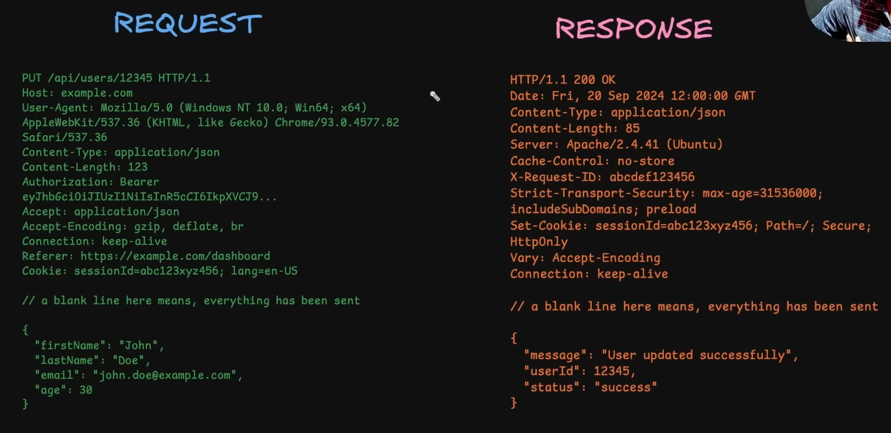

The medium through which client and servers send and receive data.

### 1. stateless
It means that it has no memory of past interaction. So each HTTP request carries all the necessary information for the server to process it. After a server responds it forgets about this request. If client were to make another request it would have to send all these things again.

Benefits of stateless design:
**simplicity** -> It simplifies server architecture because the server does not need to store session information which would otherwise require additional resources.

**scalability** -> It is also easy to distribute request across multiple servers. Even if the server crashes it doesn't affect the state of client Interaction.

Because HTTP is stateless developers create state management techniques like cookies or sessions or tokens to maintain continuity in interactions. 

### 2. Client server model
```
 ________                     ----------
|        |                   |          |
| Client |                   | Server   |
|________|                   |__________|
```

Client is typically a web browser or a application which initiates the communication by sending a request to the server. the client is responsible for providing all information needed by the server such as headers. 

Server hosts resources like websites or apis and waits for incoming requests from the client. when the server receives the request it processes and sends back a appropriate response such as a webpage or data.


HTTP states that communication has to be intiated by the client to get some kind of response. 

HTTPs is just more secure version of HTTP.

HTTP uses TCP for creating a connection (used to send request and recieve response)

Versions of HTTP
1. HTTP 1.0 -> Each request opened a new connection. This led to ineffeciency since connection has to be opened and closed for each req/res. 
2. HTTP 1.1 -> introduced persistent connections allowing multiple requests and responses over the same connection, over the same tcp connection that was extablished before sending the request. it also added stuff like chunk transfer encoding and better cahcing. 
3. HTTP 2.0 -> added multiplixeing. allowing multiple request and response over a single connection. it uses something called binary framing instead of text and supports header compression. it also has server push allowing server to send resources before client asks for them. 
4. HTTP 3.0 -> built over udp rather than tcp which improved performance with faster connection establishement, reduce latency and better handling of packet loss. Supports multiplexing without head of line blocking which is still an issue in http 2.

Client and server some kiind of network connection which they used to connect. 

Requst message is the one that is sent by the client to the server.
response message is the one that is receieved by the client from the server. 


about request message
`put` is the http method
`api/user/12345` is the resource url, the one that we are requesting from the server.
`http1.1` is http version
`host: example.com` is the domain that we are tyring to fetch, the backend domain
rest till cookies are headers. 
after the blank line is the request body.


in response message
`http1.1` is the http version
`200 ok` is the status code
than we have response headers 
after the blank line, we have the response body


headers are just basically key value pair.

why not just send them in the url or request body?

type of request headers?

user-agent -> what kind of client> is it a browser or it is postman
Authorization -> stores credentials which are like tokens for the server to identiy the user. 
accept -> like what kind of content we are accepting.


general headers (used both in requst and responss)
date
cache-control
connection


represntation header , deals with the representation of the resource being transferred
content-type -> describes the media type of the request or the response 
content-length -> size of resource in bytes
content-encoding -> specifies encoding
ETag -> unqiue identifier which is mostly used for caching 


security, used to enhance the security of the request and response by controlling behavours like content loading, cookies and encryption. 
strict-transport-security -> ensures that client only communicate to the server over https, precenting protocol downgrade attack
content-security-Policy -> restricts the sources from which content like js, css can be loaded helping prevent cross site scripting attack
x-frame-options -> prevents the webpage from being embedded in i-frame mitigating clickjacking attack
x-content-type-options -> ensure that the browser does not try to guess the mime type of the content preventing MIME type sniffing attack 
set-cookie -> set cookie with http only or secure flags, ensuring that they are sent over https 


about headers only
Extensibility -> http is highly extensible because headers can be easily added or customized without altering the underlying protocol. we only have to add some kind of metadata and the whole flow of the interaction changes  depeding on that. developers can create custom headers. content - negotatioation -> like the accept and the accept language and accept encoding allows server to server different version of the content depending on the client preference. 

remote - control -> headers kind of act like remote control on the server side, they allow client to send preferences influencing how the server responds or proccesses the requst. client can ask the server to send a particular type of fomat in the response. caching and expiration control. can be used to control how long a resource should be cached. client can authenticate himself through authorization headers influencing access control decisions. 

http methods
get -> get something from the server, it should not modify anything on the server. 
post -> create something on the server. it will have a request body with it. 
patch -> used to update some data, also has a request body. always try to use patch
put -> also used to update data, difference from patch is that whatever data comes in the request body should replace the previous instance of that data 
delete -> delete some kind of resource on the server
they exist to represent different kind of actions that a client like a browser can request on a server. instead of every request doing the same thing, method define the intenet


Idempotent vs non-Idempotent

we can call the same http methods multiple times and expect the same result. 

Idempotent
get, put, delete
get -> whenever you try to access a resource, you should not be modifying anything on the server. 
put -> completely replace the resource on the server, so it doesn't matte how many times you replace the old data with the new data. because the result will always be new data.
delete -> you can only delete a resource from the server once, because after that you cannot perform the action multiple times and expect different result. 


non-Idempotent
post, because say your users can create a note on your app. the first time the user sends some data to the server a new note is created and the second time you send the same request body a new note is created, now there are two notes on the serve with the same body 


http method options, used in the cors flow (same origin policy in browser). you don't directly use them but will see it in pre-flight requests in browsers. used to fetch the capabilities of the server for a cross origin request . without cors browsers block the request made from some different origin than the website. 


in a cross origin request there are two kinds of request
1. simple request 
2. preflight request 

simple request
say you frontend is on example.com and your api is on api.example.com.

your frontend sends a request to your api with all the headers.
```
get /api/products/123 http1.1
host: api.anotherdomain.COM
origin: https://example.COM
accept: application/json
```

the backend gets the request and checks the origin of the request `https://example.com` if this origin is available in its cors configuration it will send the request back with `access-control-allow-origin`: `your origin url`. the browser gets the response and it checks this header `access-control-allow-origin`. if that header is either `*` or the url of the frontend the response goes through to the user otherwise it gets blocked. 


pre-flight request -> the browsers have to do a request before the original request to inquire some stuff. 

when does a request qualifies as a preflight request (any of these conditions have to be true):
mandatory condition is that it has to be a cross origin request. 
1. the method is not get, post or head. it is put or delete
2. the request includes non-simple headers like authorization, x-custom-header
3. the request has a content-type other than application/x-www-form-urlencoded, multiport/form-data or text/plain 

what a preflight request looks like:
```
options /api/resouce http1.1
host: api.example.COM
orgiin: http://example.COM
access-control-request-method: put
access-control-request-headers: authorization 
```

`access-control-request-method` is asking the server if this method is supported or not. it also asks whether server supports `access-control-request-headers` header.

this request does not include any request body. it is just a general inquiry to the server about its capability.

  if the server is configured properly with cors (otherwise the request will be blocked), it will respond with something like this:
  ```
  http1.1 204 no content
  access-control-allow-origin: https://example.COM
  access-control-allow-methods: put, delete
  access-control-allow-headers: Authorization
  access-control-max-age: 86400
  ```

`access-control-allow-origin` means that the server is saying that it allows request from example.com. server also could have used `*`. 

`access-control-allow-methods` tells what methods does it support for that route.

`access-control-allow-headers` what headers are allowed

`access-control-max-age`: it means that the aboev thing will be same for the next 24 hours (86400), so client don't have to keep making the same request again. 


HTTP response codes
they exist to communicate the result of a request in a standardized way. you can just look at the response code and see whether the request was successful or not or what is the state of the server without looking into the body or judging from the entire response message.  They also helps client handle errors by providing specific codes to identify the problem. another reason is standardiation. http response codes are standardized across all web services enabling consistency how serverse communicate with different clients regardless of the platform or language used. before http response code clients would have to guess outcome of the request based on the content response leading to inconssitencies and inefficiences. http status code solve this by providing a universal Language that all client and servers understand streamlinig interactions and error handling. 


broad categories of http response codes:
1xx -> information, used by server to tell the client that it has received the headers and client can proceed to send the request body. commonly used in large uploads. client Firstly sends the headers and if the server is ok with it, it sends a 100 code to continue sending data. used for switching protocols requested by the client such as upgrading from http to https or web sockets.
2xx -> success, used for success responses. 200 request was successul and server is returning the requested resource or performing the requested action. , 201 request has been fulfilled and it resulted in a creation of a resource., 204, used in preflight request. server says that there is no content but here is some information in form of headers. also used for delete requests. 
3xx -> redirection, 301 moved permanently. requested resoured has been moved permanently to a new url and the future request should use the new url, 302 temporary redirect. requested resource
 is located at a new url but the client should use the original url for future request, 304 resource has not been modified since the last time the client requested it. used in conjunction with conditional get request to allow efficient caching. it also means that the resource has not been modified so the client should just use the old response. 
4xx -> client error, 400 bad request, when the client sends invalid data, illogical data. expecting some kind of data but got something else. 401, unauthroized, 403 forbidden, server understood the request but the server refused to reply. this can happen to authenticated users also for example when a user tries to access a resource that they don't have permission to access, 404 not found, client requests a resource that is Unavailable. 405, method not allowed, when a invalid http method is used. 409, conflict, lets say that your app allows users to create folders, but the folder names should be unique, if some user tries to duplicate folder names, we can invoke this http response. 429, too many request. 
5xx -> server error, 500 internal server error, unexpected conditions in server. you also return 500 internal server error instead of some explicit error for security reason so that client doesn't know too much about the server.  501, not implemented, when the server doesn't support a particular http method or functionlity but plans to add it soon. 502, bad gateway. 503, service Unavailable, 504, gateway time out, server failed to respond within given timelimit. 


http caching -> it is a techinque to store copies of response for reuse reducing repeated request to the server. this reduces load time bandwidth and decreases server load. client doesn't need to download a lot of data and server doesn't need to send a lot of data. 

when responding server tells for what time the response should be cached.
`cache-control: max-age-10, public`. response also sends etag and last modified. etag is a unique identifier of that resource. 

So in future when client sends request for the same resource, request will contain that etag and modified since. what these two mean is that if etag doesn't match or it has been modified since the timestamp mentioned in the request send us the new resource, else use the cached copy.


**content negotiation** -> it is basically a mechanism using which client and server agree on the best format to exchange data. the client can indicate its preferred format and the server will try to respond with a compatible format or if not available a fallback format.  

types of content negotiation
1. media type -> means that the client specifies the desired format througth the accept format.
2. language negotation -> client requests data in a specific language using the accept language header. 
3. encoding negotation -> client specifies which encoding it supports using the accept encoding header.


explain about http compression and its different formats?


persistent connections and keep-alive -> each request response required a seperate connection to the server. this created inefficines since establishing and closing tcp connections is resource intensive and slow. to solve this issue persistent connections were introduced in http 1.1. with persistent connection, a single tcp connection can be reused for multiple requests and responses avoiding the overhead of opening and closing a connection for every req / res cycle. for acheiveing that a new header was introduced.
`keep-alive` -> it is the mechanism that enables persistent connections. it allows the client and server to reuse the same connection for multiple request responses until one of them decides to close it. in http1.1 connections are persistent by default. even if it is by default, `keep-alive` header is still sometimes used to ask the server to keep the connection open. it can also include options like how long should the connection be opened or how many requests can be sent before the connection is closed. by default connection is only closed after the response has been sent. 


handling large requests and responses -> 

multipart requests -> used by client to send large files to the server. data/binary data of the file is transferred to the server in parts. 

as the data is sent in parts, you need some kind of delimiter to sepearate those parts, you specify this delemiter in `content-type` header by the name of boundary

when sending data from server to client, we use something called streaming. you tell this by specifying in resonse header. `content-type: text/event-stream`. server will send multiple responses each containing a certain chunk of the requested data.  another header is `connection: keep-alive` which just means to keep the connection alive until all the data is at the client side. 

ssl? https? tls?

ssl was the original protcol for securing commnucations between client like a web browser and server it encrypts data. 

ssl has been replaced by tls due to some security vulnerabilities. it is a more modern and secure version of ssl. it encrypts data in transit ensuring that any data sent between the client and server is protected from interception and tampering. tls uses certifcates to authenticate the server and establish a encrypted connection preventing eves dropping. 

https underlying mechanism is tls. 