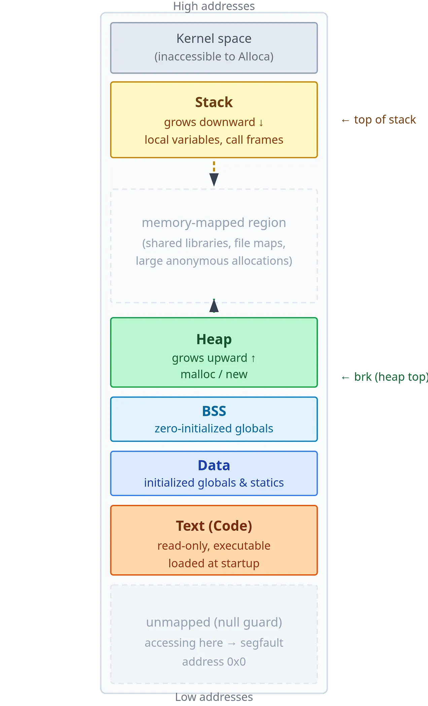

Normally, we think of virtual memory as a system that provides isolation a the memory level to processes. It also performs some other functions like follows:

- Lazy allocation of memory through demand paging
- Copy-on-write for shared memory between processes, and fast process creation via fork 
- file I/O that avoids the page-cache-to-user-buffer copy using mmap 
- page reclaim, swap, and the page cache 
- performance effects from access patterns, huge pages, TLB shootdowns, and NUMA placement 

Things to know when reading further:

- Alloca is a newly created process.
- And you know what kernel (bridge between software and hardware) is.

## The Need for Virtual Memory 

At any particular time, a very large number of processes are running on any machine and each process have its own virtual memory. Virtual memory feels like real memory, and it consists of addresses that a process can read and write. A process can freely navigate this memory without worrying if it would mess up other processes data. Every virtual address is mapped to a physical address that kernel knows about and gives access in a certain way that no two processes end up sharing the same physical addresses. 

## Size of Virtual Memory 

If the memory is virtual, is it infinite? Not infinite but very large. In x84-64 systems, addresses are stored in 64-bit registers, out of these 64-bit only 48 bits are used due to historical reasons (can be expanded, if future demands). So you can have $2^{48}$ bytes of addressable space, which is 256 TiB (around 256 TB). But a process can't use all of it. Only 128 TiB is available to process and another 128 TiB is used by kernel to provide necessary things to processes. Many modern machines uses around 16GB (or more) RAM but virtual memory is still the same for everyone. 

## The Virtual Memory Address Space layout

How does the 128 TiB memory space given to process look like:

### What each part does?

- **Text (code) segment**: The compiled instructions of the program. Loaded at startup, mapped read-only and executable. The process cannot write to its own code pages.
- **Data segment**: Global and static variables that have been explicitly initialized.
- **BSS segment**: Global and static variables that are zero-initialized. The binary stores no data for this region; the loader provides zero-initialized memory for it at startup.
- **Heap**: The region for dynamic memory allocation (malloc/new). It grows upwards. You can only allocate memory here programmatically.
- **Memory-mapped region**: A large, flexible area in the middle of the address space used for shared libraries, file mappings, and anonymous large allocations. Libraries like `libc` are loaded here.
- **Stack**: Holds the call frames of all currently executing functions. Starts near the top of the address space and grows downward. Each function call pushes a frame containing local variables, saved registers, and the return address; each return pops it. By default it is 8MB.

### Why such a layout?

It due to two reasons: performance and security. 

- **Performance**: Normally, when you're executing instructions in your code, you typically run them one after another (except for loops and function calls, it's mostly sequential). This pattern of accessing nearby memory location is so common that the hardware is designed around it. Fetching data from physical memory is slow (can take hundreds of cycles), so CPU uses very fast and small cache present right on the chip. When you read a value from memory, hardware doesn't just fetch that value but that entire block. It just fetches nearby values thinking that you would access those only.
- **Security**: Hardware uses something called Write XOR Execute. Memory can be writable or executable, but not both. Heap and stack are read-write but you can't execute here. Text segment is read-only and executable. We achieve this by giving each segment permission bits. 

> ### 🧠 Anonymous Memory
>
> The kernel manages two kinds of memory:
>
> | Type | Description |
> |------|-------------|
> | **Anonymous** | Allocated using `malloc()` or `mmap()`. Used for dynamic program data. |
> | **File-backed** | Memory backed by a file. |

## How are virtual Addresses Translated to Physical Addresses 

First instinct could be to just map every byte in virtual address to physical address. But the user half of the address space is 128 TiB, so at 8 bytes per entry that table would be about 1 PiB per process. The fix is to map fixed-size chunks instead: **pages** (4 KB) in virtual space map to **frames** (4 KB) in physical memory. Because every page and frame is the same size, any free frame can back any page. 

**But we have a specific address of virtual memory, how do we know which page it belongs to, and further which byte so that we can go to that particular physical frame?**

The answer lies in the virtual address itself. The virtual address is made up of two things. The upper bits gives the _virtual page number_, and the lower 12 bits give the _page offset_. If you're 500 bytes into virtual page N and N maps to frame M, you end up 500 bytes into frame M. 

**But a flat table is still too big?**

128 TiB of 4 KB pages is $2^{35}$ pages. At 8 bytes each, that is 256 GiB table per process. Most of the address space is empty (the middle part in stack and heap). So there is a high level index that just tracks which large regions are in use, and within those regions and so on until you get to individual pages.

Precisely, It's called a _hierarchical_ page table. There are four levels. At the top level, there's a table with 512 entries, and each entry represents 512 GB of your address space. Each entry at the top level can point to a second-level table, which again has 512 entries, each covering 1 GB. Each of these can point to a third-level table covering smaller regions, and so on, until the deepest level maps to individual 4 KB pages.

### Table names according to Linux and x86

| **Level**  | **Linux Kernel name**      | **x86 architecture name**          |
| ---------- | -------------------------- | ---------------------------------- |
| 1 (top)    | PGD: Page Global Directory | PML4: Page Map Level 4             |
| 2          | PUD: Page Upper Directory  | PDPT: Page Directory Pointer Table |
| 3          | PMD: Page Middle Directory | PD: Page Directory                 |
| 4 (bottom) | PTE: Page Table Entry      | PT: Page Table                     |

**How does a virtual address help you traverse above table?***

Virtual addresses are 64 bits wide, but only 48 bits are used. These 48 bits are split into five parts: four groups of 9 bits each, followed by a 12-bit offset. The first four groups are used one by one to step through each level of the page table tree, narrowing down to the right physical frame. The offset is then used to pinpoint the exact byte within that frame. 

This memory translation is done by MMU or _Memory Management Unit_. The CPU has a register called `CR3` that holds the physical address of your current PGD, the top-level table, which is updated by kernel on every context switch so the MMU knows where to start and which process's table to use. There is also a TLB or Translation Lookaside Buffer which acts like a cache to avoid traversing all four tables.

## Memory Protection via Permission Bits 

Each page table entry contains not just a frame number but also several permission bits that the MMU enforces on every memory access:

- **Present bit**: Indicates whether the page is currently backed by a physical frame. If 0, the page table walk stops and the CPU raises a page fault. A not-present page doesn't always signal an error; it might mean the kernel has promised the address range but hasn't yet allocated physical memory for it. It might also mean that the physical frame was swapped to disk and reused by another process.
- **Writable bit**: Controls write permission. If 0, any write attempt triggers a fault. Used to make code pages read-only.
- **Executable bit**: Controls execution permission. If the page is marked non-executable, the processor refuses to fetch instructions from it. Code pages are marked executable; data, heap, and stack pages are marked non-executable to prevent code injection attacks.

The MMU checks these permission bits on every memory access, _before_ the access completes. Permission violations typically indicate bugs or security violations and usually result in the kernel terminating the faulting process. This hardware-enforced separation between code and data is a foundational defense against many classes of exploits.

## Demand Paging 

When a process allocates memory, whether by calling `malloc`, growing its stack, or explicitly requesting memory via `mmap`, the kernel does not immediately back every page of the allocation with a physical frame. Instead, it creates a _Virtual Memory Area (VMA)_ in the process's memory descriptor: a record that says "this range of virtual addresses is valid and belongs to this process, with these permissions". The page table entries for these pages are left absent (present bit = 0).

The VMA and the page table serve different roles:

- The **VMA** is the kernel’s record of _intent_: what address ranges the process is allowed to access.
- The **page table** is the record of _reality_: which virtual pages are currently backed by physical frames.

The first time the process reads or writes any address in an allocated-but-unmapped range, the MMU finds a page table entry with present=0 and raises a _page fault_, a CPU exception that transfers control to the kernel. The kernel’s page fault handler:

1. Looks up which VMA contains the faulting address. If none, the access is invalid and the kernel delivers a segmentation fault, terminating the process. Otherwise, it continues:
2. Allocates a free physical frame.
3. Zero-fills that frame (the zero-fill guarantee, required for security, ensures the process never sees data from a previous owner of that frame).
4. Installs a new page table entry pointing to that frame, with the present bit set.    
5. Returns from the exception, causing the CPU to retry the faulting instruction.

## When Physical Memory Runs Out: Swap and the Dual Meaning of the Present Bit

When physical memory runs out, the kernel must reclaim frames. It selects pages that have not been accessed recently and evicts them. This frame can be from any process. The kernel writes the page's contents to _swap space_ on disk before freeing the frame. It then updates the PTE: the present bit is cleared to 0, and the remaining bits are repurposed to store swap coordinates. 

When the evicted page is next accessed, the MMU finds present=0 and raises a _major page fault_. The fault handler reads the swap coordinates from the PTE, loads the page from disk into a fresh frame, reinstalls the PTE with present=1, and resumes the process.

However, a page fault for a file-backed mapping is handled slightly differently. Here, the VMA contains information about the file and the offset in the file needed to populate the frame.

> ### Minor vs Major Page Fault
> 
> - Minor Page Fault: Is the one that doesn't require I/O disk and can be entirely resolved by kernel in memory. For e.g. when the page is not mapped, but the data is already in the RAM.
> - Major Page Fault: When page fault requires disk I/O to be resolved. For e.g. when the page has been swapped to disk.

### Pinned memory and GPU data transfers 

Everything above assume that the kernel is free to evict any page when memory pressure demands it. However there are cases where that is unacceptable. _Pinned memory_ (also called _page-locked_ memory) is memory that the kernel is prohibited from swapping out. A process can pin a region by calling `mlock()`, after which the kernel guarantees that the underlying physical frames will not be moved or reclaimed for as long as the lock is held.  The lock will be freed when the process terminates. 

The most common reason to pin memory today is GPU data transfers. DMA (Direct Memory Access) engines, which move data between host RAM and GPU memory without CPU involvement, require that the source or destination buffer remain at a fixed physical address for the duration of the transfer. If the kernel were to evict a page mid-transfer and reassign the frame, the DMA engine would read or write the wrong physical location. Pinning prevents this by fixing the physical address in place.

## Copy-on-Write and Fork 