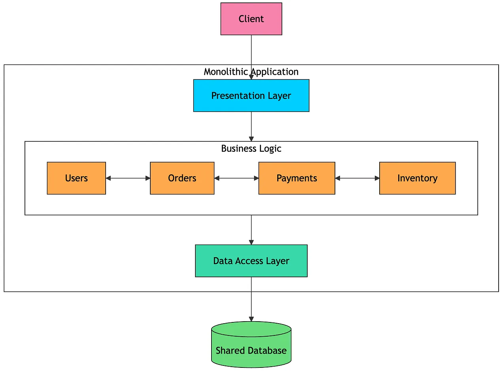
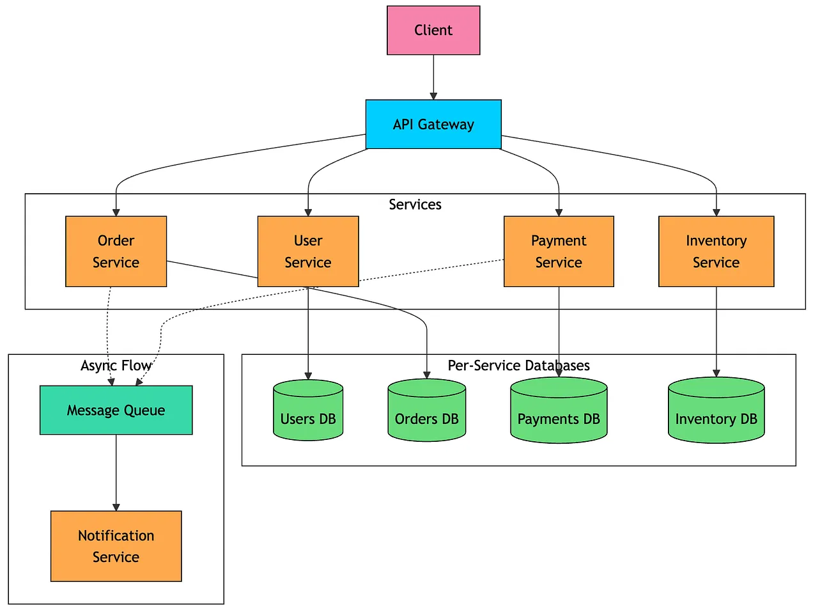
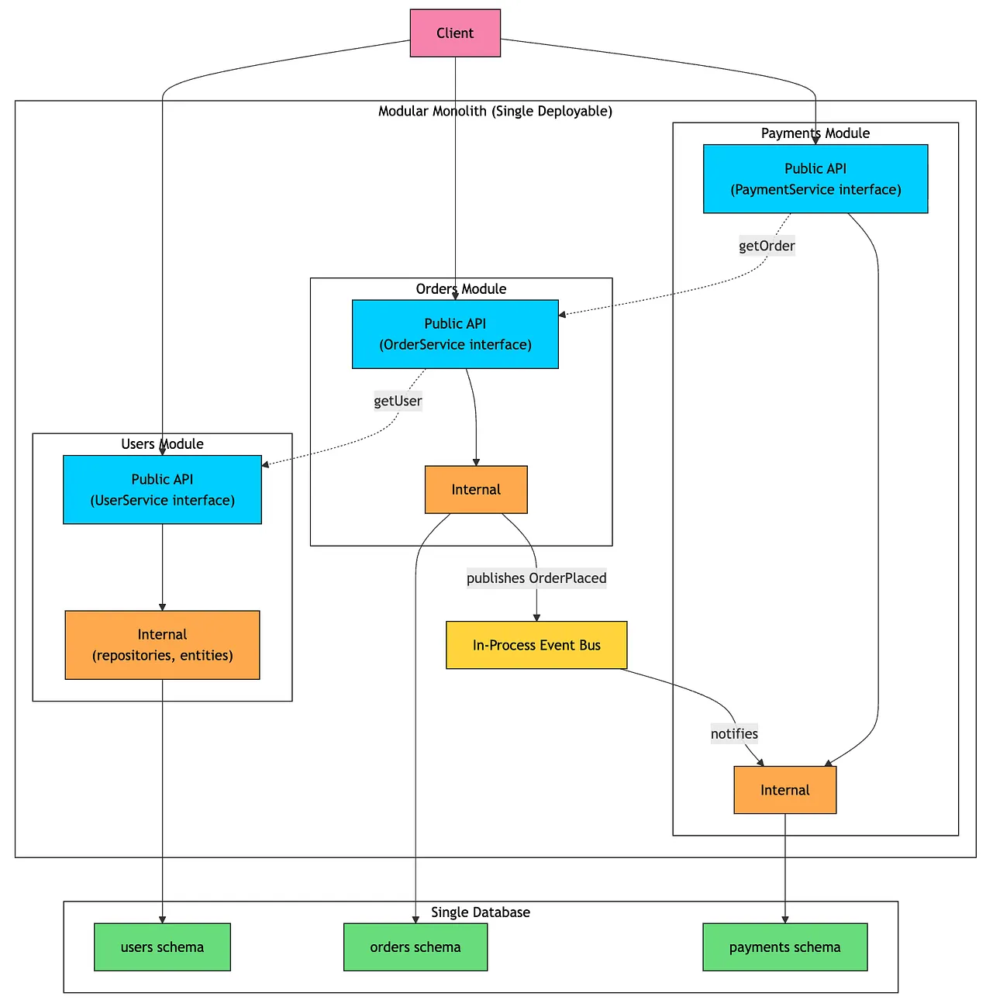
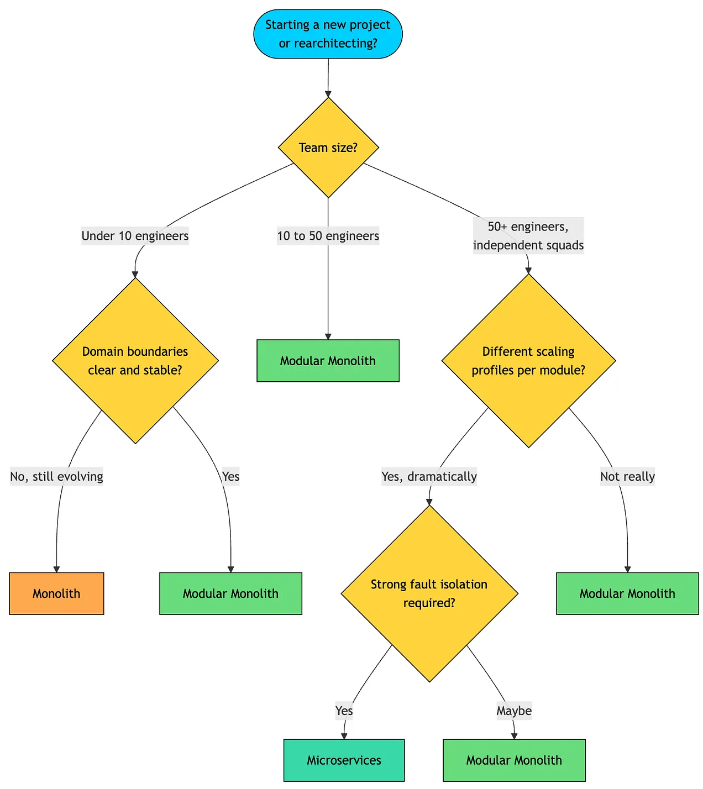
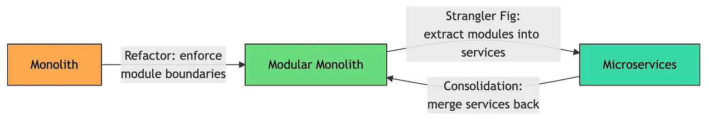

## What is a Monolith?

A monolithic application is built and deployed as a single unit. The UI, business logic, and data access code all live in the same codebase. They are compiled into one artifact, deployed together, and usually run as one process.



Different parts of the application communicate through direct function calls and share the same database.

A simple example of a e-commerce monolith:
```text
ecommerce-app/
├── controllers/
├── services/
├── repositories/
└── models/
```

This structure is easy to understand in the early stages of a product. You clone one repository, run one application, connect one database, and start building. This simplicity is the biggest strength of a monolith. 

But the same simplicity can become painful as the system grows.

A small change in one module may require rebuilding, retesting, and redeploying the entire application. If one module gets heavy traffic, you often have to scale the whole app. One bad query, memory leak, or unhandled exception can affect the entire system. Over time, internal boundaries can blur, and developers may start reaching across modules directly.

Almost every successful application starts as a monolith. The real question is not whether monoliths are bad. The real question is: **what should you do when the monolith starts slowing you down?**

## What is a Microservice Architecture?

A microservices architecture breaks an application into a set of small, independently deployable services.

Each service owns a specific business capability, runs in its own process, and usually manages its own database. Services communicate over the network using HTTP, REST, gRPC, or asynchronous messaging.


For example, the same e-commerce application could be split like this:
```text
user-service/        # Own codebase, own deployment
order-service/       # Own codebase, own deployment
payment-service/     # Own codebase, own deployment
inventory-service/   # Own codebase, own deployment
```

The main promise of microservices is independence.

Each service can be built, deployed, and scaled separately. The orders team can release changes without redeploying payments or inventory. If a flash sale overloads payments, you can scale only the payment service. Different services can also use different technologies, such as Python with a vector database for recommendations and Java with PostgreSQL for orders.

But this independence comes with complexity.

A simple in-process function call now becomes a network call. That means latency, serialization, timeouts, retries, and partial failures. Debugging also gets harder because one request may pass through multiple services. You now need distributed tracing, centralized logging, metrics, dashboards, and alerts.

Data management becomes harder too. Since each service owns its database, you cannot rely on one large transaction across the whole system. Placing an order may involve orders, payments, and inventory. If payment succeeds but inventory reservation fails, the system needs recovery patterns like Saga, outbox, idempotency, and eventual consistency.

Microservices make sense when the system is large, domain boundaries are clear, and multiple teams need to move independently. They are useful when different parts of the system have very different scaling needs, or when one team’s deployment should not block another team.

## what is a Modular Monolith?

A modular monolith is a single deployable application with clear boundaries between its internal modules.

From the outside, it looks like a regular monolith. It runs as one process, ships as one artifact, and is deployed as one application. But inside, the code is organized around business capabilities such as Users, Orders, Payments, and Inventory. Each module owns its public API, internal implementation, and ideally its own data model.


This is what separates if from a traditional monolith. In a regular monolith, "modules" often just mean folders. The code may look organized, but nothing stops the orders code from directly accessing payment classes, inventory tables, or user internals. Over time, these shortcuts create a tangled codebase. In a modular monolith, modules are treated as real boundaries. A module can use another module only through it public API. Internal classes, database tables, and implementation details stay hidden.

A modular monolith sits between a traditional monolith and microservices. It gives you more structure than a regular monolith, but avoids the operational complexity of microservices.

For example, an e-commerce modular monolith might look like this:
```text
ecommerce-app/
├── modules/
│   ├── users/
│   │   ├── api/         # Public API: interfaces, DTOs
│   │   ├── internal/    # Implementation hidden from other modules
│   │   └── schema/      # Owns the users database schema
│   ├── orders/
│   │   ├── api/
│   │   ├── internal/
│   │   └── schema/
│   ├── payments/
│   │   ├── api/
│   │   ├── internal/
│   │   └── schema/
│   └── inventory/
└── shared/              # Cross-cutting utilities only
```

The important part is not the folder structure itself. The important part is the rule behind it: A module can use another module only through its public API. 

Modules usually communicate in two ways:
1. **Synchronous API calls:** For example, the orders module may call `userService.getAddress(userId)`. This is still a fast in-process call, but it goes through the users module’s public API.
2. **Domain events:** When an order is placed, the orders module can publish an `OrderPlaced` event. Payments, notifications, or inventory can react to it without the orders module knowing who is listening.

A modular monolith keeps the best parts of a monolith: one repository, one build, one deployment, one process, and simple local development. At the same time, it reduces the biggest monolith problems: tangled dependencies, unclear ownership, and shared data access. It also creates a smoother path to microservices later. If one module eventually needs to scale independently, it is much easier to extract because it already has a clean API and owns its data.

## How to choose



A useful rule from Sam Newman’s “Building Microservices”: never start a project with microservices. The cost of getting the boundaries wrong is enormous, and you’ll only know the right boundaries after you’ve lived in the domain for a while.

## Migration Paths

Architectures are not permanent. As the product, team, and traffic patterns evolve, systems can move in either direction.



### Monolith to Modular Monolith

This is usually a refactor, not a rewrite. The deployment pipeline stays the same. The runtime stays the same. Users should not notice anything changing.

Steps:
1. Identify business capability boundaries such as Users, Orders, Payments, and Inventory.
2. Move each capability into its own top-level module or package.
3. Define a public API for each module and hide internal implementation details.
4. Move tables into module-owned database schemas where possible.
5. Add architecture tests using tools like ArchUnit, Packwerk, or Spring Modulith.    
6. Fix boundary violations gradually instead of trying to clean everything at once.

This migration can happen incrementally over months without a risky big-bang rewrite.

This migration can happen incrementally over months without a risky big-bang rewrite.

### Modular Monolith to Microservices

This is where a modular monolith pays off.

If a module already has a clean API, clear ownership, and isolated data, extracting it into a service becomes much easier.

Steps:
1. Pick a module with few dependencies, such as Notifications or Reporting.
2. Create a new service using the same module logic.
3. Keep the API contract as close as possible to the existing module API.
4. Route traffic gradually using a proxy, feature flag, or adapter.
5. Move the module’s data into the new service’s database.
6. Remove the in-process module once the new service is stable.

This is the **Strangler Fig pattern**: instead of rewriting the whole system, you slowly extract one piece at a time.

### Microservices to Modular Monolith

Moving away from microservices is not a failure. Sometimes it is the right engineering decision.

The right architecture depends on context. If a team is spending more time operating services than building features, or if most services always deploy together anyway, consolidation can simplify the system.

Steps:
1. Identify services with stable interfaces and overlapping release cycles.
2. Merge them into one application while preserving module boundaries.
3. Replace network calls with in-process calls.
4. Move separate databases into one database with separate schemas where possible.    
5. Bring the merged application under one deployment pipeline.

Teams usually take this path to reduce operational cost, simplify debugging, lower latency, or match the architecture to the actual size of the organization.

The key idea is simple: architecture should serve the team and the product. It should not become something the team is forced to serve.

## Sources:
[Algomonster](https://blog.algomaster.io/p/monolith-vs-microservices-vs-modular-monoliths?img=https%3A%2F%2Fsubstack-post-media.s3.amazonaws.com%2Fpublic%2Fimages%2Fe0d2e693-060c-4985-a01f-6a6a95994f5f_1950x1440.png&open=false)

## Tags:
#deployment 
#architecture
