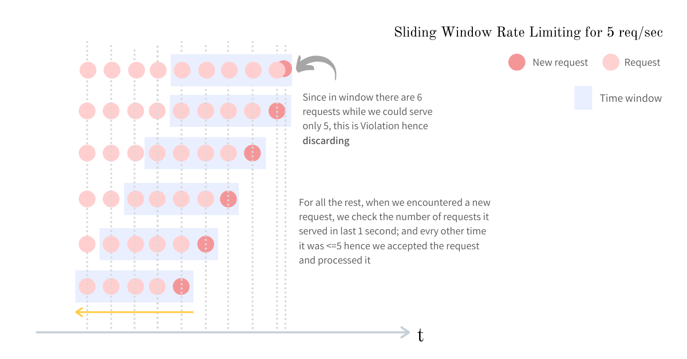
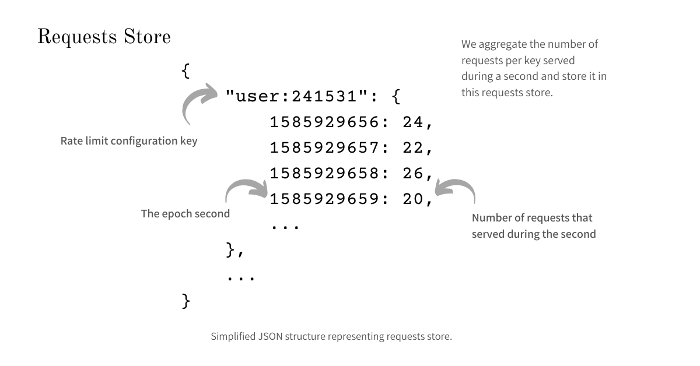
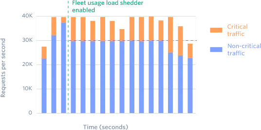

Rate limiting is a strategy for limiting network traffic. It puts a cap on how often someone can repeat an action within a certain timeframe – for instance, trying to log in to an account. It can reduce strain on web servers.

### What kinds of problems are mitigated by rate limiting?
Rate limiting is often employed to stop malicious actors from negatively impacting a website or application. It can help mitigate:
* Brute force attacks
* DoS and DDoS attacks
* Web scraping
* API overuse
* A user is sending you a lot of lower-priority requests, and you wan to make sure that it doesn't affect your high priority traffic.
* Something in your system has gone wrong internally, and as a result you can't serve all of your regular traffic and need to drop low-priority requests.

Rate limiters are amazing for day-to-day operations, but during incidents (for example, if a service is operating more slowly than usual), we sometimes need to drop low-priority requests to make sure that more critical requests get through. This is called _load shedding_. It happens infrequently, but it is an important part of keeping your application available.

A _load shedder_ makes its decisions based on the whole state of the system rather than the user who is making the request. Load shedders help you deal with emergencies, since they keep the core part of your business working while the rest is on fire.

### How does rate limiting works?
Rate limiting runs within an application, rather than running on the web server itself. Typically, rate limiting is based on tracking the IP addresses that requests are coming from, and tracking how much time elapses between each request.

A rate limiting solution measures the amount of time between each request from each IP address, and also measures the number of requests within a specified timeframe. If there are too many requests from a single IP within the given timeframe, the rate limiting solution will not fulfil the IP address's requests for a certain amount of time.

#### How does rate limiting work with user login?
Users may find themselves locked out of an account if they unsuccessfully attempt to log in too many times in a short amount of time. This occurs when a website has login rate limiting in place.

This precaution exists, not to frustrate users who have forgotten their passwords, but to block [brute force attacks](https://www.cloudflare.com/learning/bots/brute-force-attack/) in which a bot tries thousands of different passwords in order to guess the correct one and break into the account. If a bot can only make 3 or 4 login attempts an hour, then such an attack is statistically unlikely to be successful.

Rate limiting on a login page can be applied according to the IP address of the user trying to log in, or according to the user's username. Ideally it would use a combination of the two, because:

- If rate limiting is only applied by IP address, brute force attackers could bypass this by attempting logins from multiple IP addresses (perhaps by using a [botnet](https://www.cloudflare.com/learning/ddos/what-is-a-ddos-botnet/)).
- If it's only done by username, any attacker that has a list of known usernames can try a variety of commonly used passwords with those usernames and is likely to successfully break into at least a few accounts, all from the same IP address.

Because rate limiting is necessary to prevent these brute force attacks, users who can't remember their passwords may be rate limited along with malicious bots. Users will likely see a "too many login attempts" message of some sort and be prompted to try again within a specified timeframe, or be advised that they are locked out of their accounts altogether.

#### Components of a Rate limiter
The Rate limiter has the following components
- **Configuration Store** - to keep all the rate limit configurations
- **Request Store** - to keep all the requests made against one configuration key
- **Decision Engine** - it uses data from the Configuration Store and Request Store and makes the decision
Have talked more about them in sliding window algorithm

### Most common rate limiting algorithms:
#### 1. Fixed Window 
A set number of requests can be made within a predefined time window. Requests increment a counter that’s reset to zero at the start of each window.
**Pros:**
* Simple to implement
* Predictable for users
**Cons:**
- Allows bursts up to 2x the `limit` when requests begin near the end of a window
**Real-world example:**
- GitHub’s API uses a fixed window rate limiter with `limit = 5000`, `windowDuration = 1h`, and `windowStart` set to the start of each wall clock hour, allowing users 5,000 requests per hour.

**A problem with 24 hour window**
```text
If we have a rate limiter which reset every day at midnight, but midnight according to which time zone? One can use UTC, but a user in different time zone can try to request just after midnight and will still see he is blocked. A potential solution can be to use time zone according to users(where they are based). But in this case user can change their time zone manually to gain additional requests. Or if the user is travelling they can gain or lose number of requests according to the direction they are travelling. Suppose they are travelling from east to west they will have more requests allowed, and if they are travelling from west to east they will have less number of requests available to them.
```

**Fixed window with user-defined start**
Instead of fixing the start times to a set interval, each window can be created at the time of the user’s first request within that window. With this approach, it’s especially important to show users the time remaining until the next window once they’re limited since there’s no set time that aligns each window.

#### 2. Sliding window
Instead of refreshing the capacity all at once, sliding windows refill one request at a time.

**How sliding window works?**
Every time we get a request we have to decide whether we should serve it or not. How should we decide? We will look back some window size (pre determined) and calculate the number of requests that have happened in that window size or time frame. If the number of requests that have been server is equal to the allowed number of requests than don't serve this request else you can serve this request.

Above thing in technical terms:
Every time we get a request, we make a decision to either serve it or not; hence we check the `number_of_requests` made in last `time_window_sec` seconds. So this process of checking for a fixed window of `time_window_sec` seconds on every request, makes this approach a sliding window where the fixed window of size `time_window_sec` seconds is moving forward with each request.



/
/

Below details about sliding window rate limiter is from [Arpit Bhayani - sliding window](https://arpitbhayani.me/blogs/sliding-window-ratelimiter/). According to this blog, a user or system that makes a request is abstracted away to a `key`.
##### Design
Designing a rate limiter has to be super-efficient because the rate limiter decision engine will be invoked on every single request and if the engine takes a long time to decide this, it will add some overhead in the overall response time of the request. A better design will not only help us keep the response time to a bare minimum, but it also ensures that the system is extensible with respect to future requirement changes.
##### Configuration Store
The primary role of the Configuration Store would be to
- efficiently store configuration for a key
- efficiently retrieve the configuration for a key

In case of machine failure, we would not want to lose the configurations created, hence we choose a disk-backed data store that has an efficient `get` and `put` operation for a key. Since there would be billions of entries in this Configuration Store, using a SQL DB to hold these entries will lead to a performance bottleneck and hence we go with a simple key-value NoSQL database like [MongoDB](https://mongodb.com/) or [DynamoDB](https://aws.amazon.com/dynamodb/) for this use case.

##### Request Store
Request Store will hold the count of requests served against each key per unit time. The most frequent operations on this store will be
- registering (storing and updating) requests count served against each key - _write heavy_
- summing all the requests served in a given time window - _read and compute heavy_
- cleaning up the obsolete requests count - _write heavy_

Since the operations are both read and write-heavy and will be made very frequently (on every request call), we chose an in-memory store for persisting it. A good choice for such operation will be a datastore like [Redis](https://redis.io/).

##### Configuration Store
We will be using a NoSQL key-value store to hold the configuration data. How this configuration will look:
```
{
  "user:241531": {
    "time_window_sec": 1,
    "capacity": 5
  }
}
```
Above configuration defines that the user with id `241531` would be allowed to make `5` requests in `1` second.

##### Request Store
Request store is a nested dictionary where the outer dictionary maps the configuration key `key` to an inner dictionary. The inner dictionary maps each epoch second to the number of requests made in that second.

/
##### Implementation
Implementation is pretty simple. First you get the `key`(the one associated to the user) from configuration store. We can use a cache to speed up this process.
```python
def get_ratelimit_config(key):
    value = cache.get(key)

    if not value:
        value = config_store.get(key)
        cache.put(key, value)

    return value
```
Now to get request in the current window, we first compute the `start_time` from which we want to count the requests that have been server by the system for the `key`. For this we can simply iterate the dictionary and sum up the number of requests. 
In order to reduce memory footprint, we could delete the items from the inner dictionary which are older than `start_time`.
```python
def get_current_window(key, start_time):
    ts_data = requests_store.get(key)
    if not key:
        return 0

    total_requests = 0
    for ts, count in ts_data.items():
        if ts > start_time:
            total_requests += count
        else:
            del ts_data[ts]

    return total_requests
```

Once we have got the inner dictionary from configuration store, added up the number of requests and if it is allowed to serve more requests we can register this request.
```python
def register_request(key, ts):
    store[key][ts] += 1
```

#### Potential issues
##### Atomic updates:
While we register a request in the Request Store we increment the request counter by 1. When the code runs in a multi-threaded environment, all the threads executing the function for the same key `key`, all will try to increment the same counter. Thus there will be a classical problem where multiple writers read the same old value and updates. To fix this we need to ensure that the increment is done atomically and to do this we could use one of the following approaches
- optimistic locking (compare and swap)
- pessimistic locks (always taking lock before incrementing)
- utilize atomic hardware instructions (fetch-and-add instruction)

##### Non-static sliding window
There would be cases where the `time_window_sec` is large - an hour or even a day, suppose it is an hour, so if in the Request Store we hold the requests count against the epoch seconds there will be 3600 entries for that key and on every request, we will be iterating over at least 3600 keys and computing the sum. A faster way to do this is, instead of keeping granularity at seconds we could do it at the minute-level and thus we sub-aggregate the requests count at per minute and now we only need to iterate over about 60 entries to get the total number of requests and our window slides not per second but per minute.

**Pros**
* Smooths the distribution of request traffic
* Well-suited for high loads
**Cons**
* Less predictable for users than fixed windows
* Storing timestamps for each request is resource-intensive
It doesn't scale well for high-traffic scenarios, cloudflare uses something called approximation sliding window (will update here after i have read it).

#### 3. Token Bucket
In this approach, we have a imaginary bucket which is getting filled at a constant rate. When our server gets a request we check inside this bucket if there is any token available we serve this request else we don't.
**Pros**
* Allows bursts of high traffic, but enforces a long-term average rate of requests
* More flexible for users, allowing for traffic spikes within an acceptable range
**Cons**
* More difficult to convey limits and refill times to users than with fixed windows
**Real-world examples**
* Stripe [uses a token bucket](https://stripe.com/blog/rate-limiters) in which each user gets a bucket with `limit = 500`, `refillInterval = 0.01s`, allowing for sustained activity of 100 requests per second, but bursts of up to 500 requests. ([Implementation details](https://gist.github.com/ptarjan/e38f45f2dfe601419ca3af937fff574d).)
* OpenAI’s free tier for GPT-3.5 is limited to 200 [requests per day](https://platform.openai.com/docs/guides/rate-limits) using a token bucket with `limit = 200` and `refillInterval = 86400s / 200`, replenishing the bucket such that at the end of a day (86,400 seconds) an empty bucket will be 100% filled. They refill the bucket one token at a time.

Below details are from [Stripe](https://stripe.com/blog/rate-limiters) and [Smudge](https://smudge.ai/blog/ratelimit-algorithms)
#### Using different kinds of rate limiters
##### 1. Request rate limiter
This rate limiter restricts each user to _N_ requests per second. Request rate limiters are the first tool most APIs can use to effectively manage a high volume of traffic.

##### 2. Concurrent requests limiter
Instead of “You can use our API 1000 times a second”, this rate limiter says “You can only have 20 API requests in progress at the same time”. Some endpoints are much more resource-intensive than others, and users often get frustrated waiting for the endpoint to return and then retry. These retries add more demand to the already overloaded resource, slowing things down even more. The concurrent rate limiter helps address this nicely.

When this limiter reaches its maximum capacity/limit it will ask the user to `Fork off X jobs and have them process the queue` meaning that the developer should create a fixed number of parallel processors which execute the requests instead of constantly bumping into rate limiters and retrying.


/

##### 3. Fleet usage load shedder
Using this type of load shedder ensures that a certain percentage of your fleet will always be available for your most important API requests.

In this approach, traffic is divided into two types: critical API methods and non-critical methods. We can have a Redis cluster that counts how many requests we currently have of each type. In this way we can reserve a fraction of our infrastructure for critical requests. If say the reservation number of 20%, then any non-critical request over their 80% allocation would be rejected with status code 503.


/

##### 4. Worker utilization load shedder
Most API services use a set of workers to independently respond to incoming requests in a parallel fashion. Meaning that services like stripe have a number of workers that handle incoming requests in parallel one by one. If your workers start getting overwhelmed it will shed lower-priority traffic. This works by tracking the number of workers with available capacity at all times. If workers start getting overwhelmed it will start shedding of traffic starting from lowest priority tasks and going up (shedding ramps up if overwhelming continues). Once the workers are back to normal it will re-enable the traffic slowly to full capacity.


/

#### Important things to consider when implementing rate limiters:
- **Hook the rate limiters into your middleware stack safely.** Make sure that if there were bugs in the rate limiting code (or if Redis were to go down), requests wouldn’t be affected. This means catching exceptions at all levels so that any coding or operational errors would fail open and the API would still stay functional.
- **Show clear exceptions to your users.** Figure out what kinds of exceptions to show your users. In practice, you should decide if you want [HTTP 429](https://tools.ietf.org/html/rfc6585#section-4) (Too Many Requests) or [HTTP 503](https://tools.ietf.org/html/rfc7231#section-6.6.4) (Service Unavailable) and what is the most accurate depending on the situation. The message you return should also be actionable.
- **Build in safeguards so that you can turn off the limiters.** Make sure you have kill switches to disable the rate limiters should they kick in erroneously. Having feature flags in place can really help should you need a human escape valve. Set up alerts and metrics to understand how often they are triggering.
- **Dark launch each rate limiter to watch the traffic they would block.** Evaluate if it is the correct decision to block that traffic and tune accordingly. You want to find the right thresholds that would keep your API up without affecting any of your users’ existing request patterns. This might involve working with some of them to change their code so that the new rate limit would work for them.
-  **Create a persisted store for the rate limiter.** If you ever intend to horizontally scale your server (or even just restart it, or use serverless) your rate limiter data store can’t be in-memory. A popular option is to save rate limiting data to a key-value store like Redis, which has built-in functions for expiring keys, on a separate machine from your application. You can, however, use an ephemeral in-memory cache to block requests without hitting Redis while the limiter is hot.
- **Fail open.** If your server’s connection to the persisted store fails, make sure to allow all requests rather than blocking access to your service altogether.
- **Optionally throttle bursts.** Throttling can be used in combination with rate limiting to reduce the impact of burst traffic.
- **Choose sensible keys.** In general, rate limiting is done on a per-user level. For most apps, this means keying on the user ID. For APIs, key on an API key. To rate limit unauthenticated users, the options aren’t great, but popular methods include using the request’s IP address, a device fingerprint, a unique installation ID, or just a shared limiter.

Sources:
[Cloudflare - what is rate limiting](https://www.cloudflare.com/en-gb/learning/bots/what-is-rate-limiting/)
[Smudge - rate limiting with types](https://smudge.ai/blog/ratelimit-algorithms)
[Arpit Bhayani - sliding window](https://arpitbhayani.me/blogs/sliding-window-ratelimiter/)
[Stripe - different kinds](https://stripe.com/blog/rate-limiters)
[Github repo (implementation by me)](https://github.com/Calcifer077/Rate-limiting-implementation)