Memory management in JavaScript is performed automatically and invisibly to us. We create primitives, objects, functions… All that takes memory.

## [Reachability](https://javascript.info/garbage-collection#reachability)

The main concept of memory management in JavaScript is _reachability_.

Simply put, “reachable” values are those that are accessible or usable somehow. They are guaranteed to be stored in memory.

1. There’s a base set of inherently reachable values, that cannot be deleted for obvious reasons.
    For instance:
    - The currently executing function, its local variables and parameters.
    - Other functions on the current chain of nested calls, their local variables and parameters.
    - Global variables.
    - (there are some other, internal ones as well)
    These values are called _roots_.
    
2. Any other value is considered reachable if it’s reachable from a root by a reference or by a chain of references.
    For instance, if there’s an object in a global variable, and that object has a property referencing another object, _that_ object is considered reachable. And those that it references are also reachable. 

There's a background process in the JavaScript engine that is called garbage collector. It monitors all objects and removes those that have become unreachable.

## A simple example

```js
// user has a reference to the object
let user = {
  name: "John"
};
```
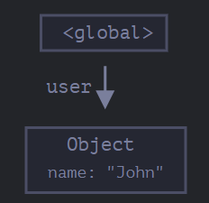
Here the arrow depicts an object reference. The global variable `user` reference the object `{name: "John"}`. The `name` property of John stores a primitive, so it's painted inside the object.

If the value of `user` is overwritten, the reference is lost:
```js
user = null;
```
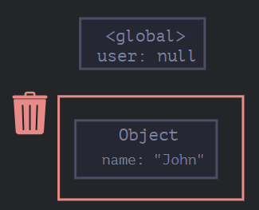
Now John becomes unreachable. There's no way to access it, no references to it. Garbage collector will junk the data and free the memory.

## Two references

Now let's imagine we copied the reference from `user` to `admin`:
```js
// user has a reference to the object
let user = {
  name: "John"
};

let admin = user;
```
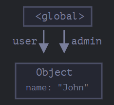
Now if we do the same:
```js
user = null;
```
Then the object is still reachable via `admin` global variable, so it must stay in memory. If we overwrite `admin` too, then it can be removed.

## Interlinked objects

```js
function marry(man, woman) {
  woman.husband = man;
  man.wife = woman;

  return {
    father: man,
    mother: woman
  }
}

let family = marry({
  name: "John"
}, {
  name: "Ann"
});
```

Function `marry` “marries” two objects by giving them references to each other and returns a new object that contains them both.

The resulting memory structure:
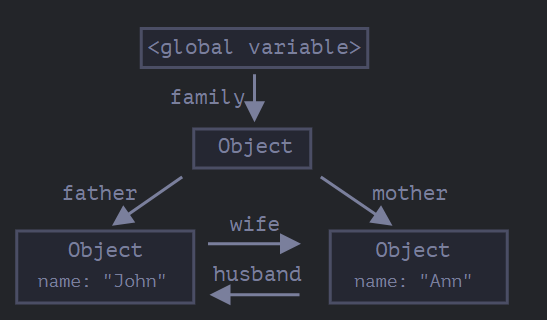As of now, all objects are reachable.

Now let’s remove two references:
```js
delete family.father;
delete family.mother.husband;
```
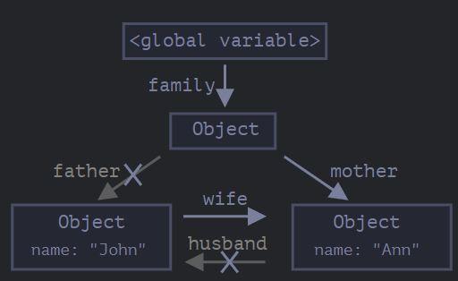

It’s not enough to delete only one of these two references, because all objects would still be reachable.

But if we delete both, then we can see that John has no incoming reference any more:
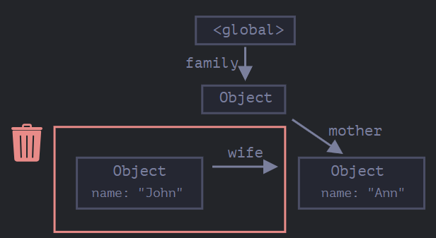

Outgoing references do not matter. Only incoming ones can make an object reachable. So, John is now unreachable and will be removed from the memory with all its data that also became inaccessible.

After garbage collection:
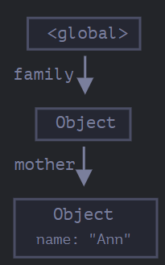

## Unreachable island
It is possible that the whole island of interlinked objects becomes unreachable and is removed from the memory.

The source object is the same as above. Then:
```js
family = null;
```

The in-memory picture becomes:
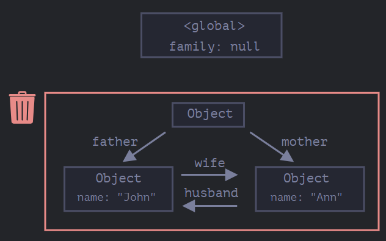

It's obvious that John and Ann are still linked, both have incoming references. But that' not enough. The former `family` object has been unlinked from the root, there's no reference to it any more, so the whole island becomes unreachable and will be removed.

## Internal algorithms

The basic garbage collection algorithm is called “mark-and-sweep”.

The following “garbage collection” steps are regularly performed:
- The garbage collector takes roots and “marks” (remembers) them.
- Then it visits and “marks” all references from them.
- Then it visits marked objects and marks _their_ references. All visited objects are remembered, so as not to visit the same object twice in the future.
- …And so on until every reachable (from the roots) references are visited.
- All objects except marked ones are removed.

For instance, let our object structure look like this:
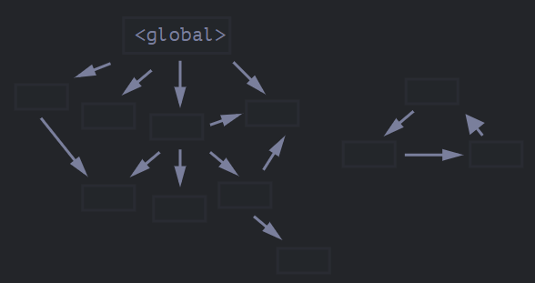We can clearly see an “unreachable island” to the right side. Now let’s see how “mark-and-sweep” garbage collector deals with it.

The first step marks the roots:
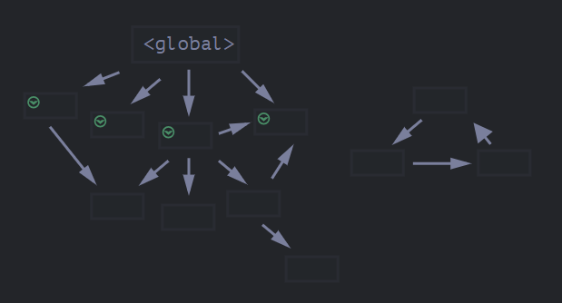

Then we follow their references and mark referenced objects:
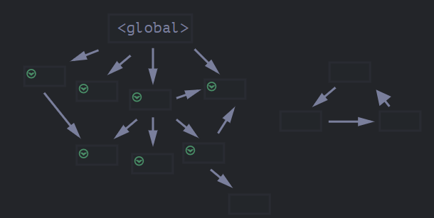
It will do this until it have reached all reachable objects and have marked them. Now the objects that could not be visited in the process are considered unreachable and will be removed:
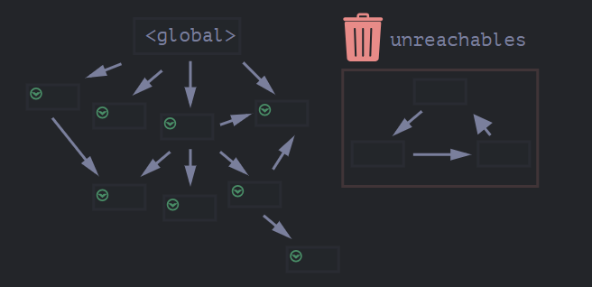

We can also imagine the process as spilling a huge bucket of paint from the roots, that flows through all references and marks all reachable objects. The unmarked ones are then removed.

That’s the concept of how garbage collection works. JavaScript engines apply many optimizations to make it run faster and not introduce any delays into the code execution.

Some of the optimizations:
- **Generational collection** – objects are split into two sets: “new ones” and “old ones”. In typical code, many objects have a short life span: they appear, do their job and die fast, so it makes sense to track new objects and clear the memory from them if that’s the case. Those that survive for long enough, become “old” and are examined less often.
- **Incremental collection** – if there are many objects, and we try to walk and mark the whole object set at once, it may take some time and introduce visible delays in the execution. So the engine splits the whole set of existing objects into multiple parts. And then clear these parts one after another. There are many small garbage collections instead of a total one. That requires some extra bookkeeping between them to track changes, but we get many tiny delays instead of a big one.
- **Idle-time collection** – the garbage collector tries to run only while the CPU is idle, to reduce the possible effect on the execution.

## [Summary](https://javascript.info/garbage-collection#summary)

The main things to know:
- Garbage collection is performed automatically. We cannot force or prevent it.
- Objects are retained in memory while they are reachable.
- Being referenced is not the same as being reachable (from a root): a pack of interlinked objects can become unreachable as a whole, as we’ve seen in the example above.

Resources:
[JavaScript Info](https://javascript.info/garbage-collection)

Tags:
#javascript 
