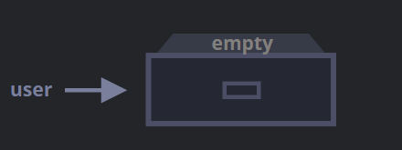
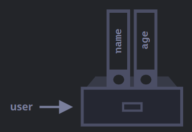
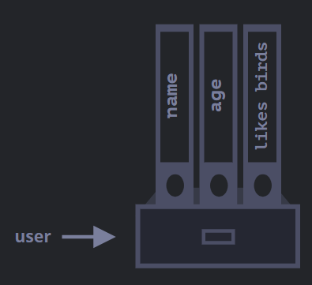

We know that JS have eight data types. Seven of them are called "primitive", because their values contain only a single thing (be it a string or a number of whatever).

In contrast, objects are used to store keyed collections of various data and more complex entities.

An object can be created with curly braces `{…}` with an optional list of _properties_. A property is a “key: value” pair, where `key` is a string (also called a “property name”), and `value` can be anything.

We can imagine an object as a cabinet with signed files. Every piece of data is stored in its file by the key. It’s easy to find a file by its name or add/remove a file.


An empty object ("empty cabinet") can be created using one of two syntaxes:
```js
let user = new Object(); // "object constructor" syntax
let user = {};  // "object literal" syntax
```
  

Usually, the curly braces `{...}` are used. That declaration is called an _object literal_.

## Literal and properties
We can immediately put some properties into `{...}` as “key: value” pairs:
```js
let user = {     // an object
  name: "John",  // by key "name" store value "John"
  age: 30        // by key "age" store value 30
};
```

A property has a key (also known as “name” or “identifier”) before the colon `":"` and a value to the right of it.

In the `user` object, there are two properties:
1. The first property has the name `"name"` and the value `"John"`.
2. The second one has the name `"age"` and the value `30`.

The resulting `user` object can be imagined as a cabinet with two signed files labelled “name” and “age”.

We can add, remove and read files from it at any time. Property values are accessible using the dot notation:
```js
// get property values of the object:
alert(user.name); // John
alert(user.age); // 30
```

To remove a property, we can use the `delete` operator:
```js
delete user.age;
```

We can also use multiword property names, but then they must be quoted:
```js
let user = {
  name: "John",
  age: 30,
  "likes birds": true  // multiword property name must be quoted
};
```


## Square brackets
For multiword properties, the dot access doesn't work:
```js
// this would give a syntax error
user.likes birds = true
```

JS doesn't understand that. It thinks that we address `user.likes`, and then gives error when comes across unexpected `birds`.

The dot requires the key to be a valid variable identifier. That implies: contains no spaces, doesn’t start with a digit and doesn’t include special characters (`$` and `_` are allowed).

There’s an alternative “square bracket notation” that works with any string:
```js
let user = {};

// set
user["likes birds"] = true;

// get
alert(user["likes birds"]); // true

// delete
delete user["likes birds"];
```

Square brackets also provide a way to obtain the property name as the result of any expression – as opposed to a literal string – like from a variable as follows:
```js
let key = "likes birds";

// same as user["likes birds"] = true;
user[key] = true;
```

Here, the variable `key` may be calculated at run-time or depend on the user input and then we use it to access the property.
```js
let user = {
  name: "John",
  age: 30
};

let key = prompt("What do you want to know about the user?", "name");

// access by variable
alert( user[key] ); // John (if enter "name")
```

The dot notation cannot be used in a similar way:
```js
let user = {
  name: "John",
  age: 30
};

let key = "name";
alert( user.key ) // undefined
```

## Computed properties

We can use square brackets in an object literal, when creating an object. That’s called _computed properties_.
```js
let fruit = prompt("Which fruit to buy?", "apple");

let bag = {
  [fruit]: 5, // the name of the property is taken from the variable fruit
};

alert( bag.apple ); // 5 if fruit="apple"
```

The meaning of a computed property is simple: `[fruit]` means that the property name should be taken from `fruit`. So, if a visitor enters `"apple"`, `bag` will become `{apple: 5}`.

We can use more complex expressions inside square brackets:
```js
let fruit = 'apple';
let bag = {
  [fruit + 'Computers']: 5 // bag.appleComputers = 5
};
```

## Property value shorthand

In real code, we often use existing variables as values for property names.
```js
function makeUser(name, age) {
  return {
    name: name,
    age: age,
    // ...other properties
  };
}

let user = makeUser("John", 30);
alert(user.name); // John
```

In the example above, properties have the same names as variables. The use-case of making a property from a variable is so common, that there’s a special _property value shorthand_ to make it shorter.

Instead of `name:name` we can just write `name`, like this:
```js
function makeUser(name, age) {
  return {
    name, // same as name: name
    age,  // same as age: age
    // ...
  };
}
```

We can use both normal properties and shorthands in the same object:
```js
let user = {
	name, // same as name:name
	age: 30
};
```

## Property names limitations

As we know, a variable cannot have a name equal to one of the language-reserved words like "for", "let", "return" etc. But for an object property, there's no such restriction:
```js
// these properties are all right
let obj = {
  for: 1,
  let: 2,
  return: 3
};

alert( obj.for + obj.let + obj.return );  // 6
```

In short, there are no limitations on property names. They can be any strings or symbols. Other types are automatically converted to strings.

For instance, a number `0` becomes a string `"0"` when used as a property key:
```js
let obj = {
  0: "test" // same as "0": "test"
};

// both alerts access the same property (the number 0 is converted to string "0")
alert( obj["0"] ); // test
alert( obj[0] ); // test (same property)
```

There's a minor gotcha with a special property names `__proto__`. We can't set it to a non-object value:
```js
let obj = {};
obj.__proto__ = 5; // assign a number
alert(obj.__proto__); // [object Object] - the value is an object, didn't work as intended
```

As we see from the code, the assignment to a primitive 5 is ignored.

## Property existence test, “in" operator

A notable feature of objects in JavaScript, compared to many other languages, is that it’s possible to access any property. There will be no error if the property doesn’t exist! Reading a non-existing property just returns `undefined`. So we can easily test whether the property exists:
```js
let user = {};

alert( user.noSuchProperty === undefined ); // true means "no such property"
```

There's also a special operator `"in"` for that. Syntax is:
```js
"key" in object
```

For instance:
```js
let user = { name: "John", age: 30 };

alert( "age" in user ); // true, user.age exists
alert( "blabla" in user ); // false, user.blabla doesn't exist
```

Not that on the left side of `in` there must be a _property name_. That's usually a quoted string. If we omit quotes, that means a variable should contain the actual name to be tested.
```js
let user = { age: 30 };

let kay = "age";
alert( key in user ); // true, property "age" exists
```

Why does the `in` operator exist? Isn’t it enough to compare against `undefined`?

Well, most of the time the comparison with `undefined` works fine. But there’s a special case when it fails, but `"in"` works correctly.

It’s when an object property exists, but stores `undefined`:
```js
let obj = {
  test: undefined
};

alert( obj.test ); // it's undefined, so - no such property?

alert( "test" in obj ); // true, the property does exist!
```

In the code above, the property `obj.test` technically exists. So the `in` operator works right. Situations like this happen very rarely, because `undefined` should not be explicitly assigned. We mostly use `null` for “unknown” or “empty” values. So the `in` operator is an exotic guest in the code.

## The “for..in" loop

To walk over all keys of an object, there exists a special form of the loop: `for..in`. Syntax:
```js
for (key in object) {
  // executes the body for each key among object properties
}
```

For instance, let's output all properties of `user`:
```js
let user = {
  name: "John",
  age: 30,
  isAdmin: true
};

for (let key in user) {
  // keys
  alert( key );  // name, age, isAdmin
  // values for the keys
  alert( user[key] ); // John, 30, true
}
```

We could use another variable name here instead of `key`. For instance, `"for (let prope in obj)"` is also widely used.

## Ordered like an object

Are objects ordered? In other words, if we loop over an object, do we get all properties in the same order they were added? Can we rely on this?

The short answer is: “ordered in a special fashion”: integer properties are sorted, others appear in creation order. The details follow. As an example, let's consider an object with the phone codes:
```js
let codes = {
  "49": "Germany",
  "41": "Switzerland",
  "44": "Great Britain",
  // ..,
  "1": "USA"
};

for (let code in codes) {
  alert(code); // 1, 41, 44, 49
}
```

The phone codes go in the ascending sorted order, because they are integers. So we see `1, 41, 44, 49`.

#### Integer properties? What's that?
The "integer property" term here means a string can be converted to-and-from an integer without a change.
So, `"49"` is an integer property name, because when it’s transformed to an integer number and back, it’s still the same. But `"+49"` and `"1.2"` are not:
```js
// Number(...) explicitly converts to a number
// Math.trunc is a built-in function that removes the decimal part
alert( String(Math.trunc(Number("49"))) ); // "49", same, integer property

alert( String(Math.trunc(Number("+49"))) ); // "49", not same "+49" ⇒ not integer property

alert( String(Math.trunc(Number("1.2"))) ); // "1", not same "1.2" ⇒ not integer property
```

…On the other hand, if the keys are non-integer, then they are listed in the creation order, for instance:
```js
let user = {
  name: "John",
  surname: "Smith"
};
user.age = 25; // add one more

// non-integer properties are listed in the creation order
for (let prop in user) {
  alert( prop ); // name, surname, age
}
```

So, to fix the issue with the phone codes, we can “cheat” by making the codes non-integer. Adding a plus `"+"` sign before each code is enough.
Like this:
```js
let codes = {
  "+49": "Germany",
  "+41": "Switzerland",
  "+44": "Great Britain",
  // ..,
  "+1": "USA"
};

for (let code in codes) {
  alert( +code ); // 49, 41, 44, 1
}
```
Now it works as intended.

## Summary

Objects are associative arrays with several special features.

They store properties (key-value pairs), where:
- Property keys must be strings or symbols (usually strings).
- Values can be of any type.

To access a property, we can use:
- The dot notation: `obj.property`.
- Square brackets notation `obj["property"]`. Square brackets allow taking the key from a variable, like `obj[varWithKey]`.

Additional operators:
- To delete a property: `delete obj.prop`.
- To check if a property with the given key exists: `"key" in obj`.
- To iterate over an object: `for (let key in obj)` loop.

What we’ve studied in this chapter is called a “plain object”, or just `Object`.

There are many other kinds of objects in JavaScript:
- `Array` to store ordered data collections,
- `Date` to store the information about the date and time,
- `Error` to store the information about an error.
- …And so on.

They have their special features that we’ll study later. Sometimes people say something like “Array type” or “Date type”, but formally they are not types of their own, but belong to a single “object” data type. And they extend it in various ways.

Objects in JavaScript are very powerful. Here we’ve just scratched the surface of a topic that is really huge. We’ll be closely working with objects and learning more about them in further parts of the tutorial.

References:
[JS Info](https://javascript.info/object)

## Links:
- [Object references and copying](Object%20references%20and%20copying.md)
- [Garbage collection](Garbage%20collection.md)
- [Object methods, `this`](Object%20methods,%20`this`.md)
- [Constructor, operator `new`](Constructor,%20operator%20`new`.md)
- [Optional chaining](Optional%20chaining.md)
- [Symbol type](Symbol%20type.md)
- [Object to primitive conversion](Object%20to%20primitive%20conversion.md)

Tags:
#javascript 