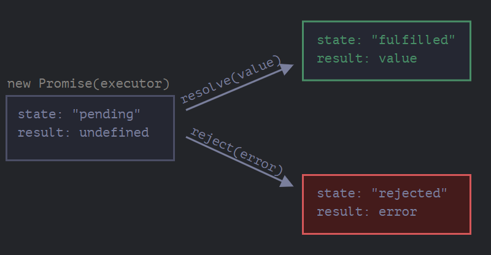
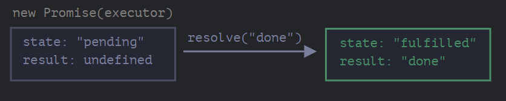
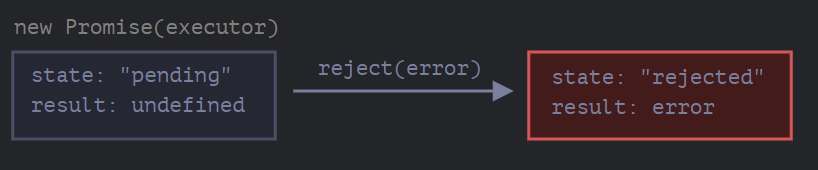

Imagine that you’re a top singer, and fans ask day and night for your upcoming song.

To get some relief, you promise to send it to them when it’s published. You give your fans a list. They can fill in their email addresses, so that when the song becomes available, all subscribed parties instantly receive it. And even if something goes very wrong, say, a fire in the studio, so that you can’t publish the song, they will still be notified.

Everyone is happy: you, because the people don’t crowd you anymore, and fans, because they won’t miss the song.

This is a real-life analogy for things we often have in programming:
1. A “producing code” that does something and takes time. For instance, some code that loads the data over a network. That’s a “singer”.
2. A “consuming code” that wants the result of the “producing code” once it’s ready. Many functions may need that result. These are the “fans”.
3. A _promise_ is a special JavaScript object that links the “producing code” and the “consuming code” together. In terms of our analogy: this is the “subscription list”. The “producing code” takes whatever time it needs to produce the promised result, and the “promise” makes that result available to all of the subscribed code when it’s ready.

The constructor syntax for a promise object is:
```js
let promise = new Promise(function(resolve, reject) {
  // executor (the producing code, "singer")
});
```

The function passed to `new Promise` is called the _executor_. When `new Promise` is created, the executor runs automatically. It contains the producing code which should eventually produce the result. In terms of the analogy above: the executor is the “singer”.

Its arguments `resolve` and `reject` are callbacks provided by JavaScript itself. Our code is only inside the executor.

When the executor obtains the result, be it soon or late, doesn’t matter, it should call one of these callbacks:
- `resolve(value)` — if the job is finished successfully, with result `value`.
- `reject(error)` — if an error has occurred, `error` is the error object.

So to summarize: the executor runs automatically and attempts to perform a job. When the job is finished, it calls `resolve` it if it was successful or `reject` if there was an error.

The `promise` object returned by the `new Promise` constructor has these internal properties:
- `state` — initially `"pending"`, then changes to either `"fulfilled"` when `resolve` is called or `"rejected"` when `reject` is called.
- `result` — initially `undefined`, then changes to `value` when `resolve(value)` is called or `error` when `reject(error)` is called.

So the executor eventually moves `promise` to one of these states:


A simple example:
```js
let promise = new Promise(function(resolve, reject) {
  // the function is executed automatically when the promise is constructed

  // after 1 second signal that the job is done with the result "done"
  setTimeout(() => resolve("done"), 1000);
});
```

We can see two things by running above code:
1. The executor is called automatically and immediately (by `new Promise`).
2. The executor receives two arguments: `resolve` and `reject`. These functions are given to us by JavaScript engine, we don't need to create them, just call one of them when ready.

After one second of "processing", the executor calls `resolve("done")` to produce the result. This changes the state of the `promise` object:


And now an example of the executor rejecting the promise with an error:
```js
let promise = new Promise(function(resolve, reject) {
  // after 1 second signal that the job is finished with an error
  setTimeout(() => reject(new Error("Whoops!")), 1000);
});
```

The call to `reject(...)` moves the promise object to `"rejected"` state.


To summarize, the executor should perform a job and then call `resolve` or `reject` to change the state of the corresponding promise object. 

A promise that is either resolved or rejected is called "settled", initially it is a "pending" promise.

#### There can be only a single result or an error
The executor should call only one `resolve` or one `reject`.  Any state change is final. All further calls of `resolve` and `reject` are ignored:
```js
let promise = new Promise(function(resolve, reject) {
  resolve("done");

  reject(new Error("…")); // ignored
  setTimeout(() => resolve("…")); // ignored
});
```

Also, `resolve/reject` expect only one argument (or none) and will ignore additional arguments.

#### Reject with `Error` objects
In case something goes wrong, the executor should call `reject`. That can be done with any type of argument (just like `resolve`). But it is recommended to use `Error` objects (or objects that inherit from `Error`).

#### The `state` and `result` are internal
The properties `state` and `result` of the Promise object are internal. We can't directly access them. We can use the methods `.then`/`.catch`/`.finally` for that.

## Consumers: then, catch

A Promise object serves as a link between the executor (the “producing code” or “singer”) and the consuming functions (the “fans”), which will receive the result or error. Consuming functions can be registered (subscribed) using the methods `.then` and `.catch`.

### then

```js
promise.then(
  function(result) { /* handle a successful result */ },
  function(error) { /* handle an error */ }
);
```

The first argument of `.then` is a function that runs when the promise is resolved and receives the result. The second argument of `.then` is a function that runs when the promise is rejected and receives the error. 

Instance of  a successfully resolved promise:
```js
let promise = new Promise(function(resolve, reject) {
  setTimeout(() => resolve("done!"), 1000);
});

// resolve runs the first function in .then
promise.then(
  result => alert(result), // shows "done!" after 1 second
  error => alert(error) // doesn't run
);
```

First function was executed.

In case of rejection, the second one will be executed:
```js
let promise = new Promise(function(resolve, reject) {
  setTimeout(() => reject(new Error("Whoops!")), 1000);
});

// reject runs the second function in .then
promise.then(
  result => alert(result), // doesn't run
  error => alert(error) // shows "Error: Whoops!" after 1 second
);
```

If we're interested only in successful completions, then we can provide only one function argument to `.then`:
```js
let promise = new Promise(resolve => {
  setTimeout(() => resolve("done!"), 1000);
});

promise.then(alert); // shows "done!" after 1 second
```

## catch

If we're interested only in errors, then we can use `null` as the first argument: `.then(null, errorHandlingFunction)` or we can use `.catch(errorHandlingFunction)`, which is exactly the same:
```js
let promise = new Promise((resolve, reject) => {
  setTimeout(() => reject(new Error("Whoops!")), 1000);
});

// .catch(f) is the same as promise.then(null, f)
promise.catch(alert); // shows "Error: Whoops!" after 1 second
```

The call `.catch(f)` is complete analog of `.then(null, f)`. `null` here means that there is no function for successful completion of promise.

## Cleanup: finally

Just like there’s a `finally` clause in a regular `try {...} catch {...}`, there’s `finally` in promises. The call `.finally(f)` is similar to `.then(f, f)` in the sense that `f` runs always, when the promise is settled: be it resolve or reject. The idea of `finally` is to set up a handler for performing cleanup/finalizing after the previous operations are complete.

The code may look like this:
```js
new Promise((resolve, reject) => {
  /* do something that takes time, and then call resolve or maybe reject */
})
  // runs when the promise is settled, doesn't matter successfully or not
  .finally(() => stop loading indicator)
  // so the loading indicator is always stopped before we go on
  .then(result => show result, err => show error)
```

Note that `finally(f)` isn't exactly an alias of `then(f, f)` though.

There are important differences:
1. A `finally` handler has no arguments. In `finally` we don’t know whether the promise is successful or not. That’s all right, as our task is usually to perform “general” finalizing procedures. Take a loot at the example above: the `finally` handler has no arguments, and the promise outcome is handled by the next handler.
2. A `finally` handler "passes through" the result or error to the next suitable handler. 

Passing result to `then`:
```js
new Promise((resolve, reject) => {
  setTimeout(() => resolve("value"), 2000);
})
  .finally(() => alert("Promise ready")) // triggers first
  .then(result => alert(result)); // <-- .then shows "value"
```

Passing result to `catch`:
```js
new Promise((resolve, reject) => {
  throw new Error("error");
})
  .finally(() => alert("Promise ready")) // triggers first
  .catch(err => alert(err));  // <-- .catch shows the error
```

3. A `finally` handler also shouldn't return anything. If it does, the returned value is ignored. Only exception to this rule is when a `finally` handler throws an error. Then this error goes to the next handler.

To summarize:
- A `finally` handler doesn’t get the outcome of the previous handler (it has no arguments). This outcome is passed through instead, to the next suitable handler.
- If a `finally` handler returns something, it’s ignored.
- When `finally` throws an error, then the execution goes to the nearest error handler.

## Example: loadScript

We've got the `loadScript` function for loading a script from [Callbacks](Callbacks.md).
```js
function loadScript(src, callback) {
  let script = document.createElement('script');
  script.src = src;

  script.onload = () => callback(null, script);
  script.onerror = () => callback(new Error(`Script load error for ${src}`));

  document.head.append(script);
}
```

Let's rewrite is using Promises:
```js
function loadScript(src) {
  return new Promise(function(resolve, reject) {
    let script = document.createElement('script');
    script.src = src;

    script.onload = () => resolve(script);
    script.onerror = () => reject(new Error(`Script load error for ${src}`));

    document.head.append(script);
  });
}
```

Usage:
```js
let promise = loadScript("https://cdnjs.cloudflare.com/ajax/libs/lodash.js/4.17.11/lodash.js");

promise.then(
  script => alert(`${script.src} is loaded!`),
  error => alert(`Error: ${error.message}`)
);

promise.then(script => alert('Another handler...'));
```

We can immediately see a few benefits over the callback-based pattern:

| Promises                                                                                                                                                 | Callbacks                                                                                                                                                                                |
| -------------------------------------------------------------------------------------------------------------------------------------------------------- | ---------------------------------------------------------------------------------------------------------------------------------------------------------------------------------------- |
| Promises allow us to do things in the natural order. First, we run `loadScript(script)`, and `.then` we write what to do with the result.                | We must have a `callback` function at our disposal when calling `loadScript(script, callback)`. In other words, we must know what to do with the result _before_ `loadScript` is called. |
| We can call `.then` on a Promise as many times as we want. Each time, we’re adding a new “fan”, a new subscribing function, to the “subscription list”.  | There can be only one callback.                                                                                                                                                          |

So promises give us better code flow and flexibility.

## Summary

A promise is something which returns a result or an error after sometime and different parts of our code (consumers) can subscribe for that result (either success or error).

Basic syntax:
```js
let promise = new Promise(function(resolve, reject) {
  // executor (the producing code, "singer")
});
```

The function `function(resolve, reject)` is called the executor. It is run automatically when a new function is created. `resolve` runs on success and `reject` runs on error are both provided by JavaScript engine. A promise can only run one of them, not both. If you have called either `resolve` or `reject` all subsequent calls will be ignored.

You can consume promises using `then`, `catch` and `finally`

`then` can do it all. Read result on success and even on error. 
```js
promise.then(
  function(result) { /* handle a successful result */ },
  function(error) { /* handle an error */ }
);
```

If you only want to read errors you can either omit the successful result function from `then` or use  a `catch`.
```js
let promise = new Promise((resolve, reject) => {
  setTimeout(() => reject(new Error("Whoops!")), 1000);
});

// .catch(f) is the same as promise.then(null, f)
promise.catch(alert); // shows "Error: Whoops!" after 1 second
```

`finally` is used for clean-up, runs whether there is a error or there is a successful run. It doesn't take any arguments except in case of errors. It just take the result of promise and pass it down to appropriate handler.

## Sources
[JavaScript info](https://javascript.info/promise-basics)

## Tags:
#javascript 