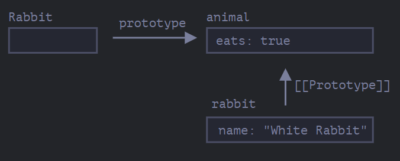
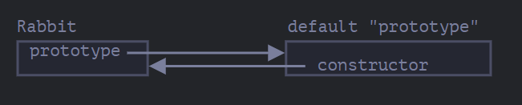
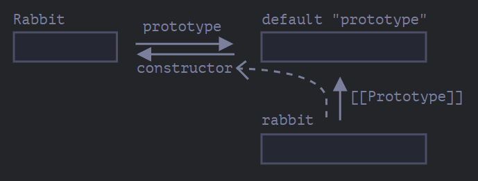

Remember, new objects can be created with a constructor function, like `new F()`.

If `F.prototype` is an object, then the `new` operator uses it to set `[[Prototype]]` for the new object.

### Please note:
JavaScript had prototypal inheritance from the beginning. It was one of the core features of the language.

But in the old times, there was no direct access to it. The only thing that worked reliably was a `"prototype"` property of the constructor function, described in this chapter. So there are many scripts that still use it.


Please note that `F.prototype` here means a regular property named `"prototype"` on `F`. It sounds something similar to the term “prototype”, but here we really mean a regular property with this name.

It just means that when you create an object using `new F()`, JavaScript automatically sets the new object's internal `[[Prototype]]` (its prototype chain parent ) to whatever `F.prototype` points to.

Here’s the example:

```javascript
let animal = {
  eats: true
};

function Rabbit(name) {
  this.name = name;
}

Rabbit.prototype = animal;

let rabbit = new Rabbit("White Rabbit"); //  rabbit.__proto__ == animal

alert( rabbit.eats ); // true
```

Setting `Rabbit.prototype = animal` literally states the following: “When a `new Rabbit` is created, assign its `[[Prototype]]` to `animal` ”.

That’s the resulting picture:


On the picture, `"prototype"` is a horizontal arrow, meaning a regular property, and `[[Prototype]]` is vertical, meaning the inheritance of `rabbit` from `animal`.

### `F.prototype` only used at `new F` time
`F.prototype` property is only used when `new F` is called, it assigns `[[Prototype]]` of the new object.

If, after the creation, `F.prototype` property changes (`F.prototype = <another object>`), then new objects created by `new F` will have another object as `[[Prototype]]`, but already existing objects keep the old one.

### `F.prototype` VS `[[Prototype]]`


|                 | What it is                              |
| --------------- | --------------------------------------- |
| `F.prototype`   | A regular property on the function      |
| `[[Prototype]]` | The internal link on the created object |

`F.prototype` is just the _blueprint_ used at the moment `new F()` is called. After that, changes to `F.prototype` don't affect already-created objects.

## Default F.prototype, constructor property

Every function has the `"prototype"` property even if we don’t supply it.

The default `"prototype"` is an object with the only property `constructor` that points back to the function itself.

Like this:

```javascript
function Rabbit() {}

/* default prototype
Rabbit.prototype = { constructor: Rabbit };
*/
```



We can check it:

```javascript
function Rabbit() {}
// by default:
// Rabbit.prototype = { constructor: Rabbit }

alert( Rabbit.prototype.constructor == Rabbit ); // true
```

Naturally, if we do nothing, the `constructor` property is available to all rabbits through `[[Prototype]]`:

```javascript
function Rabbit() {}
// by default:
// Rabbit.prototype = { constructor: Rabbit }

let rabbit = new Rabbit(); // inherits from {constructor: Rabbit}

alert(rabbit.constructor == Rabbit); // true (from prototype)
```



This means any object created via `new Rabbit()` can access `rabbit.constructor`, which points back to `Rabbit`. We can use this to create another object of the same "type" even if we don't know the original constructor.

Like here:

```javascript
function Rabbit(name) {
  this.name = name;
  alert(name);
}

let rabbit = new Rabbit("White Rabbit");

let rabbit2 = new rabbit.constructor("Black Rabbit");
```

That’s handy when we have an object, don’t know which constructor was used for it (e.g. it comes from a 3rd party library), and we need to create another one of the same kind.

But probably the most important thing about `"constructor"` is that…

**…JavaScript itself does not ensure the right `"constructor"` value.**

Yes, it exists in the default `"prototype"` for functions, but that’s all. What happens with it later – is totally on us.

In particular, if we replace the default prototype as a whole, then there will be no `"constructor"` in it.

For instance:

```javascript
function Rabbit() {}
Rabbit.prototype = {
  jumps: true
};

let rabbit = new Rabbit();
alert(rabbit.constructor === Rabbit); // false
```

So, to keep the right `"constructor"` we can choose to add/remove properties to the default `"prototype"` instead of overwriting it as a whole:

```javascript
function Rabbit() {}

// Not overwrite Rabbit.prototype totally
// just add to it
Rabbit.prototype.jumps = true
// the default Rabbit.prototype.constructor is preserved
```

Or, alternatively, recreate the `constructor` property manually:

```javascript
Rabbit.prototype = {
  jumps: true,
  constructor: Rabbit
};

// now constructor is also correct, because we added it
```

## Summary

In this chapter we briefly described the way of setting a `[[Prototype]]` for objects created via a constructor function. Later we’ll see more advanced programming patterns that rely on it.

Everything is quite simple, just a few notes to make things clear:

- The `F.prototype` property (don’t mistake it for `[[Prototype]]`) sets `[[Prototype]]` of new objects when `new F()` is called.
- The value of `F.prototype` should be either an object or `null`: other values won’t work.
- The `"prototype"` property only has such a special effect when set on a constructor function, and invoked with `new`.

On regular objects the `prototype` is nothing special:

```javascript
let user = {
  name: "John",
  prototype: "Bla-bla" // no magic at all
};
```

By default all functions have `F.prototype = { constructor: F }`, so we can get the constructor of an object by accessing its `"constructor"` property.

## Questions

### Ques - 1) Changing "prototype"
In the code below we create `new Rabbit`, and then try to modify its prototype.

In the start, we have this code:
```js
function Rabbit() {}
Rabbit.prototype = {
  eats: true
};

let rabbit = new Rabbit();

alert( rabbit.eats ); // true
```

1. We added one more string (emphasized). What will `alert` show now?
```js
function Rabbit() {}
Rabbit.prototype = {
  eats: true
};

let rabbit = new Rabbit();

Rabbit.prototype = {};

alert( rabbit.eats ); // ?
```

2. ... And if the code is like this (replaced one line)?
```js
function Rabbit() {}
Rabbit.prototype = {
  eats: true
};

let rabbit = new Rabbit();

Rabbit.prototype.eats = false;

alert( rabbit.eats ); // ?
```

3. And like this (replaced one line)?
```js
function Rabbit() {}
Rabbit.prototype = {
  eats: true
};

let rabbit = new Rabbit();

delete rabbit.eats;

alert( rabbit.eats ); // ?
```

4. The last variant:
```js
function Rabbit() {}
Rabbit.prototype = {
  eats: true
};

let rabbit = new Rabbit();

delete Rabbit.prototype.eats;

alert( rabbit.eats ); // ?
```

### Ans:
1. `true`.
    
    The assignment to `Rabbit.prototype` sets up `[[Prototype]]` for new objects, but it does not affect the existing ones.
    
2. `false`.
    
    Objects are assigned by reference. The object from `Rabbit.prototype` is not duplicated, it’s still a single object referenced both by `Rabbit.prototype` and by the `[[Prototype]]` of `rabbit`.
    
    So when we change its content through one reference, it is visible through the other one.
    
3. `true`.
    
    All `delete` operations are applied directly to the object. Here `delete rabbit.eats` tries to remove `eats` property from `rabbit`, but it doesn’t have it. So the operation won’t have any effect.
    
4. `undefined`.
    
    The property `eats` is deleted from the prototype, it doesn’t exist any more.

### Ques - 2) Create an object with the same constructor
Imagine, we have an arbitrary object `obj`, created by a constructor function – we don’t know which one, but we’d like to create a new object using it.

Can we do it like that?

```javascript
let obj2 = new obj.constructor();
```

Give an example of a constructor function for `obj` which lets such code work right. And an example that makes it work wrong.

### Ans:
We can use such approach if we are sure that `"constructor"` property has the correct value.

For instance, if we don’t touch the default `"prototype"`, then this code works for sure:

```javascript
function User(name) {
  this.name = name;
}

let user = new User('John');
let user2 = new user.constructor('Pete');

alert( user2.name ); // Pete (worked!)
```

It worked, because `User.prototype.constructor == User`.

…But if someone, so to speak, overwrites `User.prototype` and forgets to recreate `constructor` to reference `User`, then it would fail.

For instance:

```javascript
function User(name) {
  this.name = name;
}
User.prototype = {}; // (*)

let user = new User('John');
let user2 = new user.constructor('Pete');

alert( user2.name ); // undefined
```

Why `user2.name` is `undefined`?

Here’s how `new user.constructor('Pete')` works:

1. First, it looks for `constructor` in `user`. Nothing.
2. Then it follows the prototype chain. The prototype of `user` is `User.prototype`, and it also has no `constructor` (because we “forgot” to set it right!).
3. Going further up the chain, `User.prototype` is a plain object, its prototype is the built-in `Object.prototype`.
4. Finally, for the built-in `Object.prototype`, there’s a built-in `Object.prototype.constructor == Object`. So it is used.

Finally, at the end, we have `let user2 = new Object('Pete')`.

Probably, that’s not what we want. We’d like to create `new User`, not `new Object`. That’s the outcome of the missing `constructor`.

(Just in case you’re curious, the `new Object(...)` call converts its argument to an object. That’s a theoretical thing, in practice no one calls `new Object` with a value, and generally we don’t use `new Object` to make objects at all).