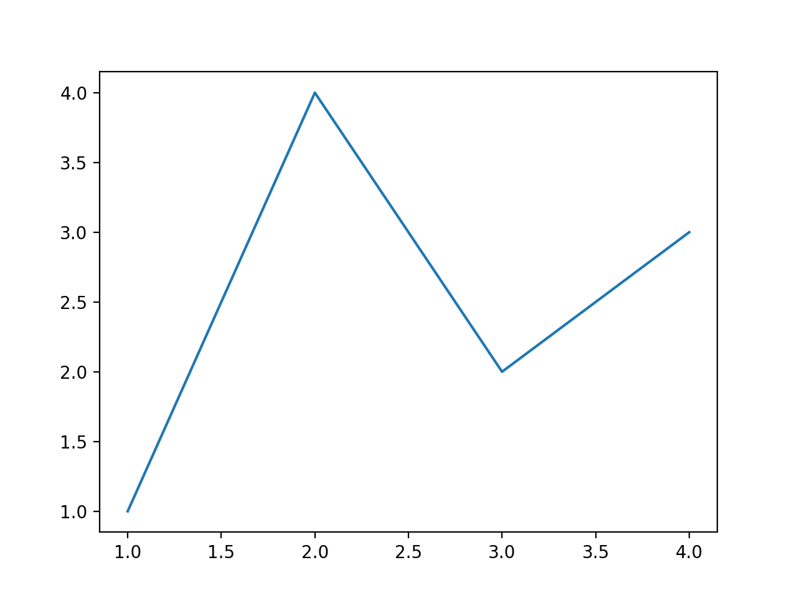
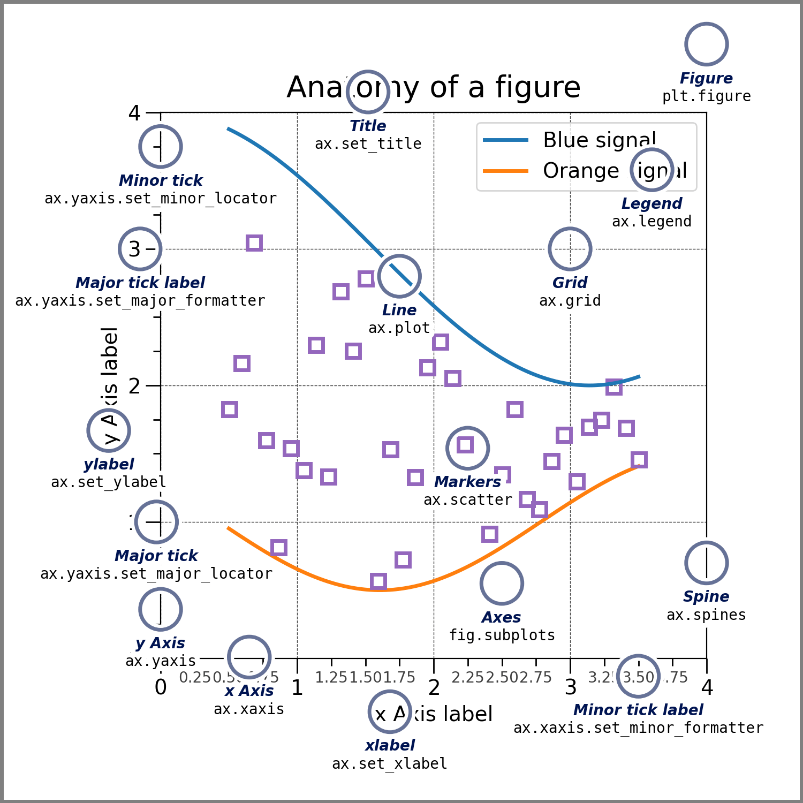

## Installation

```python
import matplotlib.pyplot as plt
import numpy as np
```

## A simple example

Matplotlib graphs your data on [`Figure`](https://matplotlib.org/stable/api/_as_gen/matplotlib.figure.Figure.html#matplotlib.figure.Figure "matplotlib.figure.Figure")s (e.g., windows, Jupyter widgets, etc.), each of which can contain one or more [`Axes`](https://matplotlib.org/stable/api/_as_gen/matplotlib.axes.Axes.html#matplotlib.axes.Axes "matplotlib.axes.Axes"), an area where points can be specified in terms of x-y coordinates (or theta-r in a polar plot, x-y-z in a 3D plot, etc.). The simplest way of creating a Figure with an Axes is using [`pyplot.subplots`](https://matplotlib.org/stable/api/_as_gen/matplotlib.pyplot.subplots.html#matplotlib.pyplot.subplots "matplotlib.pyplot.subplots"). We can then use [`Axes.plot`](https://matplotlib.org/stable/api/_as_gen/matplotlib.axes.Axes.plot.html#matplotlib.axes.Axes.plot "matplotlib.axes.Axes.plot") to draw some data on the Axes, and [`show`](https://matplotlib.org/stable/api/_as_gen/matplotlib.pyplot.show.html#matplotlib.pyplot.show "matplotlib.pyplot.show") to display the figure:

```python
fig, ax = plt.subplots()             # Create a figure containing a single Axes.
ax.plot([1, 2, 3, 4], [1, 4, 2, 3])  # Plot some data on the Axes.
plt.show()                           # Show the figure.
```




## Parts of a figure

Here are the components of a Matplotlib Figure.



### [`Figure`](https://matplotlib.org/stable/api/_as_gen/matplotlib.figure.Figure.html#matplotlib.figure.Figure "matplotlib.figure.Figure")

The **whole** figure. The Figure keeps track of all the child [`Axes`](https://matplotlib.org/stable/api/_as_gen/matplotlib.axes.Axes.html#matplotlib.axes.Axes "matplotlib.axes.Axes"), a group of 'special' Artists (titles, figure legends, colorbars, etc.), and even nested subfigures.

Typically, you'll create a new Figure through one of the following functions:

```python
fig = plt.figure()             # an empty figure with no Axes
fig, ax = plt.subplots()       # a figure with a single Axes
fig, axs = plt.subplots(2, 2)  # a figure with a 2x2 grid of Axes
# a figure with one Axes on the left, and two on the right:
fig, axs = plt.subplot_mosaic([['left', 'right_top'],
                               ['left', 'right_bottom']])
```

What each of the above command show:
```python
fig, ax = plt.subplots()   
```


```python
flg, axs = plt.subplots(2, 2)
```


```python
fig, axs = plt.subplot_mosaic([['left', 'right_top'],
								['left', 'right_bottom']])
```


[`subplots()`](https://matplotlib.org/stable/api/_as_gen/matplotlib.pyplot.subplots.html#matplotlib.pyplot.subplots "matplotlib.pyplot.subplots") and [`subplot_mosaic`](https://matplotlib.org/stable/api/_as_gen/matplotlib.pyplot.subplot_mosaic.html#matplotlib.pyplot.subplot_mosaic "matplotlib.pyplot.subplot_mosaic") are convenience functions that additionally create Axes objects inside the Figure, but you can also manually add Axes later on.

For more on Figures, including panning and zooming, see [Introduction to Figures](https://matplotlib.org/stable/users/explain/figure/figure_intro.html#figure-intro).

### [`Axes`](https://matplotlib.org/stable/api/_as_gen/matplotlib.axes.Axes.html#matplotlib.axes.Axes "matplotlib.axes.Axes")

An Axes is an Artist attached to a Figure that contains a region for plotting data, and usually includes two (or three in the case of 3D) `Axis` objects that provides ticks and tick labels to provide scales for the data in the Axes. Each Axes also has a title (set via `set_title()`), and x-label (set via `set_xlabel()`), and a y-label set via `set_ylabel()`).

An Axes is an individual plotting area (or subplot) contained inside the figure where data actually gets drawn.

The `Axes` methods are the primary interface for configuring most parts of your plot (adding data, controlling axis scales and limits, adding labels etc.).

### [`Axis`](https://matplotlib.org/stable/api/axis_api.html#matplotlib.axis.Axis "matplotlib.axis.Axis")

These objects set the scale and limits and generate ticks (the marks on the Axis) and tick labels (strings labelling the ticks). The location of the ticks is determined by a [`Locator`](https://matplotlib.org/stable/api/ticker_api.html#matplotlib.ticker.Locator "matplotlib.ticker.Locator") object and the ticklabel strings are formatted by a [`Formatter`](https://matplotlib.org/stable/api/ticker_api.html#matplotlib.ticker.Formatter "matplotlib.ticker.Formatter"). The combination of the correct [`Locator`](https://matplotlib.org/stable/api/ticker_api.html#matplotlib.ticker.Locator "matplotlib.ticker.Locator") and [`Formatter`](https://matplotlib.org/stable/api/ticker_api.html#matplotlib.ticker.Formatter "matplotlib.ticker.Formatter") gives very fine control over the tick locations and labels.

### [`Artist`](https://matplotlib.org/stable/api/artist_api.html#matplotlib.artist.Artist "matplotlib.artist.Artist")

Basically, everything visible on the Figure is an Artist (even [`Figure`](https://matplotlib.org/stable/api/_as_gen/matplotlib.figure.Figure.html#matplotlib.figure.Figure "matplotlib.figure.Figure"), [`Axes`](https://matplotlib.org/stable/api/_as_gen/matplotlib.axes.Axes.html#matplotlib.axes.Axes "matplotlib.axes.Axes"), and [`Axis`](https://matplotlib.org/stable/api/axis_api.html#matplotlib.axis.Axis "matplotlib.axis.Axis") objects). This includes [`Text`](https://matplotlib.org/stable/api/text_api.html#matplotlib.text.Text "matplotlib.text.Text") objects, [`Line2D`](https://matplotlib.org/stable/api/_as_gen/matplotlib.lines.Line2D.html#matplotlib.lines.Line2D "matplotlib.lines.Line2D") objects, [`collections`](https://matplotlib.org/stable/api/collections_api.html#module-matplotlib.collections "matplotlib.collections") objects, [`Patch`](https://matplotlib.org/stable/api/_as_gen/matplotlib.patches.Patch.html#matplotlib.patches.Patch "matplotlib.patches.Patch") objects, etc. When the Figure is rendered, all of the Artists are drawn to the **canvas**. Most Artists are tied to an Axes; such an Artist cannot be shared by multiple Axes, or moved from one to another.


## Types of inputs to plotting functions

Plotting functions expect [`numpy.array`](https://numpy.org/doc/stable/reference/generated/numpy.array.html#numpy.array "(in NumPy v2.4)") or [`numpy.ma.masked_array`](https://numpy.org/doc/stable/reference/generated/numpy.ma.masked_array.html#numpy.ma.masked_array "(in NumPy v2.4)") as input, or objects that can be passed to [`numpy.asarray`](https://numpy.org/doc/stable/reference/generated/numpy.asarray.html#numpy.asarray "(in NumPy v2.4)"). Classes that are similar to arrays ('array-like') such as [`pandas`](https://pandas.pydata.org/pandas-docs/stable/index.html#module-pandas "(in pandas v3.0.2)") data objects and [`numpy.matrix`](https://numpy.org/doc/stable/reference/generated/numpy.matrix.html#numpy.matrix "(in NumPy v2.4)") may not work as intended. Common convention is to convert these to [`numpy.array`](https://numpy.org/doc/stable/reference/generated/numpy.array.html#numpy.array "(in NumPy v2.4)") objects prior to plotting. For example, to convert a [`numpy.matrix`](https://numpy.org/doc/stable/reference/generated/numpy.matrix.html#numpy.matrix "(in NumPy v2.4)")

```python
b = np.matrix([[1, 2], [3, 4]])
b_asarray = np.asarray(b)
```

