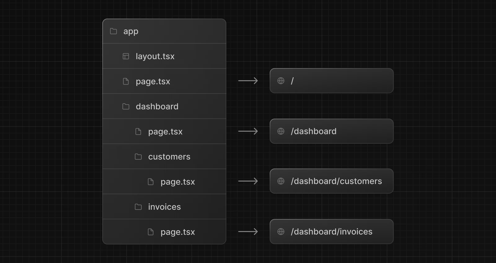
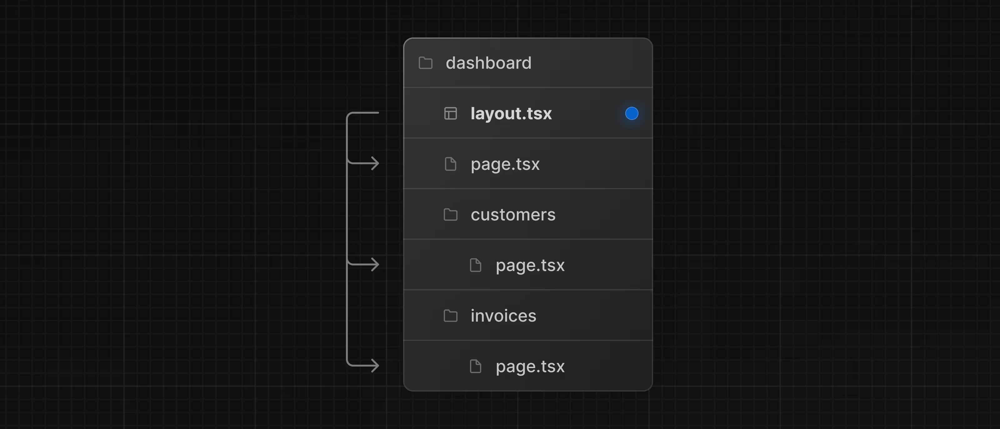
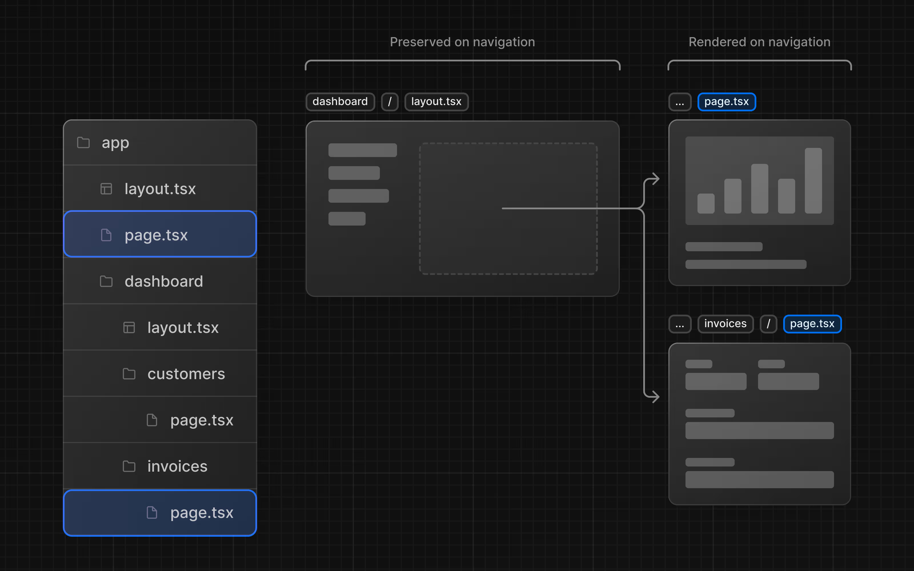

Next.js uses folder based routing, meaning that the folder you create under your `app` folder will be used as route in your application. You can create nested routes also.

If you want to display something for a route, you have to create a `page.jsx` or `page.tsx` file inside your folder, this file will act as the component that will be rendered when you load that route.

\
\
**Layouts:**
If you wish to create some sort of navigation or UI that is shared between multiple pages, you can use a `layout.tsx` file. Simply create `layout.tsx` under any route where you want to have a navigation. `layout` receives a `children` prop. This child can be either a page or another layout.

\
\
One benefit of using layouts in Next.js is that on navigation, only the page components update while the layout won't re-render. This is called [partial rendering](https://nextjs.org/docs/app/building-your-application/routing/linking-and-navigating#4-partial-rendering) which preserves client-side React state in the layout when transitioning between pages.

\
\
**Root Layout:**
`layout` file which exists under app (`/`) only not to any subfolder or routes. It is required in every Next.js application. Any UI you add to the root layout will be shared across **all** pages in your application. You can use the root layout to modify your `<html>` and `<body>` tags, and add metadata.

**Route group:**
If you want to create a new subfolder (say you don't want to implement a few things like `loading.tsx` in the nested routes, they may have their own) without creating a new route, you can use `()`, you can write your folder name here, and it will not create a new route just a subfolder.

\

Route groups allow you to organize files into logical groups without affecting the URL path structure. When you create a new folder using parantheses `()`, the name won't be included in the URL path. So `/dashboard/(overview)/page.tsx` becomes `/dashboard`.

