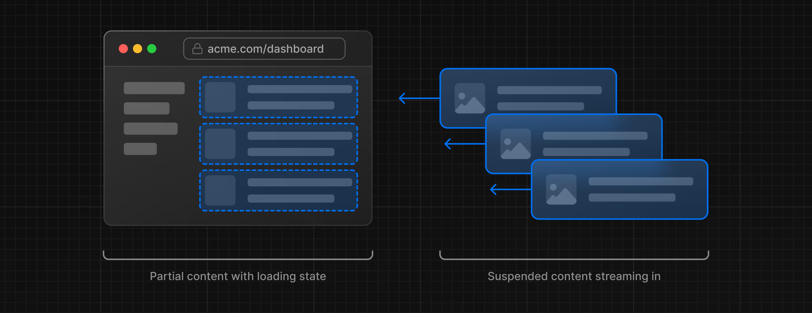

#### What is streaming?
Streaming is a data transfer technique that allows you to break down a route into smaller "chunks" and progressively stream them from the server to the client as they become ready. It means that components will only render when they are ready.
\
\
By streaming, you can prevent slow data requests from blocking your whole page. This allows the user to see and interact with parts of the page without waiting for all the data to load before any UI can be shown to the user.

Streaming works well with React's component model, as each component can be considered a _chunk_.

There are two ways you implement streaming in Next.js:

1. At the page level, with the `loading.tsx` file (which creates `<Suspense>` for you).
2. At the component level, with `<Suspense>` for more granular control.

##### Streaming a whole page with `loading.tsx`
If you were to create a `loading.tsx` file, the component that you render inside it will be shown until current routes `page.tsx`  or any nested route file's `page.tsx` fetch data. As soon as they are done fetching data `loading.tsx` will stop doing its work and show the intended data.

Example:
```tsx
export default function Loading() {
  return <div>Loading...</div>;
}
```
A few things are happening here:

1. `loading.tsx` is a special Next.js file built on top of React Suspense. It allows you to create fallback UI to show as a replacement while page content loads.
2. If there is any static content inside `layout.tsx` the user can still interact with that as it is shown immediately.
3. The user doesn't have to wait for the page to finish loading before navigating away (this is called interruptible navigation).

We can further improve the User experience by showing a **loading skeleton** until data loads. A loading skeleton is a simplified version of the UI.

##### Streaming a component

So far, you're streaming a whole page. But you can also be more granular and stream specific components using React Suspense.

Suspense allows you to defer rendering parts of your application until some condition is met (e.g. data is loaded). You can wrap your dynamic components in Suspense. Then, pass it a fallback component to show while the dynamic component loads.

How to do it?
Move the component that you want to defer into its own component, and show some fallback while it loads.

```tsx
<Suspense fallback={<RevenueChartSkeleton />}> 
	<RevenueChart /> 
</Suspense>
```

##### Deciding where to place your Suspense boundaries
Where you place your Suspense boundaries will depend on a few things:

1. How you want the user to experience the page as it streams.
2. What content you want to prioritize.
3. If the components rely on data fetching.
