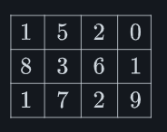
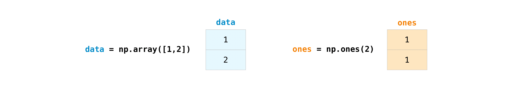
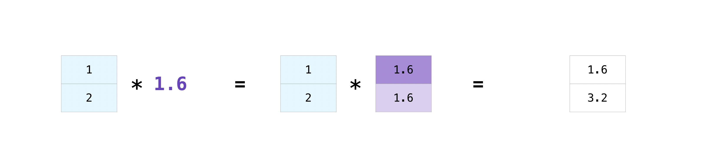

## Installation
```
pip install numpy
```

## How to import NumPy
```bash
import numpy as np
```

## What is an “array"
An array is a structure for storing and retrieving data. We might visualize a "one-dimensional" array like a list:
/


A two-dimensional array would be like a table:
/



A three-dimensional array would be like a set of tables, perhaps stacked as though they were printed on separate pages. In `NumPy`, this idea is generalized to an arbitrary number of dimensions, and so the fundamental array is called `ndarray`: it represents an "N-dimensional array".

Most NumPy arrays have some restrictions. For instance:
- All elements of the array must be of the same type of data.
- Once created, the total size of the array can’t change.
- The shape must be “rectangular”, not “jagged”; e.g., each row of a two-dimensional array must have the same number of columns.

	`>>>` refers to python code. If there is no prefix, it means output of the above command.

## Array fundamentals
One way to initialize an array is using a Python sequence, such as a list. For example:
```python
>>> a = np.array([1, 2, 3, 4, 5, 6])
>>> a
array([1, 2, 3, 4, 5, 6])
```
We can access array elements using bracket notation `[idx]`

Like the original list, the array is mutable.
```python
>>> a[0] = 10
array([10,  2,  3,  4,  5,  6])
```

Also like the original list, Python slice notation can be used for indexing.
```python
>>> a[:3]
array([10, 2, 3])
```

One major difference is that slice indexing of a list copies the elements into a new list, but slicing an array returns a `view`: an object that refers to the data in the original array. The original array can be mutated using the view.
```python
>>> b = a[3:]
>>> b
array([4, 5, 6])
b[0] = 40
a
array([10, 2, 3, 40, 5, 6])
```

Two- and higher-dimensional arrays can be initialized from nested Python sequences:
```python
>>> a = np.array([[1, 2, 3, 4], [5, 6, 7, 8], [9, 10, 11, 12]])
>>> a
array([[ 1,  2,  3,  4],
       [ 5,  6,  7,  8],
       [ 9, 10, 11, 12]])
```

## Array Attributes
The number of dimensions of an array is contained in the `ndim` attribute.
```python
>>> a.ndim
2
```

The shape of an array is a tuple of non-negative integers that specify the number of elements along each dimension.
```python
>>> a.shape
(3, 4)
>>> len(a.shape) == a.ndim
True
```

The fixed, total number of elements in array is contained in the `size` attribute.
```python
>>> a.size
12
>>> import math
>>> a.size == math.prod(a.shape)
True
```

Arrays are typically "homogeneous", meaning that they contain elements of only one "data type". The data type is recorded in the `dtype` attribute.
```python
>>> a.dtype
dtype('int64') # 'int' for integer, '64' for 64-bit
```

## How to create a basic array

Besides creating an array from sequence of elements, you can easily create an array filled with `0`'s:
```python
>>> np.zeroes(2)
array([0., 0.])
```

Or an array filled with `1`'s:
```python
>>> np.ones(2)
array([1., 1.])
```

Or even an empty array! The function `empty` creates an array whose initial content is random and depends on the state of the memory. The reason to use `empty` over `zeroes` is speed.
```python
>>> # Create an empty array with 2 elements
>>> np.empty(2) 
array([3.14, 42. ]) # may vary
```

You can create an array with a range of elements:
```python
>>> np.arange(4) # Starts elements from zero
array([0, 1, 2, 3])
```

And even an array that contains a range of evenly spaced intervals. To do this, you will specify the **first number**, **last number**, and the **step size**.
```python
>>> np.arange(2, 9, 2)
array([2, 4, 6, 8])
```

You can also use `np.linspace` to create an array with values that are spaced linearly in a specified interval:
```python
>>> np.linspace(0, 10, num=5)
array([0., 2.5, 5., 7.5, 10.])
```

**Specifying your data type**
While the default data type is floating point ( `np.float64` ), you can explicitly specify which data type you want using the `dtype` keyword.
```python
>>> x = np.ones(2, dtype=np.int64)
>>> x
array([1, 1])
```

## Adding, removing, and sorting elements
Sorting an array is simple with `np.sort()`. You can specify the axis, kind, and order when you call the function.

If you start with this array:
```python
>>> arr = np.array([2, 1, 5, 3, 7, 4, 6, 8])
```
You can quickly sort the numbers in ascending order with:
```python
>>> np.sort(arr)
array([1, 2, 3, 4, 5, 6, 7, 8])
```

In addition to sort, which returns a sorted copy of an array, you can use:
- `argsort`, which is an indirect sort along a specified axis,
- `lexsort`, which is an indirect stable sort on multiple keys,
- `searchsorted`, which will find elements in a sorted array, and
- `partition`, which is a partial sort.

If you start with these arrays:
```python
>>> a = np.array([1, 2, 3, 4])
>>> b = np.array([5, 6, 7, 8])
```
You can concatenate them with `np.concatenate()`.
```python
>>> np.concatenate((a, b))
array([1, 2, 3, 4, 5, 6, 7, 8])
```

Or, if you start with these arrays:
```python
>>> x = np.array([[1, 2], [3, 4]])
>>> y = np.array([[5, 6]])
```

You can concatenate them with:
```python
>>> np.concatenate((x, y), axis=0)
array([[1, 2],
       [3, 4],
       [5, 6]])
```
In order to remove elements from an array, it's simple to use indexing to select the elements that you want to keep.

## How do you know the shape and size of an array?
`ndarray.ndim` will tell you the number of axes, or dimensions, of the array.
`ndarray.size` will tell you the total number of elements of the array. This is the product of the elements of the array's shape.
`ndarray.shape` will display a tuple of integers that indicate the number of elements stored along each dimension of the array. If, for example, you have a 2-D array with 2 rows and 3 columns, the shape of your array is ` (2, 3) `.

## Can you reshape an array?
Yes!
Using `arr.reshape()` will give a new shape to an array without changing the data. Just remember that when you use the reshape method, the array you want to produce needs to have the same number of elements as the original array. If you start with an array with 12 elements, you'll need to make sure that your new array also has a total of 12 elements.

If you start with this array:
```python
>>> a = np.arange(6)
>>> print(a)
[0 1 2 3 4 5]
```

You can use `reshape()` to reshape your array. For example, you can reshape this array to an array with three rows and two columns:
```python
>>> b = a.reshape(3, 2)
>>> print(b)
[[0 1]
 [2 3]
 [4 5]]
```

With `np.reshape`, you can specify a few optional parameters:
```python
>>> np.reshape(a, shape=(1, 6), order='C')
array([[0, 1, 2, 3, 4, 5]])
```
`a` is the array to be reshaped.

`shape` is the new shape you want. You can specify an integer or a tuple of integers. If you specify an integer, the result will be an array of that length. The shape should be compatible with the original shape.

`order:` `C` means to read/write the elements using C-like index order, `F` means to read/write the elements using Fortran-like index order, `A` means to read/write the elements in Fortran-like index order if a is Fortran contiguous in memory, C-like order otherwise. (This is an optional parameter and doesn’t need to be specified.)

Essentially, C and Fortran orders have to do with how indices correspond to the order the array is stored in memory. In Fortran, when moving through the elements of a two-dimensional array as it is stored in memory, the **first** index is the most rapidly varying index. As the first index moves to the next row as it changes, the matrix is stored one column at a time. This is why Fortran is thought of as a **Column-major language**. In C on the other hand, the **last** index changes the most rapidly. The matrix is stored by rows, making it a **Row-major language**. What you do for C or Fortran depends on whether it’s more important to preserve the indexing convention or not reorder the data.

## How to convert a 1D array into a 2D array (how to add a new axis to an array)

[Better explanation of `np.newaxis`](https://medium.com/@heyamit10/understanding-numpy-newaxis-6b4e4a4ad5ac)
You can use `np.newaxis` and `np.expand_dims` to increase the dimensions of your existing array.

Using `np.newaxis` will increase the dimensions of your array by one dimension when used once. This means that a **1D** array will become a **2D** array, a **2D** array will become a **3D** array, and so on.

For example, if you start with this array:
```python
>>> a = np.array([1, 2, 3, 4, 5, 6])
>>> a.shape
(6, )
```

You can use `np.newaxis` to add a new axis:
```python
>>> a2 = a[np.newaxis, :]
>>> a2.shape
(1, 6)
```
You can explicitly convert a 1D array to either a row vector or a column vector using `np.newaxis`. For example, you can convert a 1D array to a row vector by inserting an axis along the first dimension:
```python
>>> row_vector = a[np.newaxis, :]
>>> row_vector.shape
(1, 6)
```
Or, for a column vector, you can insert an axis along the second dimension:
```python
>>> col_vector = a[:, np.newaxis]
>>> col_vector.shape
(6, 1)
```

You can also expand an array by inserting a new axis at a specified position with `np.expand_dims`.
For example, if you start with this array:
```python
>>> a = np.array([1, 2, 3, 4, 5, 6])
>>> a.shape
(6, )
```

You can use `np.expand_dims` to add an axis at index position 1 with:
```python
>>> b = np.expand_dims(a, axis=1)
>>> b.shape
(1, 6)
```

`np.newaxis` adds a dimension to a 1D array converting it to a 2D array. `np.expand_dims` does the same thing.

## Indexing and slicing
You can index and slice Numpy arrays in the same ways you can slice Python lists.
```python
>>> data = np.array([1, 2, 3])

>>> data[1]
2
>>> data[0:2]
array([1, 2])
>>> data[1:]
array([2, 3])
>>> data[-2:]
array([2, 3])
```
Visualization:

/

If you want to select values from your array that fulfil certain conditions, it's straightforward with NumPy.

For example, if you start with this array:
```python
>>> a = np.array([[1, 2, 3, 4], [5, 6, 7, 8], [9, 10, 11, 12]])
```
You can easily print all the values in the array that are less than 5.
```python
>>> print(a[a < 5])
[1 2 3 4]
```
You can also select, for example, numbers that are equal to or greater than 5, and use that condition to index an array.
```python
>>> five_up = (a >= 5)
>>> print(a[five_up])
[ 5  6  7  8  9 10 11 12]
```

You can select elements that are divisible by 2:
```python
>>> divisible_by_2 = a[a%2==0]
>>> print(divisible_by_2)
[ 2  4  6  8 10 12]
```

Or you can select elements that satisfy two conditions using the `&` and `|` operators:
```python
>>> c = a[(a > 2) & (a < 11)]
>>> print(c)
[ 3  4  5  6  7  8  9 10]
```

You can also make use of the logical operators **&** and **|** in order to return boolean values that specify whether or not the values in an array fulfill a certain condition. This can be useful with arrays that contain names or other categorical values.
```python
>>> five_up = (a > 5) | (a == 5)
>>> print(five_up)
[[False False False False]
 [ True  True  True  True]
 [ True  True  True True]]
```
If you were to do `a[five_up]` it will print the array elements else booleans.

You can also use `np.nonzero()` to select elements or indices from an array.

Starting with this array:
```python
>>> a = np.array([[1, 2, 3, 4], [5, 6, 7, 8], [9, 10, 11, 12]])
```

You can use `np.nonzero()` to print the indices of elements that are, for example, less than 5:
```python
>>> b = np.nonzero(a < 5)
>>> print(b)
(array([0, 0, 0, 0]), array([0, 1, 2, 3]))
```
In this example, a tuple of arrays was returned: one for each dimension. The first array represents the row indices where these values are found, and the second array represents the column indices where the values are found.

If you want to generate a list of coordinates where the elements exist, you can zip the arrays, iterate over the list of coordinates, and print them. For example:
```python
>>> list_of_coordinates= list(zip(b[0], b[1]))

>>> for coord in list_of_coordinates:
	    print(coord)
(np.int64(0), np.int64(0))
(np.int64(0), np.int64(1))
(np.int64(0), np.int64(2))
(np.int64(0), np.int64(3))
```
Above output basically means `[(0, 0), (0, 1), (0, 2), (0, 3)]`

You can also use `np.nonzero()` to print the elements in an array that are less than 5 with:
```python
>>> print(a[b])
[1 2 3 4]
```
If the element you're looking for doesn't exist in the array, then the returned array of indices will be empty. For example:
```python
>>> not_there = np.nonzero(a == 42)
>>> print(not_there)
(array([], dtype=int64), array([], dtype=int64))
```

## How to create an array from existing data

You can easily create a new array from a section of an existing array.

Let’s say you have this array:
```python
>>> a = np.array([1,  2,  3,  4,  5,  6,  7,  8,  9, 10])
```

You can create a new array from a section of your array any time by specifying where you want to slice your array.
```python
>>> arr1 = a[3:8]
>>> arr1
array([4, 5, 6, 7, 8])
```
Grabbed a section of your array from position 3 to 8 not including position 8.

You can also stack two existing arrays, both vertically and horizontally.
```python
>>> a1 = np.array([[1, 1],
	               [2, 2]])

>>> a2 = np.array([[3, 3],
	               [4, 4]])
```

You can stack them vertically with `vstack`:
```python
>>> np.vstack((a1, a2))
array([[1, 1],
       [2, 2],
       [3, 3],
       [4, 4]])
```
Or stack them horizontally with `hstack`:
```python
>>> np.hstack((a1, a2))
array([[1, 1, 3, 3],
       [2, 2, 4, 4]])
```
You can split an array into several smaller arrays using `hsplit`. You can specify either the number of equally shaped arrays to return or the columns after which the division should occur. It splits around columns.

Let's say you have this array:
```python
>>> x = np.arange(1, 25).reshape(2, 12)
>>> x
array([[ 1,  2,  3,  4,  5,  6,  7,  8,  9, 10, 11, 12],
       [13, 14, 15, 16, 17, 18, 19, 20, 21, 22, 23, 24]])
```
If you wanted to split this array into three equally shaped arrays, you would run:
```python
>>> np.hsplit(x, 3)
  [array([[ 1,  2,  3,  4],
         [13, 14, 15, 16]]), array([[ 5,  6,  7,  8],
         [17, 18, 19, 20]]), array([[ 9, 10, 11, 12],
         [21, 22, 23, 24]])]
```

If you wanted to split your array after the third and fourth column, you'd run:
```python
>>> np.hsplit(x, (3, 4))
  [array([[ 1,  2,  3],
         [13, 14, 15]]), array([[ 4],
         [16]]), array([[ 5,  6,  7,  8,  9, 10, 11, 12],
         [17, 18, 19, 20, 21, 22, 23, 24]])]
```

You can use the `view` method to create a new array object that looks at the same data as the original array (a shallow copy).

Numpy functions, as well as operations like indexing and slicing, will return views whenever possible. This saves memory and is faster (no copy of the data has to be made). However it's important to be aware of this - modifying data in a view also modifies the original array!

Let’s say you create this array:
```python
>>> a = np.array([[1, 2, 3, 4], [5, 6, 7, 8], [9, 10, 11, 12]])
```

Now we create an array `b1` by slicing `a` and modify the first element of `b1`. This will modify the corresponding element in `a` as well!
```python
>>> b1 = a[0, :]
>>> b1
array([1, 2, 3, 4])
>>> b1[0] = 99
>>> b1
array([99,  2,  3,  4])
>>> a
array([[99,  2,  3,  4],
       [ 5,  6,  7,  8],
       [ 9, 10, 11, 12]])
```

Using the `copy` method will make a complete copy of the array and its data (a deep copy). To use this on your array, you could run:
```python
>>> b2 = a.copy()
```
`view` → Shallow copy
`copy` → Deep copy

## Basic array operations

Once you've created your arrays, you can start to work with them. Let's say, for example, that you've created two arrays, one called "data" and one called "ones".

/
You can add the arrays together with the plus sign.
```python
>>> data = np.array([1, 2])
>>> ones = np.ones(2, dtype=int)
>>> data + ones
array([2, 3])
```


/
You can, of course, do more than just addition!
```python
>>> data - ones
array([0, 1])
>>> data * data
array([1, 4])
>>> data / data
array([1., 1.])
```


/
Basic operations are simple with NumPy. If you want to find the sum of the elements in an array, you’d use `sum()`. This works for 1D arrays, 2D arrays, and arrays in higher dimensions.
```python
>>> a = np.array([1, 2, 3, 4])
>>> a.sum()
10
```

To add the rows or the columns in a 2D array, you would specify the axis.

If you start with this array:
```python
>>> b = np.array([[1, 1], [2, 2]])
```

You can sum over the axis of rows with:
```python
>>> b.sum(axis=0)
array([3, 3])
```

You can sum over the axis of columns with:
```python
>>> b.sum(axis=1)
array([2, 4])
```
If you just sum without mentioning any axis, it will just return the sum of all elements in array.

## Broadcasting

There are times when you might want to carry out an operation between an array and a single number (also called _an operation between a vector and a scalar_) or between arrays of two different sizes. For example, your array (we’ll call it “data”) might contain information about distance in miles but you want to convert the information to kilometres. You can perform this operation with:
```python
>>> data = np.array([1.0, 2.0])
>>> data * 1.6
array([1.6, 3.2])
```

/
NumPy understands that the multiplication should happen with each cell. That concept is called **broadcasting**. Broadcasting is a mechanism that allows NumPy to perform operations on arrays of different shapes. The dimensions of your array must be compatible, for example, when the dimensions of both arrays are equal or when one of them is 1. If the dimensions are not compatible, you will get a `ValueError`.

You can apply broadcasting with addition, subtraction and division also.

