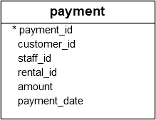

The `BETWEEN` operator allows you to check if a value falls within a range of values.

The basic syntax of the `BETWEEN` operators is as follows:
```PostgreSQL
value BETWEEN low AND high;
```

If the `value` is greater than or equal to the `low` value and less than or equal to the `high` value, the `BETWEEN` operator returns `true`; otherwise, it returns `false`.

You can rewrite the `BETWEEN` operator by using the greater than or equal ( `>=`) and less than or equal to ( `<=`) operators and the [AND operator](AND%20operator.md):
```PostgreSQL
value >= low AND value <= high
```

If you want to check if a value is outside a specific range, you can use the `NOT BETWEEN` operator as follows:
```PostgreSQL
value NOT BETWEEN low AND high
```

The following expression is equivalent to the expression that uses the `NOT BETWEEN` operators:
```postgresql
value < low OR value > high
```

## Examples

We'll use the `payment` table from the [Quick Start - Settings things up](../Quick%20Start%20-%20Setting%20things%20up/Quick%20Start%20-%20Settings%20things%20up.md) section.


### 1) Using with numbers
The following query uses the `BETWEEN` operator to retrieve payments with `payment_id` is between `17503` and `17505`:
```PostgreSQL
SELECT
  payment_id,
  amount
FROM
  payment
WHERE
  payment_id BETWEEN 17503 AND 17505
ORDER BY
  payment_id;
```

Output:
```
payment_id | amount
------------+--------
      17503 |   7.99
      17504 |   1.99
      17505 |   7.99
(3 rows)
```

### 2) Using BETWEEN
The following example uses the `NOT BETWEEN` operator to find payments with the `payment_id` not between `17503` and `17505`:
```PostgreSQL
SELECT
  payment_id,
  amount
FROM
  payment
WHERE
  payment_id NOT BETWEEN 17503 AND 17505
ORDER BY
  payment_id;
```

Output:
```
payment_id | amount
------------+--------
      17506 |   2.99
      17507 |   7.99
      17508 |   5.99
      17509 |   5.99
      17510 |   5.99
...
```

### 3) Using with a date range
If you want to check a value against a date range, you use the literal date in ISO 8601 format, which is `YYYY-MM-DD`.

The following example uses the `BETWEEN` operator to find payments whose payment dates are between `2007-02-15` and `2007-02-20` and amount more than 10:
```PostgreSQL
SELECT
  customer_id,
  payment_id,
  amount,
  payment_date
FROM
  payment
WHERE
  payment_date BETWEEN '2007-02-15' AND '2007-02-20'
  AND amount > 10
ORDER BY
  payment_date;
```

Output:
```
customer_id | payment_id | amount |        payment_date
-------------+------------+--------+----------------------------
          33 |      18640 |  10.99 | 2007-02-15 08:14:59.996577
         544 |      18272 |  10.99 | 2007-02-15 16:59:12.996577
         516 |      18175 |  10.99 | 2007-02-16 13:20:28.996577
         572 |      18367 |  10.99 | 2007-02-17 02:33:38.996577
         260 |      19481 |  10.99 | 2007-02-17 16:37:30.996577
         477 |      18035 |  10.99 | 2007-02-18 07:01:49.996577
         221 |      19336 |  10.99 | 2007-02-19 09:18:28.996577
(7 rows)
```

## Summary

- Use the `BETWEEN` operator to check if a value falls within a particular range.
- Use the `NOT BETWEEN` operator to negate the `BETWEEN` operator.

## Sources
[Neon - between](https://neon.com/postgresql/tutorial/between)

## Tags
#database #postgresql 