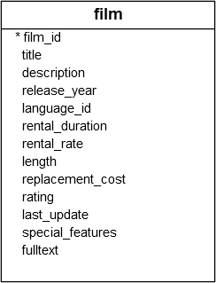

In PostgreSQL, a [boolean](https://neon.com/postgresql/tutorial/postgresql-boolean) value can have one of three values: `true`, `false`, and `null`.

PostgreSQL uses `true`, `'t'`, `'true'`, `'y'`, `'yes'`, `'1'` to represent `true` and `false`, `'f'`, `'false'`, `'n'`, `'no'`, and `'0'` to represent `false`.

A boolean expression is an expression that evaluates to a boolean value. For example, the expression `1<>1` is a boolean expression that evaluates to `false`:
```PostgreSQL
SELECT 1 <> 1 AS result;
```

Output:
```
result
--------
 f
(1 row)
```

The letter `f` in the output indicates `false`.

The `OR` operator is a logical operator that combines multiple boolean expressions. Here’s the basic syntax of the `OR` operator:
```PostgreSQL
expression1 OR expression2
```

In this syntax, `expression1` and `expression2` are boolean expressions that evaluate to `true`, `false`, or `null`.

The `OR` operator returns `true` only if any of the expressions is `true`. It returns `false` if both expressions are false. Otherwise, it returns null.

## Examples

### 1. Basic examples
The following example uses the `OR` operator to combine `true` with `true`, which returns `true`:
```PostgreSQL
SELECT true OR true AS result;
```

The following statement uses the `OR` operator to combine `true` with `false`, which returns true:
```PostgreSQL
SELECT true OR false AS result;
```

The following example uses the `OR` operator to combine `true` with `null`, which returns `true`:
```PostgreSQL
SELECT true OR null AS result;
```

The following example uses the `OR` operator to combine `false` with `false`, which returns `false`:
```PostgreSQL
SELECT false OR false AS result;
```

The following example uses the `OR` operator to combine `false` with `null`, which returns `null`:
```PostgreSQL
SELECT false OR null AS result;
```

The following example uses the `OR` operator to combine `null` with `null`, which returns `null`:
```PostgreSQL
SELECT null OR null AS result;
```

### Using in [WHERE](WHERE.md) clause
We'll use the `film` table from the [Quick Start - Settings things up](../Quick%20Start%20-%20Setting%20things%20up/Quick%20Start%20-%20Settings%20things%20up.md) section.


The following example uses the `OR` operator in the `WHERE` clause to find the films that have a rental rate of `0.99` or `2.99`:
```PostgreSQL
SELECT
  title,
  rental_rate
FROM
  film
WHERE
  rental_rate = 0.99 OR
  rental_rate = 2.99;
```

Output:
```
title            | rental_rate
-----------------------------+-------------
 Academy Dinosaur            |        0.99
 Adaptation Holes            |        2.99
 Affair Prejudice            |        2.99
 African Egg                 |        2.99
...
```

## Summary

- Use the `OR` operator to combine multiple boolean expressions

## Sources

[Neon - OR operator](https://neon.com/postgresql/tutorial/or)

## Tags
#database #postgresql 