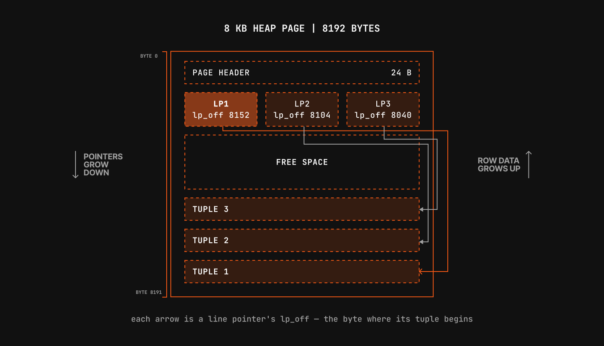

Imagine running  a big `SELECT *` on a table while another process updates the same records concurrently. Your query completes displaying the original data, and the other sees successful data modification.

This is Multi-Version Concurrency control (MVCC), a technique where the database creates new copies of rows instead of overwriting them. Using MVCC, transaction get a consistent and isolated snapshot of the data, while ongoing updates happen simultaneously. **Readers never block writers and writers never block readers**.

## Transaction basics 

Transactions rely on four guarantees known as ACID: atomicity, consistency, isolation, and durability. 

[Learn more about ACID](https://medium.com/@shivambhadani_/acid-properties-explained-a-complete-guide-with-postgresql-implementation-071afa6aaf8a)

Those guarantees are easier to guarantee when transactions run one at a time. But how do we run thousands of transactions in parallel while safely coordinating access to the same data?

## MVCC 

PostgreSQL uses MVCC which allows it to maintain more than one version of a row and let each transaction read the version its snapshot allows. Multiple tuple versions can coexist on disk. Snapshot Isolation decides which version a transaction sees when it runs a query. 

## Tuples and visibility 

A **tuple** is a single physical version of a row on disk. One logical row can coexist as several tuples at once when PostgreSQL keeps older versions around for MVCC. 

For each tuple, PostgreSQL tracks which transaction created it and which transaction deleted it. Tracking is done by an unsigned 32-bit integer value called transaction id (XID). When a tuple is updated, the old version is marked as deleted and a new tuple is created. 

Every row in a table carries hidden system columns. `xmin` records the inserting transaction; `xmax` records the deleting one. To inspect these you can simply add them to any `SELECT`:

```PostgreSQL
CREATE TABLE mytable(id SERIAL PRIMARY KEY, name VARCHAR NOT NULL);

INSERT INTO mytable (name) VALUES('First tuple');

SELECT xmin, xmax, * FROM mytable;
```

Output:

```md
| xmin | xmax | id | name         |
|------|------|----|--------------|
| 766  | 0    | 1  | First tuple  |
```

The above tuple was created by XID of 957. PostgreSQL wraps every insert into a transaction even when you don't mention it. 

When using an explicit transaction with `BEGIN`, the current transaction id can be requested by calling `pg_current_xact_id()`:

```PostgreSQL
BEGIN;

INSERT INTO mytable (name) VALUES ('Second tuple');

SELECT pg_current_xact_id();

COMMIT;
```

Output:

```md
| pg_current_xact_id |
|--------------------|
|       767          |
```

The transaction that inserts the second tuple has the ID 767,, which will also be reflected by the `xmin` value of this tuple.

## Snapshots 

Snapshot isolation determines data visibility for the current transaction. SQL isolation levels define how much data modified by concurrent transactions is visible to our own. 

For example, by executing `SET TRANSACTION ISOLATION LEVEL REPEATABLE READ;`, we tell PostgreSQL that subsequent reads in this transaction must always return the same data, even if another transaction modifies it in meantime. 

`pg_current_snapshot()` returns current snapshot information as a string with three colon-separated values: `$xmin:$xmax:$xip_list`.

- **`xmin`**: The earliest transaction ID that is still active. All transactions before this ID have already completed, so their status is settled.
- **`xmax`**: One past the highest transaction ID that had completed when the snapshot was taken. All transaction IDs greater than or equal to `xmax` have not yet started.
- **`xip_list`**: A comma separated list of active transactions when the snapshot was taken.

For example, the snapshot `1000:1012:1004,1005,1009` means that all transactions with an id lower than `1000` have already completed (committed or aborted). All transactions with an id equal to or greater than `1012` had not yet completed when the snapshot was taken. The transactions `1004`, `1005`, and `1009` were still in progress.

The function `pg_visible_in_snapshot()` can be used to test if a transaction ID is visible in a particular snapshot or not.

## Subtransactions 

Subtransactions in PostgreSQL are transactions embedded inside an existing parent transaction. They are created using the `SAVEPOINT` command and are typically used to isolate errors within a complex workflow. If an operation fails inside a subtransaction, only the modifications made up to that last `SAVEPOINT` are rolled back, allowing the main parent transaction to continue.

## Subtransactions IDs

Just like top-level transactions, each subtransaction is assigned a unique transaction ID from the same global counter sequence. Consequently, when a row is inserted inside a subtransaction block, its `xmin`  value registers the ID of the subtransaction rather than the parent transaction.

## Exception handling with subtransactions

Subtransactions also implement exception handling  in PL/pgSQL procedures.

```PostgreSQL
CREATE TABLE users (
    user_id SERIAL PRIMARY KEY,
    username VARCHAR(50) UNIQUE,
    email VARCHAR(100)
);

CREATE OR REPLACE PROCEDURE insert_users() LANGUAGE plpgsql AS $$
BEGIN
    INSERT INTO users (username, email) VALUES ('alice', 'alice@example.com');

    BEGIN
        -- This will fail because 'alice' violates the UNIQUE constraint
        INSERT INTO users (username, email) VALUES ('alice', 'duplicate_alice@example.com');

    EXCEPTION
        WHEN unique_violation THEN
            RAISE NOTICE 'Caught a unique constraint violation! Skipping this user.';
    END;

    -- This insert succeeds because the main transaction was not aborted
    INSERT INTO users (username, email) VALUES ('bob', 'bob@example.com');

END;
```

When the `insert_users` procedure is called, the constraint violation is caught properly and only this modification is rolled back while all other modifications are applied.

## Command IDs 

XIDs tell you which _transaction_ wrote a row. They cannot tell you which _statement_ inside that transaction wrote it. If you run `UPDATE` on a set of rows, the statement could potentially rewrite a row, scan ahead, encounter that same rewritten row, and update it again. Without a finer-grained marker, the statement would chase its own tail forever. Database people call this the _Halloween problem_, named for the day it was discovered.

[Read more about _Halloween problem_](https://www.cockroachlabs.com/blog/the-halloween-problem-sql/)

To solve this, PostgreSQL uses an incremental Command ID inside each transaction, starting at 0 and ticking up with every data-modifying SQL statement. When a statement creates a tuple, it stamps it with the current Command ID (shown in the system column `cmin`). This counter ensures a single running query never reads its own ongoing changes.

## Table maintenance

As we've seen, `UPDATE` leaves an old tuple versions behind on disk. When no running transactions needs them anymore, PostgreSQL can clean them up.

You can do this manually by running `VACUUM`, and PostgreSQL performs autovacuum from time to time. 

To schedule a autovacuum, PostgreSQL needs to know how many dead tuples are in a table:

```PostgreSQL
SELECT relname, n_live_tup, n_dead_tup
           FROM pg_stat_user_tables
           WHERE relname = 'mytable';
```

Output:

```md
 relname | n_live_tup | n_dead_tup
---------+------------+------------
 mytable |          5 |          3
(1 row)
```

>I did some updates, so that `n_dead_tup` have some non-negative value.

>`n_live_tup` and `n_dead_tup` are [estimates](https://www.postgresql.org/docs/18/monitoring-stats.html#MONITORING-PG-STAT-ALL-TABLES-VIEW), not exact counts. PostgreSQL updates them asynchronously, so a query run immediately after the updates may briefly show zeros until the cumulative statistics system catches up.

## Page layout 

How data is stored on disk?

PostgreSQL tables use fixed 8-kilobyte (8192 bytes) pages. Multiple tuples are stored inside each page using a specified layout:

- **Line Pointers (lp)**: - These are placed at fixed array positions starting from the beginning of the page and growing _downward_.
- **Tuple Data:** The actual row data is placed at the very end of the page and grows _upward_.
- **The Offset (`lp_off`):** Each line pointer contains a byte offset pointing directly to the exact physical byte position where its corresponding tuple data begins.



## Examining the page 

The `pageinspect` extension lets us inspect the details of a PostgreSQL page. Its function requires superuser privileges. `get_raw_page` plus `heap_page_items` returns line pointers, byte offsets, flags, and each tuple's `xmin`/`xmax`. Below we decode page 0 of `mytable`. Flag `1` means the line pointer is in use (`LP_NORMAL`).

```PostgreSQL
CREATE EXTENSION pageinspect;

SELECT lp, lp_off, lp_flags, t_xmin, t_xmax FROM heap_page_items(get_raw_page('mytable', 0));
```

Output: 

```md
 lp | lp_off | lp_flags | t_xmin | t_xmax
----+--------+----------+--------+--------
  1 |   8152 |        1 |    766 |      0
  2 |   8104 |        1 |    767 |      0
  3 |   8064 |        1 |    769 |      0
  4 |   8016 |        1 |    769 |      0
  5 |   7976 |        1 |    770 |    771
  6 |   7928 |        1 |    771 |    772
  7 |   7880 |        1 |    772 |    773
  8 |   7832 |        1 |    773 |      0
(8 rows)
```

## Standard VACUUM 

To reclaim the space, run `VACUUM`. 

```PostgreSQL
VACUUM mytable;

SELECT lp, lp_off, lp_flags, t_xmin, t_xmax FROM heap_page_items(get_raw_page('mytable', 0));
```

Output:

```md
 lp | lp_off | lp_flags | t_xmin | t_xmax
----+--------+----------+--------+--------
  1 |   8152 |        1 |    766 |      0
  2 |   8104 |        1 |    767 |      0
  3 |   8064 |        1 |    769 |      0
  4 |   8016 |        1 |    769 |      0
  5 |      8 |        2 |        |
  6 |      0 |        0 |        |
  7 |      0 |        0 |        |
  8 |   7968 |        1 |    773 |      0
(8 rows)
```

[Look at this example, for better understanding of `lp_flags`](https://planetscale.com/blog/postgresql-mvcc#standard-vacuum)

- `lp_flags` `1` means that the line pointer is still in use.
- `lp_flags` `0` means that the line pointer is not in use.
- `lp_flags` `2` represents `LP_REDIRECT`.  It means that this specific line pointer does not point directly to a physical row on the disk. Instead, it redirects to another line pointer within the same page. 

## VACUUM FULL 

`VACUUM FULL` is for rebuilding tables and indexes completely. `VACUUM FULL` packs the data sequentially, eliminates all pointer shortcuts, and shrinks the file size. This is a resource-intensive operation that puts an `ACCESS EXCLUSIVE` lock on the table.

```PostgreSQL
VACUUM FULL mytable;
```

It will even remove line redirect pointers.

## The transaction horizon 

The cleanup above worked because no other session needed the dead tuples. In practice, that is not always true.

PostgreSQL tracks the oldest transaction that might still need an old row version. That cutoff is the **transaction horizon**. VACUUM can only remove tuples that became dead before the horizon.

It just means that PostgreSQL won't vacuum those rows (even old versions) if some active session might need them.

## Wrap up 

PostgreSQL uses **MVCC (Multi-Version Concurrency Control)** to allow transactions to read and write data concurrently without blocking each other. Instead of overwriting rows, updates create new **tuple versions**, with `xmin` and `xmax` tracking which transactions created or deleted them. **Snapshots** determine which versions a transaction can see, while **subtransactions** allow partial rollbacks using savepoints. PostgreSQL uses **Command IDs** to distinguish statements within a transaction, and old tuple versions are eventually cleaned up by **VACUUM**. Since active transactions may still need old versions, the **transaction horizon** determines when those versions can safely be removed.

## Further links

Links mentioned above and / or some more for reading:

- [MVCC - planetscale](https://planetscale.com/blog/postgresql-mvcc#standard-vacuum)
- [Database transactions - planetscale](https://planetscale.com/blog/database-transactions)
- [Monitoring stats - PostgreSQL docs](https://www.postgresql.org/docs/18/monitoring-stats.html#MONITORING-PG-STAT-ALL-TABLES-VIEW)
- [ACID properties - Shivam Bhadani](https://medium.com/@shivambhadani_/acid-properties-explained-a-complete-guide-with-postgresql-implementation-071afa6aaf8a)
- [The Halloween problem - cockroach labs](https://www.cockroachlabs.com/blog/the-halloween-problem-sql/)