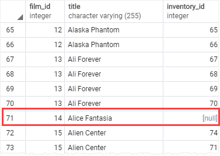
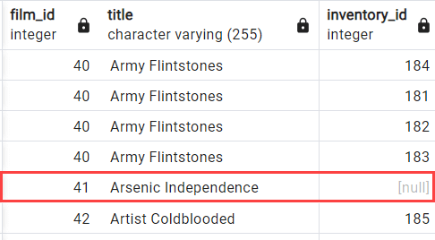
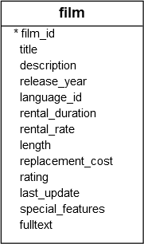

Join is used to combine columns from one or more tables based on the values of the common columns between related tables. The common columns are typically the primary key columns of the first table and the foreign key columns of the second table.

# INNER JOIN [](https://neon.com/postgresql/tutorial/inner-join)

Syntax for the `INNER JOIN` clause that joins two tables:

```PostgreSQL
SELECT
  select_list
FROM
  table1
INNER JOIN table2
  ON table1.column_name = table2.column_name;
```

In this syntax:
- First, specify the columns from both tables in the select list of the `SELECT` clause.
- Second, specify the main table (`table1`) from which you want to select data in the `FROM` clause.
- Third, specify the second table (`table2`) you want to join using the `INNER JOIN` keyword.
- Finally, define a condition for the join. This condition indicates which column (`column_name`) in each table should have matching values for the join.

If the columns for matching share the same name, you can use the `USING` syntax:

```PostgreSQL
SELECT
  select_list
FROM
  table1 t1
INNER JOIN table2 t2 USING(column_name);
```

## How the INNER JOIN works

For each row in the `table1`, the inner join compares the value in the `column_name` with the value in the corresponding column of every row in the `table2`. When these values are equal, the inner join creates a new row that includes all columns from both tables and adds this row to the result set. Conversely, if these values are not equal, the inner join disregards the current pair and proceeds to the next row, repeating the matching process.

The following Venn diagram illustrates how `INNER JOIN` clause works:


## Examples of Inner Join

Will be using tables from step [Quick Start - Settings things up](../Quick%20Start%20-%20Setting%20things%20up/Quick%20Start%20-%20Settings%20things%20up.md).

### 1) Joining two tables

Let's take a look at the `customer` and `payment` tables.


In this schema, whenever a customer makes a payment, a new row is inserted into the `payment` table. While each customer may have zero or many payments, each payment belongs to one and only one customer. The `customer_id` column serves as the link establishing the relationship between the two tables.

Query:

```PostgreSQL
SELECT
  customer.customer_id,
  customer.first_name,
  customer.last_name,
  payment.amount,
  payment.payment_date
FROM
  customer
  INNER JOIN payment ON payment.customer_id = customer.customer_id
ORDER BY
  payment.payment_date;
```

Output:
```
customer_id | first_name  |  last_name   | amount |        payment_date
-------------+-------------+--------------+--------+----------------------------
         416 | Jeffery     | Pinson       |   2.99 | 2007-02-14 21:21:59.996577
         516 | Elmer       | Noe          |   4.99 | 2007-02-14 21:23:39.996577
         239 | Minnie      | Romero       |   4.99 | 2007-02-14 21:29:00.996577
         592 | Terrance    | Roush        |   6.99 | 2007-02-14 21:41:12.996577
          49 | Joyce       | Edwards      |   0.99 | 2007-02-14 21:44:52.996577
...
```

We could have used table aliases above to make query shorter.

Since both tables have the same `customer_id` column, we can use the `USING` syntax:

```PostgreSQL
SELECT
  customer_id,
  first_name,
  last_name,
  amount,
  payment_date
FROM
  customer
  INNER JOIN payment USING(customer_id)
ORDER BY
  payment_date;
```

### 2) Joining three tables

The following diagram below illustrates the relationship between three tables: `staff`, `payment`, and `customer`:


Each staff member can handle zero or multiple payments, with each payment being processed by one and only one staff member.

Similarly, each customer can make zero or multiple payments, and each payment is associated with a single customer.

The following example uses `INNER JOIN` clauses to retrieve data from three tables:

```PostgreSQL
SELECT
  c.customer_id,
  c.first_name || ' ' || c.last_name customer_name,
  s.first_name || ' ' || s.last_name staff_name,
  p.amount,
  p.payment_date
FROM
  customer c
  INNER JOIN payment p USING(customer_id)
  INNER JOIN staff s USING(staff_id)
ORDER BY
  payment_date;
```

Output:

```
customer_id |     customer_name     |  staff_name  | amount |        payment_date
-------------+-----------------------+--------------+--------+----------------------------
         416 | Jeffery Pinson        | Jon Stephens |   2.99 | 2007-02-14 21:21:59.996577
         516 | Elmer Noe             | Jon Stephens |   4.99 | 2007-02-14 21:23:39.996577
         239 | Minnie Romero         | Mike Hillyer |   4.99 | 2007-02-14 21:29:00.996577
         592 | Terrance Roush        | Jon Stephens |   6.99 | 2007-02-14 21:41:12.996577
          49 | Joyce Edwards         | Mike Hillyer |   0.99 | 2007-02-14 21:44:52.996577
...
```


# LEFT JOIN [](https://neon.com/postgresql/tutorial/left-join)

The `LEFT JOIN` clause joins a left table with the right table and returns the rows from the left table that may or may not have corresponding rows in the right table.

The `LEFT JOIN` can be useful for selecting rows from one table that do not have matching rows in another.

Here's the basic syntax:

```PostgreSQL
SELECT
  select_list
FROM
  table1
LEFT JOIN table2
  ON table1.column_name = table2.column_name;
```

In this syntax:

- First, specify the columns from both tables in the select list (`select_list`) of the `SELECT` clause.
- Second, specify the left table (`table1`) from which you want to select data in the `FROM` clause.
- Third, specify the right table (`table2`) you want to join using the `LEFT JOIN` keyword.
- Finally, define a condition for the join (`table1.column_name = table2.column_name`), which indicates the column (`column_name`) in each table should have matching values.

## How the LEFT JOIN works

The `LEFT JOIN` clause starts selecting data from the left table (`table1`). For each row in the left table, it compares the value in the `column_name` with the value of the corresponding column from every row in the right table.

When these values are equal, the left join clause generates a new row including the columns that appear in the `select_list` and appends it to the result set.

If these values are not equal, the `LEFT JOIN` clause creates a new row that includes the columns specified in the `SELECT` clause. Additionally, it populates the columns that come from the right table with NULL.

Note that `LEFT JOIN` is also referred to as `LEFT OUTER JOIN`.

If the columns for joining two tables have the same name, you can use the `USING` syntax:

```PostgreSQL
SELECT
  select_list
FROM
  table1
  LEFT JOIN table2 USING (column_name);
```

The following Venn diagram illustrates how the `LEFT JOIN` clause works:


## LEFT JOIN examples

We will use `film` and `inventory` tables:


Each row in the `film` table may correspond to zero or multiple rows in the `inventory` table. Conversely, each row in the `inventory` table has one and only one row in the `film` table. The linkage between the `film` and `inventory` tables is established through the `film_id` column.

### 1) Basic example

The following statement uses the `LEFT JOIN` clause to join `film` table with the `inventory` table:

```PostgreSQL
SELECT
  film.film_id,
  film.title,
  inventory.inventory_id
FROM
  film
  LEFT JOIN inventory ON inventory.film_id = film.film_id
ORDER BY
  film.title;
```



When a row from the `film` table does not have a matching row in the `inventory` table, the value of the `inventory_id` column of this row is `NULL`.

### 2) Using with WHERE clause

The following uses the `LEFT JOIN` clause to join the `inventory` and `film` tables. It includes a `WHERE` clause that identifies the films that are not present in the inventory.

```PostgreSQL
SELECT
  f.film_id,
  f.title,
  i.inventory_id
FROM
  film f
  LEFT JOIN inventory i USING (film_id)
WHERE
  i.inventory_id IS NULL
ORDER BY
  f.title;
```

Output:

```
film_id |         title          | inventory_id
---------+------------------------+--------------
      14 | Alice Fantasia         |         null
      33 | Apollo Teen            |         null
      36 | Argonauts Town         |         null
      38 | Ark Ridgemont          |         null
      41 | Arsenic Independence   |         null
...
```

Above we have used the `using` clause because the `film` and `inventory` tables share the same `film_id` column.

# RIGHT JOIN [](https://neon.com/postgresql/tutorial/right-join)

The `RIGHT JOIN` clause joins a table with a right table with a left table and returns the rows from the right table that may or may not have matching rows in the left table.

Syntax of `RIGHT JOIN` clause:

```PostgreSQL
SELECT
  select_list
FROM
  table1
RIGHT JOIN table2
  ON table1.column_name = table2.column_name;
```

In this syntax:

- First, specify the columns from both tables in the `select_list` in the `SELECT` clause.
- Second, provide the left table (`table1`) from which you want to select data in the `FROM` clause.
- Third, specify the right table (`table2`) that you want to join with the left table in the `RIGHT JOIN` clause.
- Finally, define a condition for joining two tables (`table1.column_name = table2.column_name`), which indicates the `column_name` in each table should have matching rows.

## How the RIGHT JOIN works

The `RIGHT JOIN` starts retrieving data from the right table (`table2`).

For each row in the right table (`table2`), the `RIGHT JOIN` checks if the value in the `column_name` is equal to the value of the corresponding column in every row of the left table (`table1`).

When these values are equal, the `RIGHT JOIN` creates a new row that includes columns specified in the `select_list` and appends it to the result set.

If these values are not equal, the `RIGHT JOIN` generates a new row that includes columns specified in the `select_list`, populates the columns on the left with `NULL`, and appends the new row to the result set.

In other words, the `RIGHT JOIN` returns all rows from the right table whether or not they have corresponding rows in the left table.

The following Venn diagram illustrates how the `RIGHT JOIN` works:


Note that the `RIGHT OUTER JOIN` is the same as `RIGHT JOIN`. The `OUTER`  keyword is optional.

## Examples of RIGHT JOIN

### 1) Basic example

The following example uses the `RIGHT JOIN` clause to retrieve all rows from the `film` table that may or may not have corresponding rows in the `inventory` table:

```PostgreSQL
SELECT
  film.film_id,
  film.title,
  inventory.inventory_id
FROM
  inventory
RIGHT JOIN film
  ON film.film_id = inventory.film_id
ORDER BY
  film.title;
```

Output:




# SELF JOIN [](https://neon.com/postgresql/tutorial/self-join)

A `self-join` is a regular join that joins a table to itself. In practice, you typically use a `self-join` to query hierarchical data or to compare rows within the same table.

To form a `self-join`, we specify the same table twice with **different table aliases** and provide the join predicate after the `ON` keyword.

Following query uses an `INNER JOIN` that joins the table to itself:

```PostgreSQL
SELECT select_list
FROM table_name t1
INNER JOIN table_name t2 ON join_predicate;
```

In this syntax, the `table_name` is joined to itself using the `INNER JOIN` clause. You could also have used `LEFT JOIN` OR `RIGHT JOIN`.

## Examples of self-join

### 1) Querying hierarchical data

Suppose, we have the following organizational structure:


The following statements create the `employee` table and inserts some data into the table:

```postgresql
CREATE TABLE employee (
  employee_id INT PRIMARY KEY,
  first_name VARCHAR (255) NOT NULL,
  last_name VARCHAR (255) NOT NULL,
  manager_id INT,
  FOREIGN KEY (manager_id) REFERENCES employee (employee_id) ON DELETE CASCADE
);
INSERT INTO employee (employee_id, first_name, last_name, manager_id)
VALUES
  (1, 'Windy', 'Hays', NULL),
  (2, 'Ava', 'Christensen', 1),
  (3, 'Hassan', 'Conner', 1),
  (4, 'Anna', 'Reeves', 2),
  (5, 'Sau', 'Norman', 2),
  (6, 'Kelsie', 'Hays', 3),
  (7, 'Tory', 'Goff', 3),
  (8, 'Salley', 'Lester', 3);

SELECT * FROM employee;
```

Output:

```
employee_id | first_name |  last_name  | manager_id
-------------+------------+-------------+------------
           1 | Windy      | Hays        |       null
           2 | Ava        | Christensen |          1
           3 | Hassan     | Conner      |          1
           4 | Anna       | Reeves      |          2
           5 | Sau        | Norman      |          2
           6 | Kelsie     | Hays        |          3
           7 | Tory       | Goff        |          3
           8 | Salley     | Lester      |          3
(8 rows)
```

In this `employee` table, the `manager_id` column references the `employee_id` column. The `manager_id` column indicates the direct relationship, showing the manager to whom the employee reports.

The following query uses the self-join to find who reports to whom:

```PostgreSQL
SELECT
  e.first_name || ' ' || e.last_name employee,
  m.first_name || ' ' || m.last_name manager
FROM
  employee e
  INNER JOIN employee m ON m.employee_id = e.manager_id
ORDER BY
  manager;
```

Output:

```
employee     |     manager
-----------------+-----------------
 Sau Norman      | Ava Christensen
 Anna Reeves     | Ava Christensen
 Salley Lester   | Hassan Conner
 Kelsie Hays     | Hassan Conner
 Tory Goff       | Hassan Conner
 Ava Christensen | Windy Hays
 Hassan Conner   | Windy Hays
(7 rows)
```

This query references the `employees` table twice, one as the employee and the other as the manager. The join predicate finds the employee/manager pair by matching values in the `employee_id` and `manager_id` columns.

Notice that the top manager does not appear on the output.

To include the top manager in the result set, we can use the `LEFT JOIN` instead of `INNER JOIN` clause:

```PostgreSQL
SELECT
  e.first_name || ' ' || e.last_name employee,
  m.first_name || ' ' || m.last_name manager
FROM
  employee e
  LEFT JOIN employee m ON m.employee_id = e.manager_id
ORDER BY
  manager;
```

Output:

```
employee     |     manager
-----------------+-----------------
 Anna Reeves     | Ava Christensen
 Sau Norman      | Ava Christensen
 Salley Lester   | Hassan Conner
 Kelsie Hays     | Hassan Conner
 Tory Goff       | Hassan Conner
 Hassan Conner   | Windy Hays
 Ava Christensen | Windy Hays
 Windy Hays      | null
(8 rows)
```

### 2) Comparing rows with the same table

See the following `film` table from the DVD rental database:



The following query finds all pairs of films that have the same length:

```PostgreSQL
SELECT
  f1.title,
  f2.title,
  f1.length
FROM
  film f1
  INNER JOIN film f2 ON f1.film_id > f2.film_id
  AND f1.length = f2.length;
```

Output:

```
title           |            title            | length
---------------------------+-----------------------------+--------
 Chamber Italian           | Affair Prejudice            |    117
 Grosse Wonderful          | Doors President             |     49
 Bright Encounters         | Bedazzled Married           |     73
 Date Speed                | Crow Grease                 |    104
 Annie Identity            | Academy Dinosaur            |     86
 Anything Savannah         | Alone Trip                  |     82
 Apache Divine             | Anaconda Confessions        |     92
 Arabia Dogma              | Airplane Sierra             |     62
 Dying Maker               | Antitrust Tomatoes          |    168
...
```

The join predicate matches two different films (`f1.film_id > f2.film_id`) that have the same length (`f1.length = f2.length`)

# FULL OUTER JOIN [](https://neon.com/postgresql/tutorial/full-outer-join)

The `FULL OUTER JOIN` combines data from two tables and returns all rows from both tables, including matching and non-matching rows from both sides. In other words, `FULL OUTER JOIN` combines the results of both left and right join.

Here's the basic syntax:

```PostgreSQL
SELECT select_list
FROM table1
FULL OUTER JOIN table2
   ON table1.column_name = table2.column_name;
```

In this syntax:

- First, specify the columns from `table1` and `table2` in the `select_list`.
- Second, specify the `table1` that you want to retrieve data in the `FROM` clause.
- Third, specify the `table2` that you want to join with the `table1` in the `FULL OUTER JOIN` clause.
- Finally, define a condition for joining two tables.

The `FULL OUTER JOIN` is also known as `FULL JOIN`. The `OUTER` keyword is optional.

## How the FULL OUTER JOIN works

**Step 1. Initialize the result set:**

- The `FULL OUTER JOIN` starts with an empty result set.

**Step 2. Match rows:**

- First, identify rows in `table1` and `table2` where the values in the specified `column_name` match.
- Then, include these matching rows in the result set.

**Step 3. Include non-matching rows from the `table1` and `table2`:**

- First, include rows from `table1` that do not have a match in `table2`. For the columns from `table2` in these rows, include NULLs.
- Second, include rows from `table2` that do not have a match in `table1`. For the columns from `table1` in these rows, include NULLs.

**Step 4. Return the result set:**

- Return the final result set will contain all rows from both tables, with matching rows and non-matching rows from both `table1` and `table2`.
- If a row has a match on both sides, combine the values into a single row.
- If there is no match on one side, the columns from the non-matching side will have NULLs.

The following Venn diagram illustrates the `FULL OUTER JOIN` operation:


## Examples of FULL OUTER JOIN

First, let's create sample tables and insert data into them.

```PostgreSQL
CREATE TABLE departments (
  department_id serial PRIMARY KEY,
  department_name VARCHAR (255) NOT NULL
);
CREATE TABLE employees (
  employee_id serial PRIMARY KEY,
  employee_name VARCHAR (255),
  department_id INTEGER
);

INSERT INTO departments (department_name)
VALUES
  ('Sales'),
  ('Marketing'),
  ('HR'),
  ('IT'),
  ('Production');
INSERT INTO employees (employee_name, department_id)
VALUES
  ('Bette Nicholson', 1),
  ('Christian Gable', 1),
  ('Joe Swank', 2),
  ('Fred Costner', 3),
  ('Sandra Kilmer', 4),
  ('Julia Mcqueen', NULL);
  
SELECT * FROM departments;

SELECT * FROM employees;
```

Output:

```
department_id | department_name
---------------+-----------------
             1 | Sales
             2 | Marketing
             3 | HR
             4 | IT
             5 | Production
(5 rows)

employee_id |  employee_name  | department_id
-------------+-----------------+---------------
           1 | Bette Nicholson |             1
           2 | Christian Gable |             1
           3 | Joe Swank       |             2
           4 | Fred Costner    |             3
           5 | Sandra Kilmer   |             4
           6 | Julia Mcqueen   |          null
(6 rows)
```

Each department has zero or many employees and each employee belongs to zero or one department.

### 1) Basic example

The following query uses the `FULL OUTER JOIN` to query data from both `employees` and `departments` tables:

```PostgreSQL
SELECT
  employee_name,
  department_name
FROM
  employees e
FULL OUTER JOIN departments d
  ON d.department_id = e.department_id;
```

Output:

```
employee_name  | department_name
-----------------+-----------------
 Bette Nicholson | Sales
 Christian Gable | Sales
 Joe Swank       | Marketing
 Fred Costner    | HR
 Sandra Kilmer   | IT
 Julia Mcqueen   | null
 null            | Production
(7 rows)
```

The result set includes every employee who belongs to a department and every department which have an employee. Additionally, it includes every employee who does not belong to a department and every department that does not have an employee.


# CROSS JOIN [](https://neon.com/postgresql/tutorial/cross-join)

A `CROSS JOIN` allows you to join two tables by combining each row from the first table with every row from the second table, resulting in a complete combination of all rows. 

In the set theory, we can say that a `cross-join` produces the cartesian product of rows in two tables.

Unlike other join clauses the `CROSS JOIN` clause does not have a join predicate.

Suppose you have to perform a `CROSS JOIN` of `table1` and `table2`. If `table1` has `n` rows and `table2` has `m` rows, the `CROSS JOIN` will return a result set that has `nxm` rows.

Basic syntax of `CROSS JOIN`:

```PostgreSQL
SELECT
  select_list
FROM
  table1
CROSS JOIN table2;
```

The following statement is equivalent to the above statement:

```PostgreSQL
SELECT
  select_list
FROM
  table1,table2;
```

Alternatively, you can use an `INNER JOIN` clause with a condition that always evaluates to true to simulate a cross-join:

```PostgreSQL
SELECT
  select_list
FROM
  table1
  INNER JOIN table2 ON true;
```

## Examples of CROSS JOIN

Let's set up sample tables and do a cross join over them.

```PostgreSQL
CREATE TABLE
  T1 (LABEL CHAR(1) PRIMARY KEY);

CREATE TABLE
  T2 (score INT PRIMARY KEY);

INSERT INTO
  T1 (LABEL)
VALUES
  ('A'),
  ('B');

INSERT INTO
  T2 (score)
VALUES
  (1),
  (2),
  (3);
```

Doing cross join:

```postgresql
SELECT *
FROM T1
CROSS JOIN T2;
```

Output:

```
label | score
-------+-------
 A     |     1
 B     |     1
 A     |     2
 B     |     2
 A     |     3
 B     |     3
(6 rows)
```

The following picture illustrates how the `CROSS JOIN` works when joining the `T1` table with the `T2` table:


# NATURAL JOIN [](https://neon.com/postgresql/tutorial/natural-join)

A `NATURAL JOIN` is a type of join that automatically combines rows from two or more tables based on all columns that share the exact same name and data type. Unlike standard joins, you do not write a explicit `ON` or `USING` clause because the database engine implicitly determines the matching condition.

Syntax of `NATURAL JOIN`:

```PostgreSQL
SELECT select_list
FROM table1
NATURAL [INNER, LEFT, RIGHT] JOIN table2;
```

In this syntax:

- First, specify columns from the tables from which you want to retrieve data in the `select_list` in the `SELECT` clause.
- Second, provide the main table (`table1`) from which you want to retrieve data.
- Third, specify the table (`table2`) that you want to join with the main table, in the `NATURAL JOIN` clause.

A natural join can be an inner join, left join, or right join. If you do not specify an explicit join, PostgreSQL will use the `INNER JOIN` by default.

The equivalent of the `NATURAL JOIN` clause will be like this:

```PostgreSQL
SELECT select_list
FROM table1
[INNER, LEFT, RIGHT] JOIN table2
   ON table1.column_name = table2.column_name;
```

Below three are equivalents of **Natural join**:

**Inner join**

```PostgreSQL
SELECT select_list
FROM table1
NATURAL INNER JOIN table2;
```

And

```PostgreSQL
SELECT select_list
FROM table1
INNER JOIN table2 USING (column_name);
```

**Left Join**

```PostgreSQL
SELECT select_list
FROM table1
NATURAL LEFT JOIN table2;
```

And 

```PostgreSQL
SELECT select_list
FROM table1
LEFT JOIN table2 USING (column_name);
```

**Right Join**

```PostgreSQL
SELECT select_list
FROM table1
NATURAL RIGHT JOIN table2;
```

And

```PostgreSQL
SELECT select_list
FROM table1
RIGHT JOIN table2 USING (column_name);
```

## Examples

### 1) Basic example

For this we will setup sample tables.

```PostgreSQL
CREATE TABLE categories (
  category_id SERIAL PRIMARY KEY,
  category_name VARCHAR (255) NOT NULL
);

CREATE TABLE products (
  product_id serial PRIMARY KEY,
  product_name VARCHAR (255) NOT NULL,
  category_id INT NOT NULL,
  FOREIGN KEY (category_id) REFERENCES categories (category_id)
);

INSERT INTO categories (category_name)
VALUES
  ('Smartphone'),
  ('Laptop'),
  ('Tablet'),
  ('VR')
RETURNING *;

INSERT INTO products (product_name, category_id)
VALUES
  ('iPhone', 1),
  ('Samsung Galaxy', 1),
  ('HP Elite', 2),
  ('Lenovo Thinkpad', 2),
  ('iPad', 3),
  ('Kindle Fire', 3)
RETURNING *;
```

**Natural Join** syntax:

```PostgreSQL
SELECT *
FROM products
NATURAL JOIN categories;
```

Output:

```
category_id | product_id |  product_name   | category_name
-------------+------------+-----------------+---------------
           1 |          1 | iPhone          | Smartphone
           1 |          2 | Samsung Galaxy  | Smartphone
           2 |          3 | HP Elite        | Laptop
           2 |          4 | Lenovo Thinkpad | Laptop
           3 |          5 | iPad            | Tablet
           3 |          6 | Kindle Fire     | Tablet
(6 rows)
```

### 2) Example that causes an unexpected result

In practice, we should avoid using the `NATURAL JOIN` whenever possible because sometimes it may cause an unexpected result.

Consider the following `city` and `country` tables from sample database:


Both tables have the same `country_id` column so you can use the `NATURAL JOIN` to join these tables as follows:

```PostgreSQL
SELECT *
FROM city
NATURAL JOIN country;
```

The query returns an empty result set.

The reason is that both tables have another common column called `last_update`. When the `NATURAL JOIN` clause uses the `last_update` column, it does not find any matches.
# Summary

- Use `INNER JOIN` clauses to select data from two or more related tables and return rows that have matching values in all tables.
- Use the `LEFT JOIN` clause to select rows from one table that may or may not have corresponding rows in other tables.
- Use the `RIGHT JOIN` clause to join a right table with a left table and return rows from the right table that may or may not have a corresponding rows in the left table.
- A self-join is a regular join that joins a table to itself using any kind of join.
- Self-joins are very useful for querying hierarchical data or comparing rows within the same table.
- Use the `FULL OUTER JOIN` clause to combine data from both tables, ensuring that matching rows are included from both the left and right tables, as well as unmatched rows from either table.
- Use the `CROSS JOIN` clause to make a cartesian product of rows in two tables.
- Use `NATURAL JOIN` clause to query data from two or more tables that have common columns. 