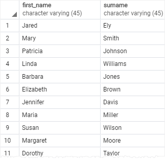
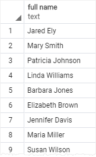

A column alias allows you to assign a column or an expression in the select list of a `SELECT` statement a temporary name. The column alias exists temporarily during the execution of the query.

The following illustrates the syntax of using a column alias:
```PostgreSQL
SELECT column_name AS alias_name
FROM table_name;
```

In this syntax, the `column_name` is assigned an alias `alias_name`. The `AS` keyword is optional so you can omit it like this:
```postgresql
SELECT column_name alias_name
FROM table_name;
```

The following syntax illustrates how to set an alias for an expression in the [SELECT](SELECT.md) clause:
```PostgreSQL
SELECT expression AS alias_name
FROM table_name;
```

The main purpose of column aliases is to make the headings of the output of a query more meaningful.

## Examples

We’ll use the `customer` table from the [Sample database](Querying%20Data.md) to show you how to work with column aliases.

### 1) Assigning a column alias to a column example
The following query returns the first names and last names of all customers from the `customer` table:
```PostgreSQL
SELECT
   first_name,
   last_name
FROM customer;
```

If you want to rename the `last_name` heading, you can assign it a new name using a column alias like this:
```PostgreSQL
SELECT
   first_name,
   last_name AS surname
FROM customer;
```

This query assigned the `surname` as the alias of the `last_name` column:


Or you can make it shorter by removing the `AS` keyword as follows:
```PostgreSQL
SELECT
   first_name,
   last_name surname
FROM customer;
```

### 2) Assigning a column alias to an expression example
The following query returns the full names of all customers. It constructs the full name by concatenating the first name, space, and the last name:
```PostgreSQL
SELECT
   first_name || ' ' || last_name
FROM
   customer;
```

Note that in PostgreSQL, you use the `||` as the concatenating operator that concatenates one or more strings into a single string.

You can assign the expression `first_name || ' ' || last_name` a column alias e.g., `full_name`:
```PostgreSQL
SELECT
    first_name || ' ' || last_name AS full_name
FROM
    customer;
```

### 3) Column aliases that contain spaces
If a column alias contains one or more spaces, you need to surround it with double quotes like this:
```PostgreSQL
column_name AS "column alias"
```

For example:
```PostgreSQL
SELECT
    first_name || ' ' || last_name "full name"
FROM
    customer;
```



## Summary

- Assign a column or an expression a column alias using the syntax `column_name AS alias_name` or `expression AS alias_name`. The `AS` keyword is optional.
- Use double quotes (“) to surround column aliases that contain spaces.

## Sources
[Neon - Column alias](https://neon.com/postgresql/tutorial/column-alias)

## Tags
#database 
#postgresql 