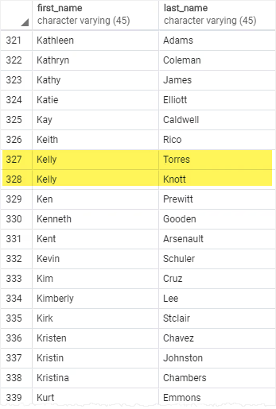
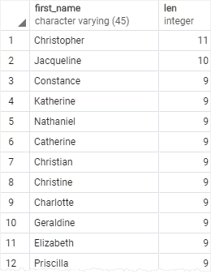

When you query data from a table, the [`Select`](SELECT.md) statement returns rows in an unspecified order. To sort the rows of the result set, you use the `ORDER BY` clause in the `SELECT` statement.

The `ORDER BY` clause allows you to sort rows returned by a `SELECT` clause in ascending or descending order based on a sort expression.

Syntax:
```PostgreSQL
SELECT
  select_list
FROM
  table_name
ORDER BY
  sort_expression1 [ASC | DESC],
  sort_expression2 [ASC | DESC],
  ...;
```

In this syntax:
- First, specify a sort expression, which can be a column or an expression, that you want to sort after the `ORDER BY` keywords. If you want to sort the result set based on multiple columns or expressions, you need to place a comma (`,`) between two columns or expressions to separate them.
- Second, you use the `ASC` option to sort rows in ascending order and the `DESC` option to sort rows in descending order. If you omit the `ASC` or `DESC` option, the `ORDER BY` uses `ASC` by default.

PostgreSQL evaluates  the clauses in the `SELECT` statement in the following order: `FROM`, `SELECT` and `ORDER BY`.

Due to order of evaluation, if you have a column alias in the `SELECT` clause, you can use it in the `ORDER BY` clause.

## Examples

We will use the `customer` table from [Quick Start - Settings things up](../Quick%20Start%20-%20Setting%20things%20up/Quick%20Start%20-%20Settings%20things%20up.md) step.


### 1) Sort rows by one column
Following query uses the `ORDER BY` clause to sort customers by their first names in ascending order:
```PostgreSQL
SELECT
  first_name,
  last_name
FROM
  customer
ORDER BY
  first_name ASC;
```

The `ASC` option is default, you can omit it if you want.

If you were to use `DESC` columns would be sorted in descending order.
```PostgreSQL
SELECT
  first_name,
  last_name
FROM
  customer
ORDER BY
  last_name DESC;
```

### 2) Sort rows by multiple columns
The following statement selects the first name and last name from the customer table and sorts the rows by the first name in ascending order and last name in descending order:
```PostgreSQL
SELECT
  first_name,
  last_name
FROM
  customer
ORDER BY
  first_name ASC,
  last_name DESC;
```


In this example, the `ORDER BY` clause sorts rows by values in the first name column first. Then it sorts the sorted rows by values in the last name column. As you can see clearly from the output, two customers with the same first name `Kelly` have the last name sorted in descending order.

### 3) Sort rows by expression
The [`LENGTH()`](https://neon.com/postgresql/postgresql-string-functions/postgresql-length-function) function accepts a string and returns the length of that string.

The following statement selects the first names and their lengths. It sorts the rows by the lengths of the first names:
```PostgreSQL
SELECT
  first_name,
  LENGTH(first_name) len
FROM
  customer
ORDER BY
  len DESC;
```



Because the `ORDER BY` clause is evaluated after the `SELECT` clause, the column alias `len` is available and can be used in the `ORDER BY` clause.

## ORDER BY clause and null

In the database world, `NULL` is a marker that indicates the missing data or the data is unknown at the time of recording.

When you sort rows that contain `NULL`, you can specify the order of `NULL` with other non-null values by using the `NULLS FIRST` or `NULLS LAST` option of the `ORDER BY` clause:
```PostgreSQL
ORDER BY sort_expression [ASC | DESC] [NULLS FIRST | NULLS LAST]
```

The `NULLS FIRST` option places `NULL` before other non-null values and the `NULLS LAST` option places `NULL` after other non-null values.

By default `ASC` uses `NULLS LAST` and `DESC` uses `NULLS FIRST`. So if you were not to specify anything for nulls the before mentioned order will be followed.

Example syntax:
```PostgreSQL
SELECT
  num
FROM
  sort_demo
ORDER BY
  num NULLS LAST;
```

Sorts by `num` in ascending order, `nulls` will come at last

## Summary

- Use the `ORDER BY` clause in the `SELECT` statement to sort the rows in the query set.
- Use the `ASC` option to sort rows in ascending order and `DESC` option to sort rows in descending order.
- The `ORDER BY` clause uses the `ASC` option by default.
- Use `NULLS FIRST` and `NULLS LAST` options to explicitly specify the order of `NULL` with other non-null values.

## Sources

[Neon - order by](https://neon.com/postgresql/tutorial/order-by)

## Tags
#database 
#postgresql 