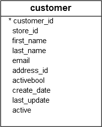

The `SELECT` statement is one of the most complex statements in PostgreSQL. It has many clauses that you can use to form a flexible query. 

The `SELECT` statement has the following clauses:
- Select distinct rows using [`DISTINCT`](https://neon.com/postgresql/tutorial/postgresql-select-distinct) operator.
- Sort rows using [`ORDER BY`](https://neon.com/postgresql/tutorial/postgresql-order-by) clause.
- Filter rows using [`WHERE`](https://neon.com/postgresql/tutorial/postgresql-where) clause.
- Select a subset of rows from a table using [`LIMIT`](https://neon.com/postgresql/tutorial/postgresql-limit) or [`FETCH`](https://neon.com/postgresql/tutorial/postgresql-fetch) clause.
- Group rows into groups using [`GROUP BY`](https://neon.com/postgresql/tutorial/postgresql-group-by) clause.
- Filter groups using [`HAVING`](https://neon.com/postgresql/tutorial/postgresql-having) clause.
- Join with other tables using [joins](https://neon.com/postgresql/tutorial/postgresql-joins) such as [`INNER JOIN`](https://neon.com/postgresql/tutorial/postgresql-inner-join), [`LEFT JOIN`](https://neon.com/postgresql/tutorial/postgresql-left-join), [`FULL OUTER JOIN`](https://neon.com/postgresql/tutorial/postgresql-full-outer-join), [`CROSS JOIN`](https://neon.com/postgresql/tutorial/postgresql-cross-join) clauses.
- Perform set operations using [`UNION`](https://neon.com/postgresql/tutorial/postgresql-union), [`INTERSECT`](https://neon.com/postgresql/tutorial/postgresql-intersect), and [`EXCEPT`](https://neon.com/postgresql/postgresql-tutorial/postgresql-except).

Let's start with the basic form of the `SELECT` statement that retrieves data from a single table.
```PostgreSQL
SELECT
   select_list
FROM
   table_name;
```

In this syntax:
- First, specify a select list that can be a column or a list of columns in a table from which you want to retrieve data. If you specify a list of columns, you need to place a comma (`,`) between two columns to separate them. If you want to select data from all the columns of the table, you can use an asterisk (`*`) shorthand instead of specifying all the column names. The select list may also contain expressions or literal values.
- Second, provide the name of the table from which you want to query data after the `FROM` keyword.

The `FROM` clause is optional. If you are not querying data from any table, you can omit the `FROM` clause in the `SELECT` statement. PostgreSQL evaluates the `FROM` clause before the `SELECT` clause in the `SELECT` statement.

## Examples

We will use the `customer` table in the `dvdrental` sample database. Sample database has been loaded in [Quick Start - Settings things up](../Quick%20Start%20-%20Setting%20things%20up/Quick%20Start%20-%20Settings%20things%20up.md)



### Querying data from one column
This example uses the `SELECT` statement to find the first names of all customers from the `customer` table:
```PostgreSQL
SELECT first_name FROM customer;
```

Output:
```text
first_name
-------------
 Jared
 Mary
 Patricia
 Linda
 Barbara
...
```

Notice that we added a semicolon (`;`) at the end of the `SELECT` statement. The semicolon is not a part of the SQL statement; rather, it serves as a signal of PostgreSQL indicating the conclusion of an SQL statement. Additionally, semicolons are used to separate two or more SQL statements.

### Querying data from multiple columns
The following query uses the `SELECT` statement to retrieve first name, last name, and email of customers from the `customer`  table:
```PostgreSQL
SELECT
   first_name,
   last_name,
   email
FROM
   customer;
```

Output:
```text
first_name  |  last_name   |                  email
-------------+--------------+------------------------------------------
 Jared       | Ely          | jared.ely@example.com
 Mary        | Smith        | mary.smith@example.com
 Patricia    | Johnson      | patricia.johnson@example.com
...
```

### Querying data from all columns 
The following query uses the `SELECT *` statement to retrieve data from all columns of the `customer` table:
```PostgreSQL
SELECT * FROM customer;
```

In this example, we used an asterisk (`*`) in the `SELECT` clause, which serves as a shorthand for all columns. Instead of listing all columns in the `SELECT` clause individually, we can use the asterisk (`*`) to make the query shorter. 

However, using the asterisk (`*`) in the `SELECT` statement is considered a bad practice when you embed SQL statements in the application code, such as **Python**, **Java**, or **PHP** for the following reasons:
- Database performance. Suppose you have a table with many columns and substantial data, the `SELECT` statement with the asterisk (`*`) shorthand will select data from all the columns of the table, potentially retrieving more data than required for the application.
- Application performance. Retrieving unnecessary data from the database increases the traffic between the PostgreSQL server and the application server. Consequently, this can result in slower response times and reduced scalability for your applications.

### SELECT statement with expressions
The following example uses the `SELECT` statement to return the full names and emails of all customers from the `customer` table:
```PostgreSQL
SELECT
   first_name || ' ' || last_name,
   email
FROM
   customer;
```

Output:
```text
?column?        |                  email
------------------------+------------------------------------------
 Jared Ely             | jared.ely@example.com
 Mary Smith            | mary.smith@example.com
 Patricia Johnson      | patricia.johnson@example.com
...
```

In this example, we used the [concatenation operator](https://neon.com/postgresql/postgresql-string-functions/postgresql-concat-function) `||` to concatenate the first name, space, and last name of every customer.

Notice the first column of the output doesn't have a name but `?column?`. To assign a name to a column temporarily in the query, you can use a [Column alias](Column%20alias.md):
```PostgreSQL
expression AS column_alias
```

The AS keyword is optional. Therefore, you can use a shorter syntax:
```PostgreSQL
expression column_alias
```

For example, you can assign a column alias full_name to the first column of the query as follows:
```PostgreSQL
SELECT
   first_name || ' ' || last_name full_name,
   email
FROM
   customer;
```

Output:
```text
full_name       |                  email
------------------------+------------------------------------------
 Jared Ely             | jared.ely@example.com
 Mary Smith            | mary.smith@example.com
 Patricia Johnson      | patricia.johnson@example.com
...
```

### Using SELECT without a FROM clause
The `FROM` clause of the `SELECT` statement is optional. Therefore, you can omit it in the SELECT statement.

Typically, you use the `SELECT` clause with a function to retrieve the function result. For example:
```PostgreSQL
SELECT NOW();
```

In this example, we use the `NOW()` function in the `SELECT` statement. It'll return the current data and time of the PostgreSQL server.

## Summary

- Use the `SELECT ... FROM` statement to retrieve data from a table.
- PostgreSQL evaluates the `FROM` clause before the `SELECT` clause.
- Use a column alias to assign a temporary name to a column or an expression in a query.
- In PostgreSQL, the `FROM` clause is optional.

## Sources
[Neon - select](https://neon.com/postgresql/tutorial/select)

## Tags
#database 
#postgresql 
