## What is PostgreSQL [](https://neon.com/postgresql/getting-started/load-postgresql-sample-database)

PostgreSQL is an advanced, enterprise-class, and open-source relational database system. PostgreSQL supports both SQL (relational) and JSON (non-relational) querying.

## Common Use cases of PostgreSQL
#### 1) A robust database in the LAPP stack
LAPP stands for **Lnux**, **Apache**, **PostgreSQL**, and **P**HP (or Python and Perl). PostgreSQL is primarily used as a robust back-end database that powers many dynamic websites and web applications.

#### 2) General-purpose transaction database
Large corporations and startups alike use PostgreSQL as the primary database to support their applications and products.

#### 3) Geospatial database
PostgreSQL with the [PostGIS extension](https://postgis.net/) supports geospatial databases for geographic information systems (GIS).

## PostgreSQL feature highlights

PostgreSQL has many advanced features that other enterprise-class database management systems offer, such as:
- User-defined types
- Table inheritance
- Sophisticated locking mechanism
- [Foreign key referential integrity](https://neon.com/postgresql/postgresql-tutorial/postgresql-foreign-key)
- [Views](https://neon.com/postgresql/postgresql-views), rules, [subquery](https://neon.com/postgresql/postgresql-tutorial/postgresql-subquery)
- Nested transactions (savepoints)
- Multi-version concurrency control (MVCC)
- Asynchronous replication

## Install PostgreSQL on windows [](https://neon.com/postgresql/getting-started/install-postgresql)

### 1. Download PostgreSQL Installer for windows

You can download installer from [PostgreSQL installers on the EnterpriseDB](https://www.enterprisedb.com/downloads/postgres-postgresql-downloads).

### 2. Install PostgreSQL

First few steps are basics like open the installer, click next, give location. At one point you will be asked which software components to install:
- **PostgreSQL Server** option allows you to install the PostgreSQL database server
- **pgAdmin 4** option allows you to install the PostgreSQL database GUI management tool.
- **Stack Builder** provides a GUI that allows you to download and install drivers that work with PostgreSQL.
- **Command Line Tools** option allows you to install command-line tools such as `psql`, `pg_restore`, and so on. These tools allow you to interact with the PostgreSQL database server using the command-line interface.

You can select according to your needs, this tutorial (right now) doesn't use **Stack Builder**, so you can uncheck it. 

After giving database directory location, you will be asked to enter password for database superuser (`postgres`). Remember this. Specify the port for PostgreSQL, by default it runs on `5432`. Click next, until you get install button. Click install.

### Adding bin directory to the PATH env variables

By adding the bin directory of the PostgreSQL to the `PATH` environment variable, you enable the execution of common PostgreSQL tools, such as `plsql` and `pg_restore`, from any directory without the need to navigate the bin directory first.

First, find the path of the `bin` directory from Postgres installation directory. Copy that path. Open environment variables (go to start and search for them). Add the copied pat to **System variables**. 

## Connect to a PostgreSQL Database server [](https://neon.com/postgresql/getting-started/connect-to-postgresql-database)

You can either use `psql` which is a terminal program or `pgadmin` which provides GUI.

### `psql`

Open command prompt and run:
```bash
psql -U postgres
```

- `psql`: Invokes the psql program
- `-U postgres`: Specify the user that connects to the PostgreSQL server. `-U` means user. You have to use it in uppercase.

After running above command you will be asked to enter your password. The one entered at the time of installation.

After entering the password correctly, you'll be connected to the PostgreSQL server. The command prompt will change to something like this:
```bash
postgres=#
```

In this command, `postgres` is the default database of a PostgreSQL server. Connecting to the PostgreSQL server will grant you a session. A session is long-lived, allowing you to perform many requests such as executing commands, before eventually disconnecting.

You can run your command here.

### Connecting using `pgAdmin`

You can search for `pgAdmin` in your start menu. 

Right-click the Servers node and select **Register > Server…** menu to create a server:
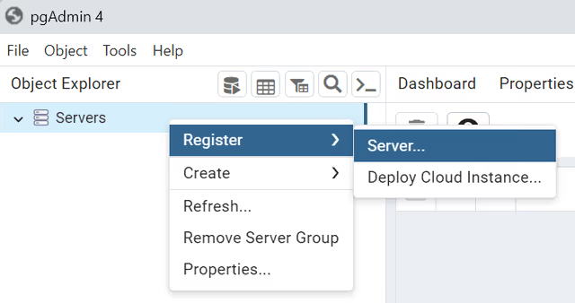

Enter server name such as `Local`, and click the **Connection** tab:
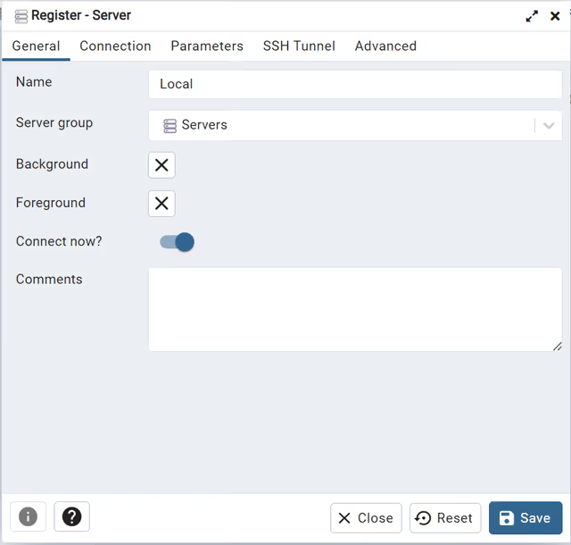

Enter the host and password for the `postgres` user and click **Save** button:
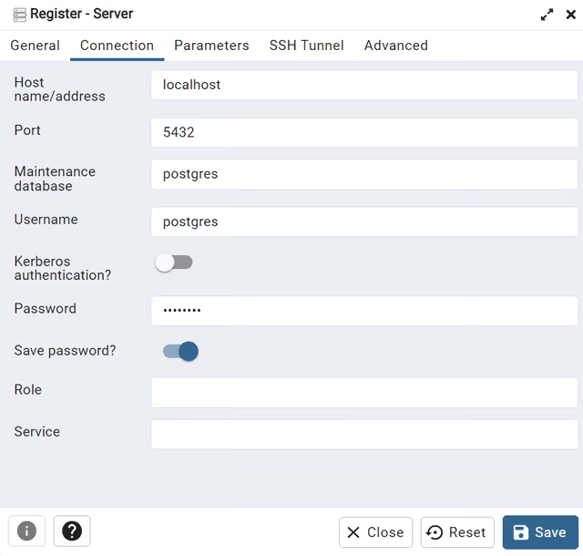

Click on the `Servers` node to expand the server. By default, PostgreSQL has a database named `postgres`:
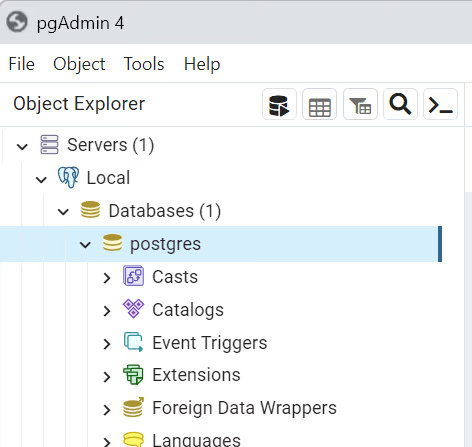

Open the query tool by selecting the menu item **Tool > Query Tool**:
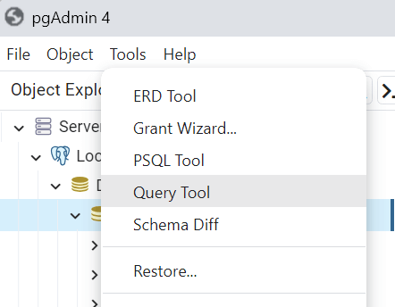

Enter the query in the **Query Editor** and click the **Execute** button, you will see the result of the query displayed in the **Data Output** tab:
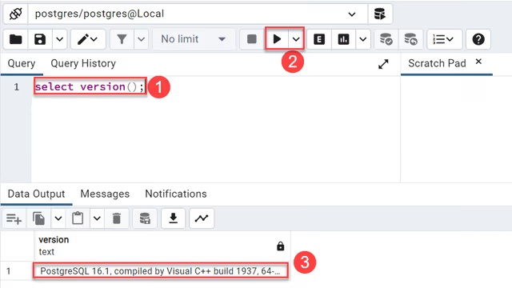

## Load the sample database [](https://neon.com/postgresql/getting-started/load-postgresql-sample-database)

Firstly we will see how to do it using cli.

`psql` is a terminal-based client tool to PostgreSQL. It allows you to enter queries, send them to PostgreSQL for execution, and display the results. `pg_restore` is a utility for restoring a database from an archive.

Steps:

### Create the database

First open the cli and connect to server using `psql`.
Create database called `dvdrental`. You can name it anything you want:
```postgresql
CREATE DATABASE dvdrental;
```

PostgreSQL will create a new database called `dvdrental`. You can verify the database creation using the `\l` command. The `\l` command will show all databases in the PostgreSQL server:
```bash
\l
```

Output:
```text
List of databases
   Name    |  Owner   | Encoding | Locale Provider |          Collate           |           Ctype            | ICU Locale | ICU Rules |   Access privileges
-----------+----------+----------+-----------------+----------------------------+----------------------------+------------+-----------+-----------------------
 dvdrental | postgres | UTF8     | libc            | English_United States.1252 | English_United States.1252 |            |           |
 postgres  | postgres | UTF8     | libc            | English_United States.1252 | English_United States.1252 |            |           |
 template0 | postgres | UTF8     | libc            | English_United States.1252 | English_United States.1252 |            |           | =c/postgres          +
           |          |          |                 |                            |                            |            |           | postgres=CTc/postgres
 template1 | postgres | UTF8     | libc            | English_United States.1252 | English_United States.1252 |            |           | =c/postgres          +
           |          |          |                 |                            |                            |            |           | postgres=CTc/postgres
(4 rows)
```

You can disconnect from the PostgreSQL server and exit the `psql` using the `exit` command.

### Restore the sample database from a tar file

You should have a `tar` file for this step. You can load the database using `pg_restore` command:
```bash
pg_restore -U postgres -d dvdrental D:\sampledb\postgres\dvdrental.tar
```

In this command:
- The `-U postgres` instructs `pg_restore` to connect the PostgreSQL server using the `postgres` user.
- The `-d dvdrental` specifies the target database to load.

It will prompt to enter your password. After some time, it will load the database. You can verify it by `\dt`. `\dt` displays all tables in a database.

We can also do the above thing using GUI in `pdAdmin`.

Steps:

First you have to launch the application and than right-click the **Databases** and select the **Create > Database…** menu option:
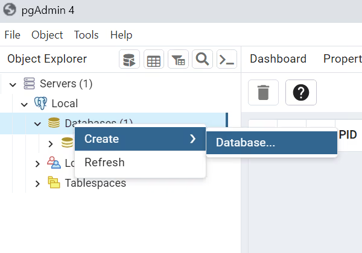

Third, enter the database name `dvdrental` and click the **Save** button:

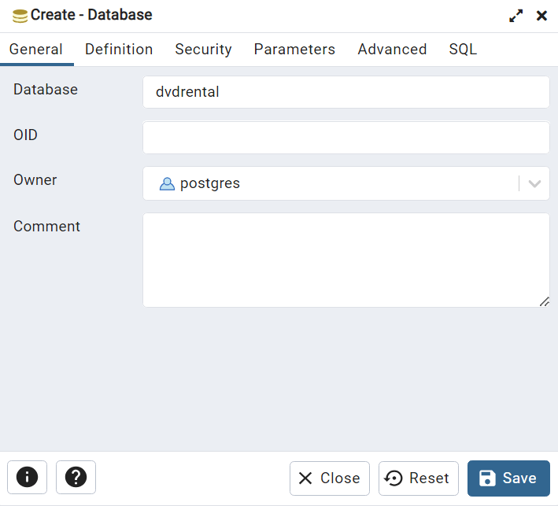
You’ll see the new empty database created under the **Databases** node:

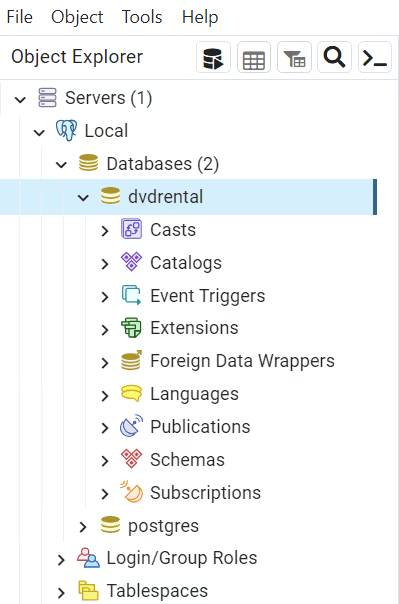 

Fourth, right-click on the **dvdrental** database and choose the **Restore…** menu item to restore the database from the downloaded database file:

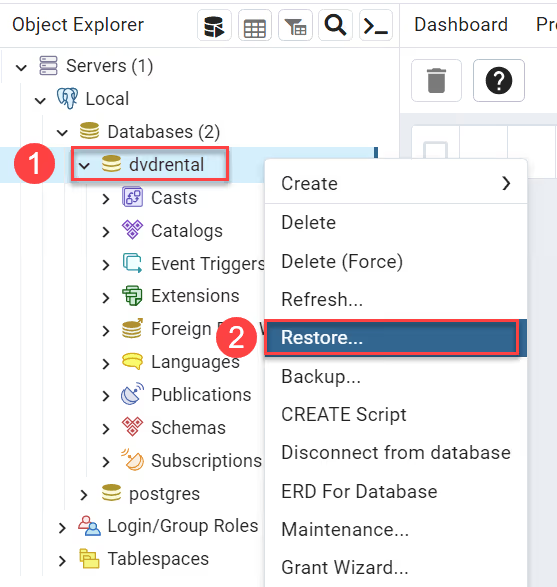

Fifth, enter the path to the sample database file such as **c:\sampledb\dvdrental.tar** and click the **Restore** button:

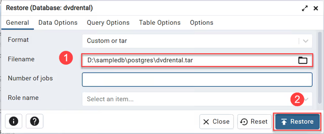

Sixth, the restoration process will complete in a few seconds and show the following dialog once it completes:

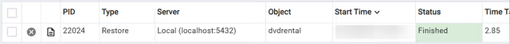

Finally, open the `dvdrental` database from the object browser panel, you will find tables in the `public` schema and other database objects as shown in the following picture:

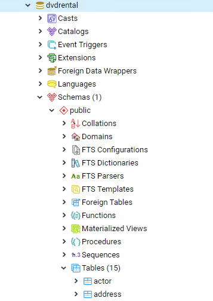

## Sources
[Neon-what is PostgreSQL](https://neon.com/postgresql/getting-started/what-is-postgresql)
[Neon-install postgressql](https://neon.com/postgresql/getting-started/install-postgresql)
[Neon-Connect to postgresql database](https://neon.com/postgresql/getting-started/connect-to-postgresql-database)
[Neon-Load sample database](https://neon.com/postgresql/getting-started/load-postgresql-sample-database)

## Tags:
#database 
#postgresql