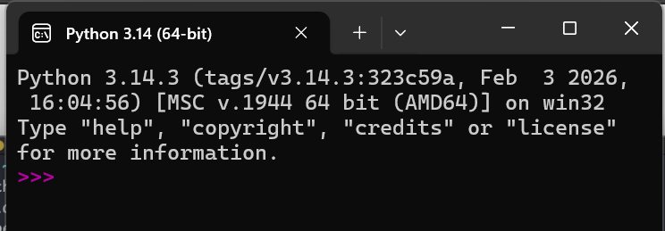

Python is a interpretated language.

Extension for files: `.py`

The IDE that is installed with python is known as REPL (Read-Evaluate-Print-Loop).

/

We can run python programs using `python hello.py`. 

Links:
[Data types](Data%20types.md)
[Operators](Operators.md)
[String](String.md)
[Lists](Lists.md)
[Tuples](Tuples.md)
[Dictionary](Dictionary.md)
[Sets](Sets.md)
[Enums and Constants](Enums%20and%20Constants.md)
